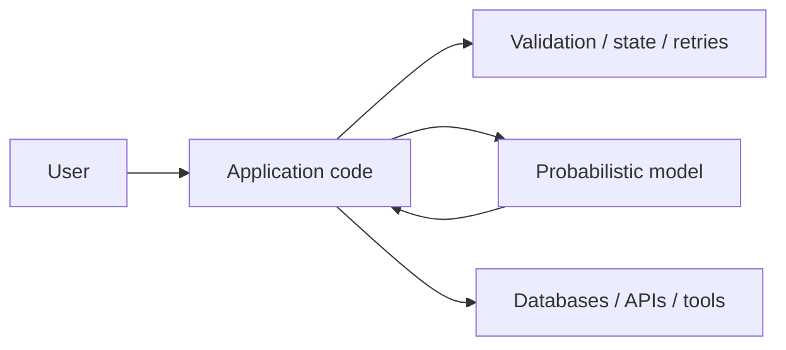
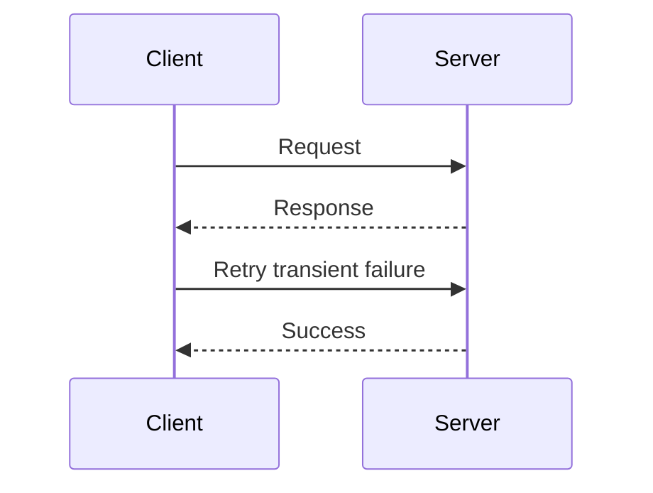
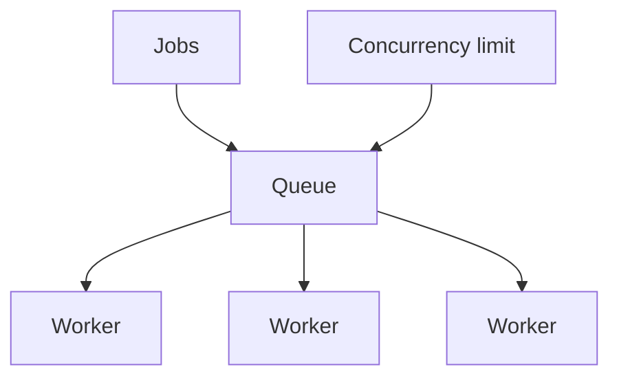
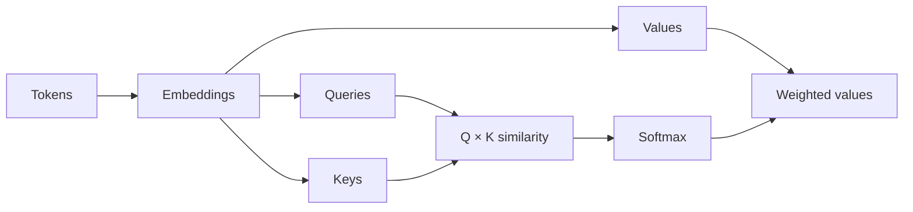

# 00 — Foundations: Concept Notes

This page expands the study guide into explanatory notes. Read it before coding.

## 1. AI engineering is software engineering + probabilistic components



The model does not replace normal engineering. Your application still needs contracts, error handling, observability, security, and tests.

**Example:** a ticket classifier can predict `billing`, but the API still needs authentication, schema validation, timeout handling, and a defined behavior when the model fails.

## 2. HTTP mental model



Learn methods, headers, status codes, authentication, timeouts, retries, pagination, and idempotency.

A timeout is not the same as a permanent failure. Retrying every error can multiply load or duplicate side effects.

## 3. Async and concurrency



Concurrency improves throughput when work can overlap. It can also increase rate-limit errors, memory use, and downstream pressure. Always bound concurrency.

## 4. Schemas are boundaries

```text
untrusted input
      ↓
parse
      ↓
validate
      ↓
typed object
      ↓
business logic
```

JSON Schema and typed validation make assumptions explicit. Schemas are especially important when LLMs produce data.

## 5. Testing

Use several layers:

- unit tests for deterministic functions
- integration tests for real boundaries
- contract tests for APIs
- property tests for general invariants
- evaluation datasets for probabilistic behavior

## 6. Transformer intuition



Attention lets each token weight information from other tokens. You do not need to train a large model to understand the mechanics; implement a tiny attention block once.

## Best practices

1. Type important boundaries.
2. Bound concurrency and retries.
3. Make failure behavior explicit.
4. Keep experiments reproducible.
5. Learn the underlying mechanism before adopting a library.

## Remember
**Build the software boundary first; the model is only one component inside it.**
