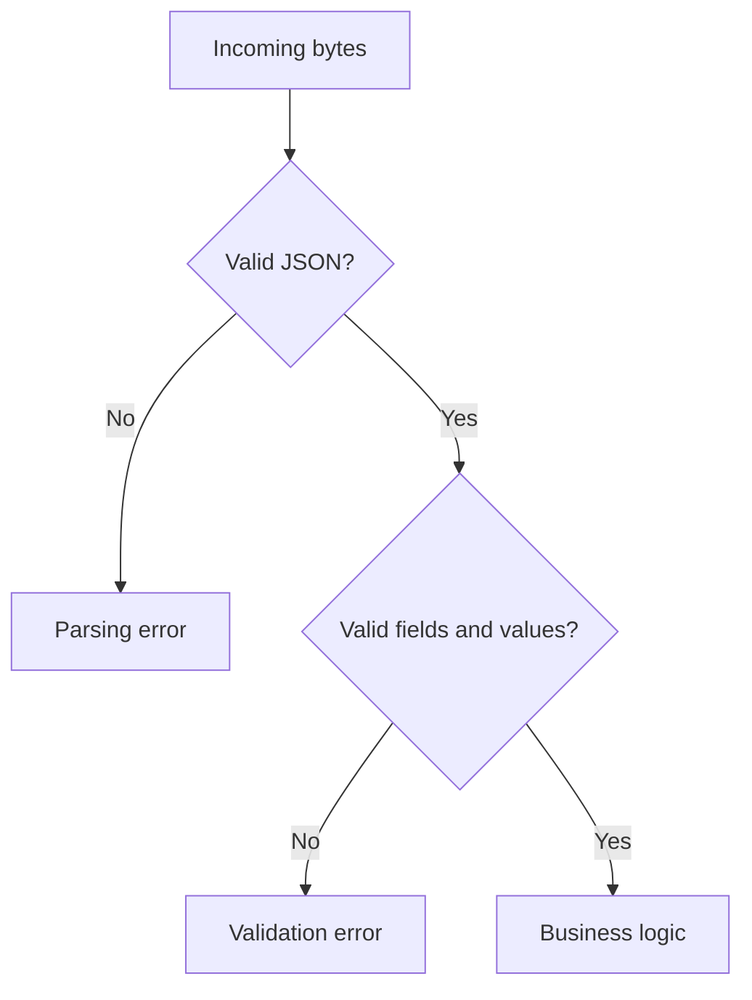
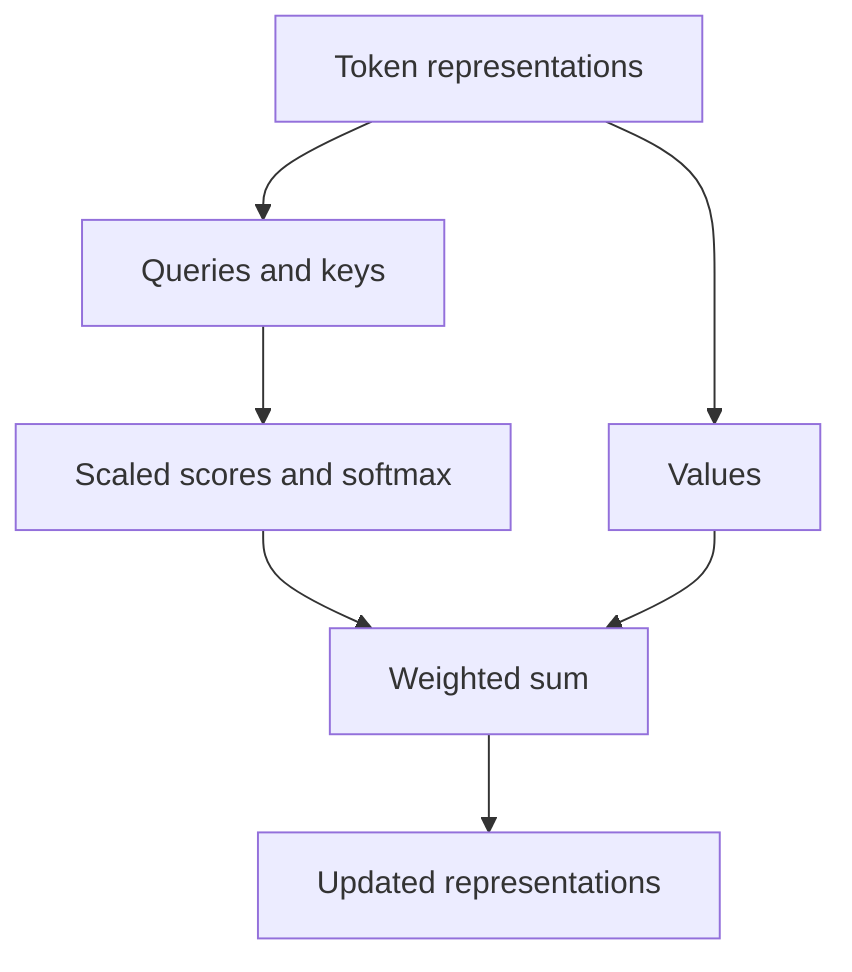

# Foundations: explained step by step

[Section home](README.md) · [Exercises and quiz](PRACTICE.md)

## Before you start

You need basic variables, functions, and a terminal. Use Python 3.11 or newer for the offline examples. No API key is required. By the end, you should be able to separate data validation, concurrency, and model behavior instead of treating an AI application as one large prompt.

## 1. Python boundaries: types describe, validators enforce

A type annotation such as `amount: int` helps an editor and a type checker; Python does not automatically reject a string at runtime. A dataclass groups fields but is not by itself a schema validator. Parse incoming JSON and then explicitly check required fields, types, ranges, and allowed values. Only validated data enters business logic.

For a ticket, `{"priority": "urgent"}` may be valid JSON but invalid application data when the supported priorities are `low`, `normal`, and `high`. Separate a parsing error from a business-rule error so the caller knows what to fix. Use exceptions for failed operations; never disguise an error as an empty successful result.

Read the diamond nodes as questions: reaching business logic requires both checks. This same boundary later protects model outputs and tool arguments.

## 2. HTTP: a timeout leaves uncertainty

An HTTP request includes a method, address, headers, and optionally a body. Responses include a status and body. A 401 normally means credentials need attention; repeating the same request does not repair them. A 429 indicates a rate limit and may include retry timing. A 503 may be temporary, but even temporary errors need a retry limit.

Distinguish connection timeout, read timeout, and overall deadline. If a server created an order but its response was lost, the caller sees a timeout even though the action succeeded. Retrying a read is usually easier than retrying a write. An idempotency key lets the receiver recognize the same operation, provided the receiver implements that contract.

## 3. Async: overlap waiting, bound the work

`asyncio` lets a task yield while it waits for I/O. It does not automatically speed CPU-heavy Python code. Threads or processes may be more appropriate depending on the library and CPU workload. A semaphore bounds active calls; a bounded queue also bounds waiting jobs. Creating a million tasks behind a semaphore can still exhaust memory.

Suppose six requests each wait 100 ms. Sequential execution takes roughly 600 ms; concurrency two ideally takes three waves, about 300 ms plus overhead. This is a simplified model, not a benchmark. More concurrency can increase queueing and rate-limit errors at the provider.

## 4. Tests, Git, and containers answer different questions

A unit test checks one function with controlled inputs. An integration test checks a real boundary. A contract test checks message compatibility. A property test asks whether an invariant holds over many inputs. An AI evaluation measures behavior over representative tasks, including variation across runs.

Git records source history. Commit source, fixtures, and configuration templates; exclude credentials, caches, and private prompts. A Docker image packages a runtime; a container is a running instance. Persistent data needs a volume or external store. Recreating a container must not erase approval records. Pin dependencies and record runtime versions so another learner can reproduce your result.

## 5. ML fundamentals with one concrete problem

To predict a ticket category from text, training examples contain features and labels. Training adjusts parameters to reduce a loss. Inference applies learned parameters to new data. Keep training, validation, and test data separate: use validation to choose settings and the held-out test set to estimate generalization. Near-duplicate tickets across splits can leak the answer and exaggerate quality.

Classification predicts a category; regression predicts a number; clustering groups examples without predefined labels. Overfitting means learning training-specific details that do not generalize. Underfitting means the model cannot capture enough of the useful pattern. A larger model is not automatically the solution to poor data.

## 6. Embeddings and attention, with numbers

An embedding represents an item as a vector. For vectors `a=(1,0)` and `b=(0.8,0.6)`, both norms are 1 and cosine similarity is 0.8. For `c=(0,1)`, similarity to `a` is 0. Similarity is a geometric signal, not a probability that two claims are true.

Attention uses queries and keys to compute weights, then mixes value vectors. For scores `[0, ln(3)]`, softmax produces `[0.25, 0.75]`. If values are `[2, 10]`, the weighted result is `0.25*2 + 0.75*10 = 8`. Real attention uses vectors, scaled dot products, masks, and multiple heads. A causal mask prevents a token from attending to future tokens during autoregressive training/generation.

The two paths matter: keys determine how much to attend, while values provide the information being combined. Positional information helps the model distinguish word order.

## Run and inspect

Run `python 00-foundations/examples/bounded_async.py` from the repository root. Predict the maximum active jobs before running it. Then change the concurrency limit and explain why result order and completion order can differ.

## References

- [Python asyncio](https://docs.python.org/3/library/asyncio.html): tasks, synchronization, and cancellation.
- [JSON Schema](https://json-schema.org/learn/getting-started-step-by-step): validation vocabulary.
- [Attention Is All You Need](https://arxiv.org/abs/1706.03762): original transformer architecture.
