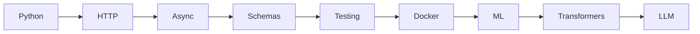
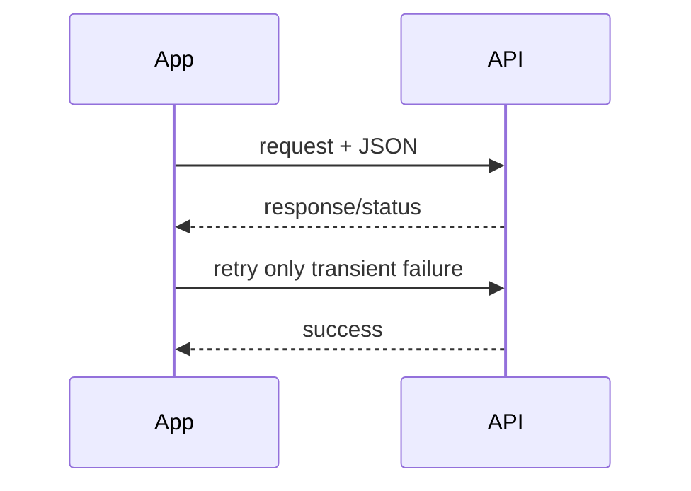
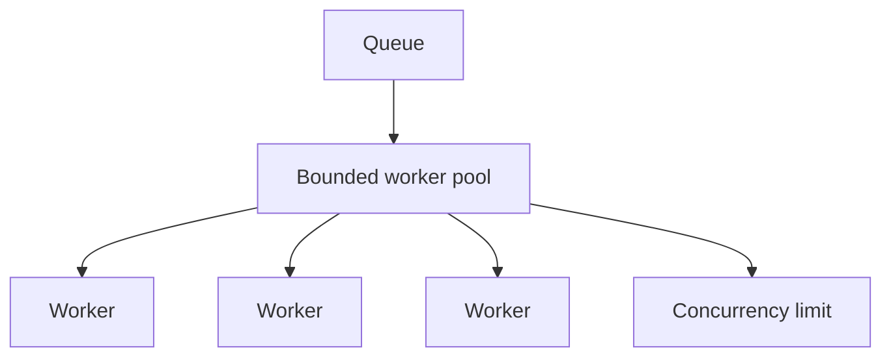
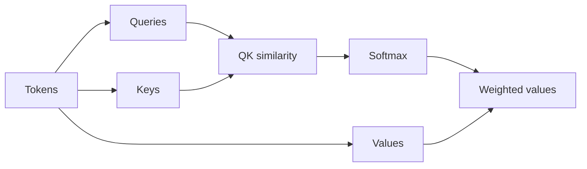

# 00 — Foundations: Study Guide

> Read this before the section README. This page keeps the concepts, diagrams, worked examples, and best practices beside the section they explain.

## Big picture



AI engineering is still software engineering. LLMs add probabilistic behavior; your application supplies deterministic boundaries such as validation, timeouts, state, permissions, and tests.

## Python for AI engineering

Learn modules/packages, environments, typing, dataclasses, exceptions, logging, files, CLIs, and async programming.

Example:

```python
from dataclasses import dataclass

@dataclass
class Message:
    role: str
    content: str

messages = [Message("user", "Explain attention")]
```

Best practice: use types at boundaries and keep side effects visible.

## HTTP and APIs



Understand methods, headers, status codes, authentication, pagination, timeouts, retries, and idempotency. A 4xx validation/auth error should not normally be retried automatically.

## Async and concurrency



Async improves utilization, not magically every workload. Measure throughput, p95/p99 latency, memory, error rate, and saturation.

## JSON, types, and schemas

Use this mental model:

```text
untrusted input → validation → typed object → business logic
```

Study JSON Schema, Pydantic-style validation, enums, unions, strictness, serialization, and versioning.

## Testing

```text
unit tests → integration tests → contract tests → property tests → AI evaluations
```

Test failure paths as deliberately as happy paths.

## Docker

```text
source → image → container → network/volume → service
```

Use Docker to make labs reproducible and to practice multi-service setups before agents become distributed systems.

## ML fundamentals

Know vectors, matrices, probability, optimization, loss functions, overfitting, train/validation/test splits, and embeddings. The goal is intuition sufficient to reason about similarity, model behavior, and evaluation—not to become a research mathematician.

## Transformer fundamentals



Attention lets each token assign different weights to other tokens. Connect tokenization → embeddings → attention → transformer block → autoregressive generation.

## Worked example: reliable async API client

1. Create a typed request/response model.
2. Add an HTTP client with timeout.
3. Classify errors as transient/permanent.
4. Add bounded retries with backoff and jitter.
5. Process 100 calls through a bounded async worker pool.
6. Collect latency and failure metrics.
7. Add tests for timeout, retry exhaustion, malformed response, and cancellation.
8. Containerize the service.

## Best practices

- Prefer typed interfaces over ad-hoc dictionaries.
- Keep concurrency bounded.
- Make retry policies explicit.
- Separate deterministic tests from probabilistic evaluations.
- Pin dependencies for experiments.
- Reproduce failures with small test cases.

## Study references

- Python: https://docs.python.org/3/
- asyncio: https://docs.python.org/3/library/asyncio.html
- pytest: https://docs.pytest.org/
- Docker: https://docs.docker.com/
- JSON Schema: https://json-schema.org/
- Hugging Face course: https://huggingface.co/learn/nlp-course/
- Attention Is All You Need: https://arxiv.org/abs/1706.03762

## Remember

**AI systems become easier to reason about when the model is surrounded by strong software boundaries.**
