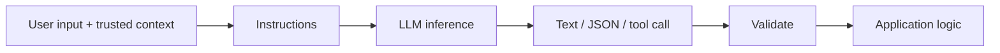
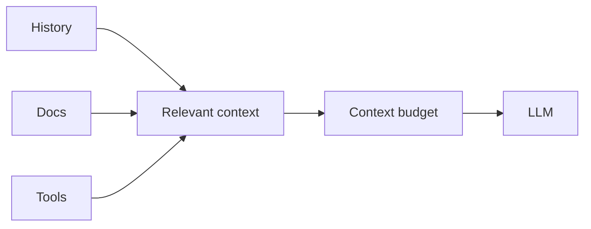
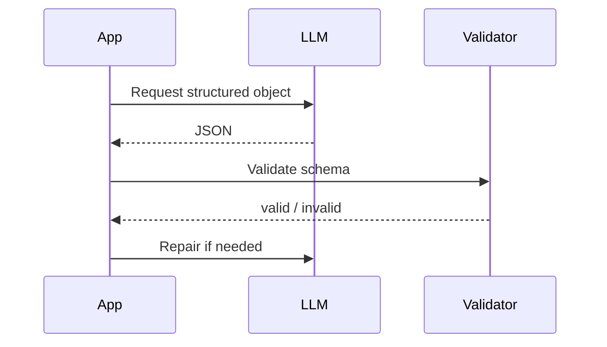
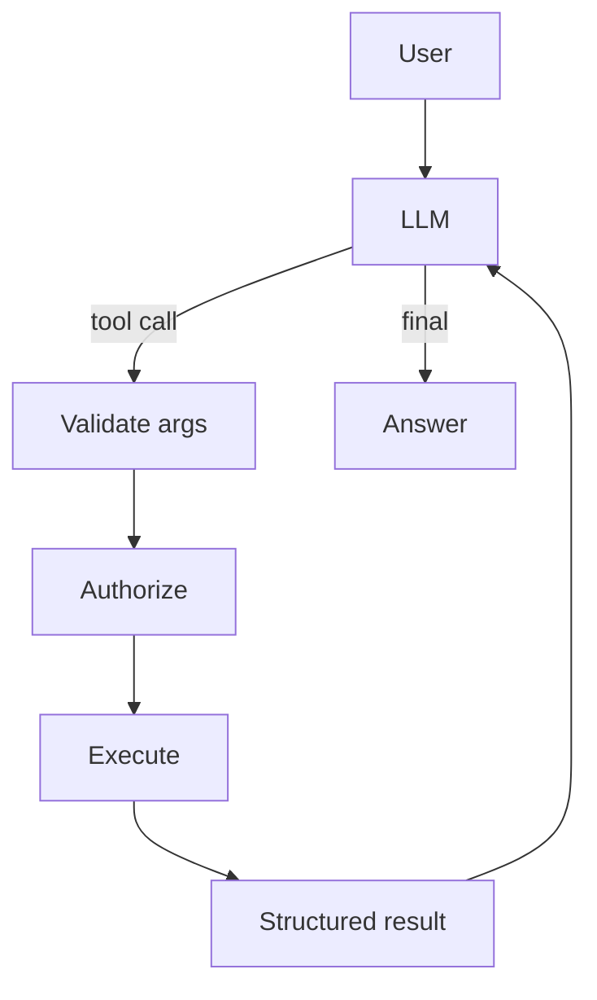

# 01 — LLM Engineering: Concept Notes

## 1. The LLM boundary



The model is probabilistic. Validation, permissions, budgets, and business rules should remain deterministic.

## 2. Tokens and context

Tokens are the units processed by the model. Context is the information available to the current inference.



More context is not automatically better. Irrelevant context can increase cost and dilute the useful signal.

## 3. Prompting

Treat a prompt like an interface:

```text
instructions + task + trusted context + examples + output contract
```

Change one variable at a time during experiments. Version prompts just like code.

## 4. Structured outputs



Never silently trust malformed output. Schema validation should be part of the normal path.

## 5. Tool calling



Tool use is controlled delegation, not unrestricted autonomy.

## 6. Reliability

Separate transient failures such as temporary provider errors from permanent failures such as invalid input or authorization failures.

```text
request → timeout → classify → retry transient → fallback → record
```

Use bounded retries with backoff and jitter.

## Worked example: support-ticket extraction

Input: `"Customer was charged twice. Please fix and refund one charge."`

Output contract:

```json
{
  "category": "billing",
  "priority": "high",
  "action": "refund_duplicate_charge"
}
```

Validate the object, reject invalid enums, record the model/prompt version, and add the case to the regression dataset.

## Best practices

- Prefer structured outputs when downstream code consumes the result.
- Keep untrusted content separate from high-priority instructions.
- Bound context and tool calls.
- Measure quality before prompt tuning.
- Log enough metadata to reproduce failures.

## Remember
**Good LLM engineering puts strong deterministic contracts around probabilistic inference.**
