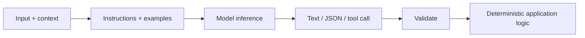
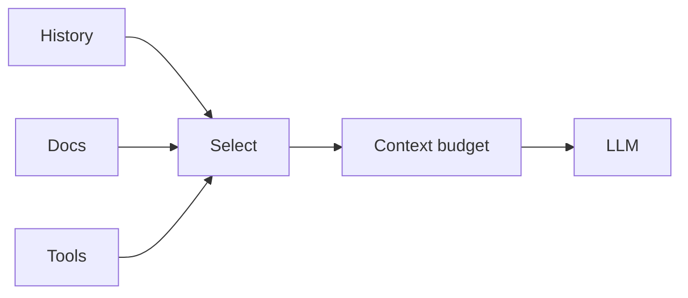
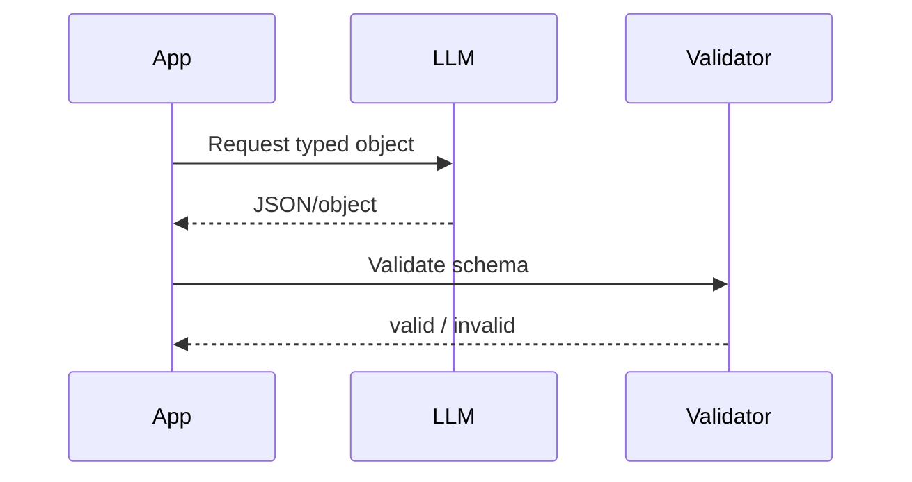
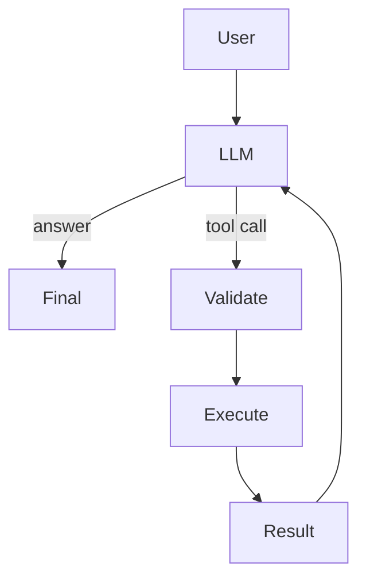

# 01 — LLM Engineering: Study Guide

## Model boundary



Treat the model as probabilistic infrastructure and keep business rules, validation, permissions, and stop conditions outside it.

## Tokens and context



Context is not a dumping ground. Retrieve, summarize, prioritize, and remove stale material. Study tokenization, context limits, truncation, context packing, and long-context trade-offs.

## Prompting

Think of a prompt as an interface contract:

```text
instructions + task + trusted context + examples + output constraints
```

Change one variable at a time and version prompts.

## Structured outputs



Never silently accept invalid model output. Use schema validation and explicit repair/failure behavior.

## Tool calling



A tool call is a proposal from the model, not authorization to perform an arbitrary action.

## Sampling and model choice

Temperature, top-p, model choice, prompt version, and context can all change results. Keep evaluation inputs fixed so changes are measurable.

## Reliability and safety

```text
request → timeout → classify → bounded retry/fallback → record result
```

Treat retrieved content, web pages, user text, and tool results as untrusted data rather than policy instructions.

## Worked example: support-ticket extractor

Input a messy ticket and request `{title, priority, category, owners}`. Validate it, retry malformed output, record model/prompt/version/latency/tokens, and run 25 regression cases.

## Best practices

- Version prompts and datasets.
- Validate structured output.
- Bound context and tool calls.
- Separate trusted instructions from untrusted content.
- Test malformed output and refusal paths.
- Measure quality before prompt tuning.

## References

- OpenAI: https://platform.openai.com/docs
- Anthropic: https://docs.anthropic.com/
- Hugging Face: https://huggingface.co/learn
- JSON Schema: https://json-schema.org/

## Remember

**Reliable LLM systems are built by putting deterministic contracts around probabilistic inference.**
