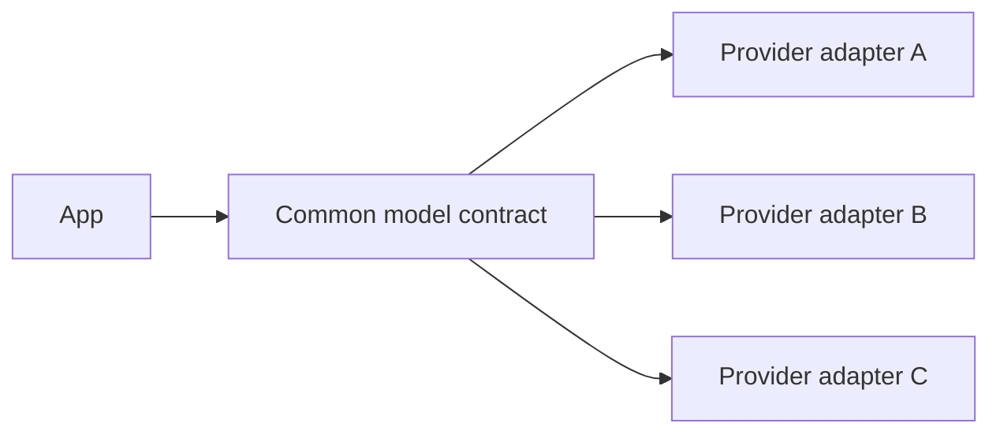
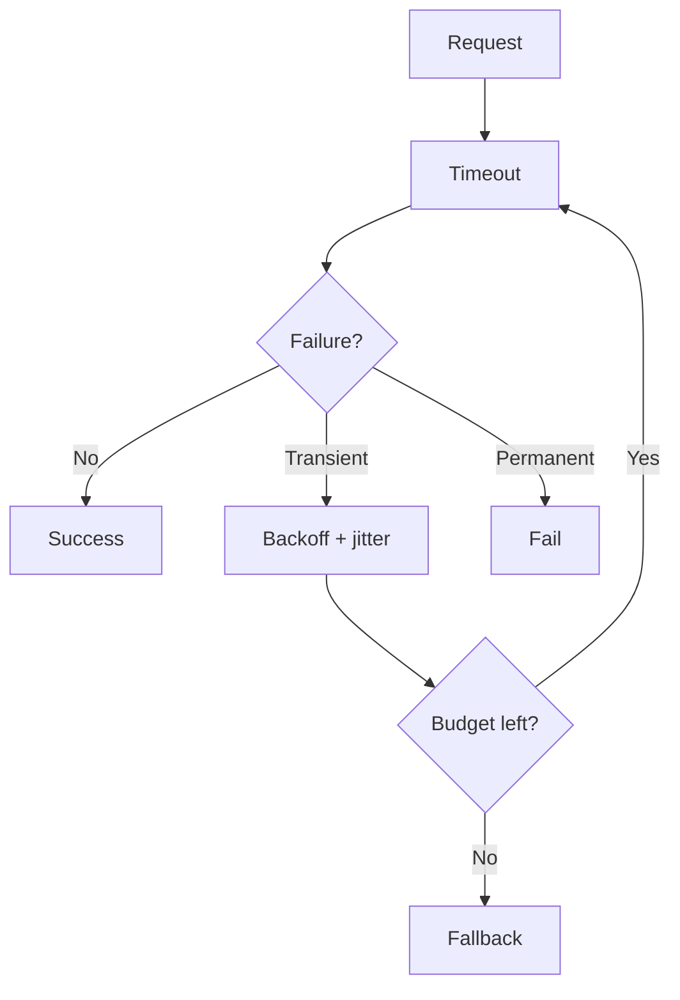
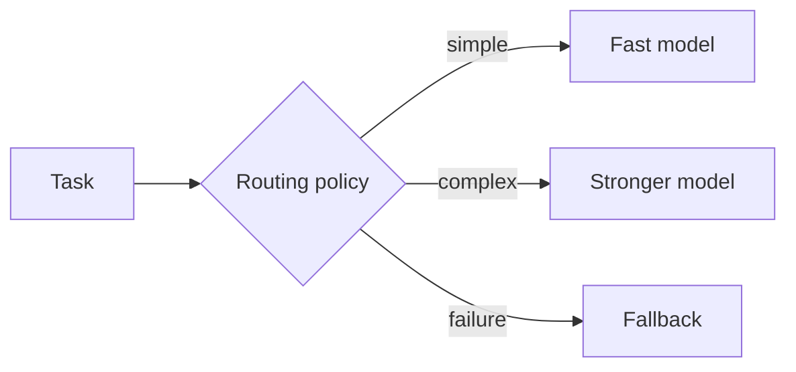

# 02 — Model APIs: Concept Notes

## Provider abstraction



Keep provider-specific request formats, SDK objects, and exceptions inside adapters. The application should depend on your contract.

## Request lifecycle



Retrying a validation error wastes time. Retrying a temporary rate limit may recover successfully.

## Streaming

Hide provider-specific chunks behind a common event model:

```text
text_delta | tool_call_delta | usage | completed | failed
```

This keeps the UI independent from provider protocols.

## Model routing



Start with explicit rules. Add more sophisticated routing only when evaluation shows benefit.

## Cost accounting

Capture:

```text
request_id, model, input_tokens, output_tokens,
latency_ms, retries, status, estimated_cost
```

This turns “the model is expensive” into measurable engineering data.

## Example

Replay 50 fixed prompts against two providers and compare:

- success rate
- p50/p95 latency
- structured-output validity
- token usage
- cost

## Best practices

1. Timeout every network call.
2. Bound retries.
3. Support cancellation.
4. Keep SDK details behind adapters.
5. Capture usage on failures too.
6. Pin package/model versions in experiments.

## Remember
**The model provider is an infrastructure dependency; isolate it behind a stable application boundary.**
