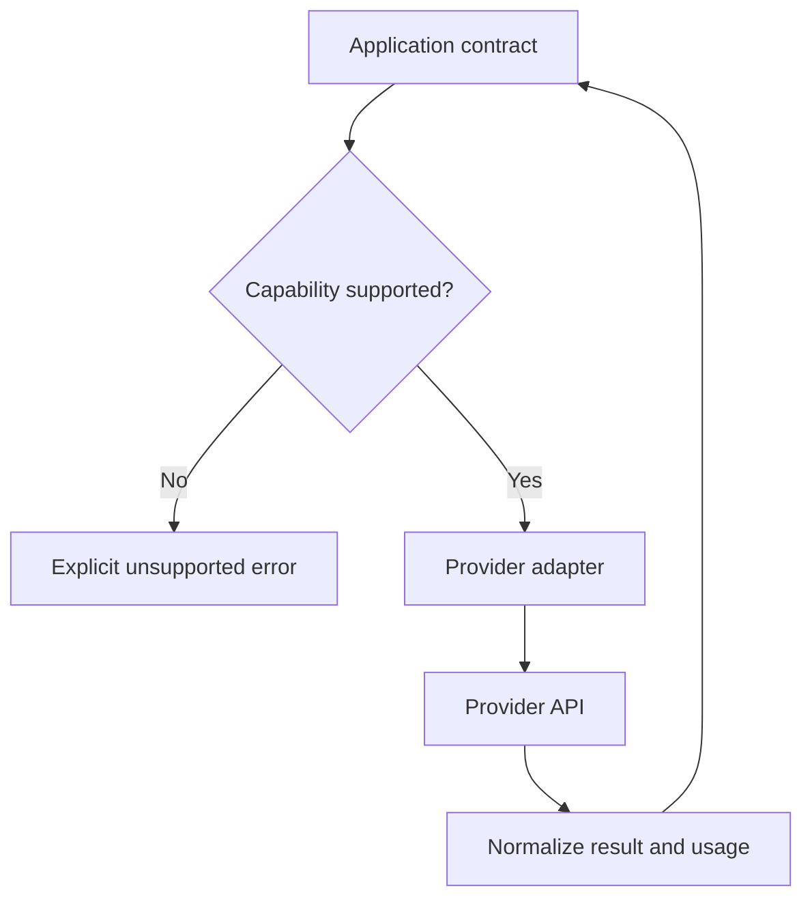

# Model APIs: explained step by step

[Section home](README.md) · [Exercises and quiz](PRACTICE.md)

## Goal

Build a provider boundary you can test without a network. The application should understand your request/result types; provider-specific exceptions and event names belong inside an adapter. A shared interface does not imply that every provider has identical capabilities.

## 1. Define a small contract

A request might contain messages, output constraints, a deadline, and a maximum output size. A result should include content, finish reason, request ID, usage if known, and a normalized error. Keep “unknown usage” different from zero usage. A failed call may still have incurred cost.

Expose capability differences explicitly: structured output, image input, tool calls, and streaming may not all be available. Reject an unsupported feature or use a documented fallback; silently dropping the output schema breaks the caller's assumptions.

The return path normalizes fields but preserves errors and finish reasons. A length-limited response must not look like a successful complete object.

## 2. Timeouts, deadlines, and cancellation

A timeout bounds one operation. A deadline bounds the whole request, including waits and retries. If three attempts each have a 10-second timeout, the user might wait over 30 seconds once backoff is included. Carry the remaining deadline into each attempt. Use a monotonic clock for durations so wall-clock adjustments do not extend a budget.

Cancellation should propagate to children where supported, but it does not prove the remote server stopped processing. Record that ambiguity rather than assuming no charge or no side effect occurred.

## 3. Retry classification

| Failure | Typical response | Why |
|---|---|---|
| Invalid input or unsupported feature | Fail and fix request | Repetition cannot repair the contract |
| Authentication/permission failure | Stop and inspect configuration | Avoid repeatedly sending an unauthorized request |
| Rate limit | Respect retry timing within deadline | Immediate retries add load |
| Temporary unavailability | Bounded backoff with jitter | Give the dependency recovery time |
| Unknown outcome of a write | Reconcile or deduplicate | Blind retries may duplicate the effect |

An exponential delay might grow as `base * 2**attempt`, capped at a maximum. Jitter spreads clients' retries across time. The exact policy depends on the provider's documented errors. SDK retries plus application retries can multiply attempts: three attempts at each layer can mean nine calls. Choose one owner or account for the combined limit.

## 4. Streaming is a state machine

Normalize events into text delta, tool delta, usage, complete, and failed. Append deltas in order and track each tool call separately by ID. Do not report success until a terminal complete event or equivalent protocol signal. A dropped connection after partial text is a partial failure.

Restarting a stream may repeat text. Decide whether to replace the draft, visibly restart, or fail. Do not append a new response blindly to the old one. Usage can arrive late or be missing; keep that visible in accounting.

## 5. Routing and fallback

Choose a route from task requirements: allowed data location, required modality, schema support, measured quality, latency, and cost. A cheap call that repeatedly fails can cost more overall. A fallback must meet the same data-handling restrictions as the primary. Test fallback output with the same fixtures, rather than testing availability alone.

## 6. Cost example with fictional prices

For 1,500 input tokens and 300 output tokens, at fictional prices of $2 and $8 per million respectively, estimated cost is `(1500*2 + 300*8)/1_000_000 = $0.0054`. Two equally sized attempts would total $0.0108. These are arithmetic examples, not current provider prices. Real accounting may distinguish cached tokens, reasoning tokens, or other billing units; preserve the provider's raw usage where safe.

## Run and extend

`python 02-model-apis/examples/retry_policy.py` replays statuses without network calls or real sleeping. It demonstrates attempt limits and classification, not a complete HTTP client. Add a real adapter only after defining cancellation, deadline, and usage behavior.

## References

- [HTTP semantics, RFC 9110](https://www.rfc-editor.org/rfc/rfc9110): method semantics and status codes.
- [HTTPX timeouts](https://www.python-httpx.org/advanced/timeouts/): distinct timeout categories.
- [Python monotonic clock](https://docs.python.org/3/library/time.html#time.monotonic): measuring elapsed durations.
