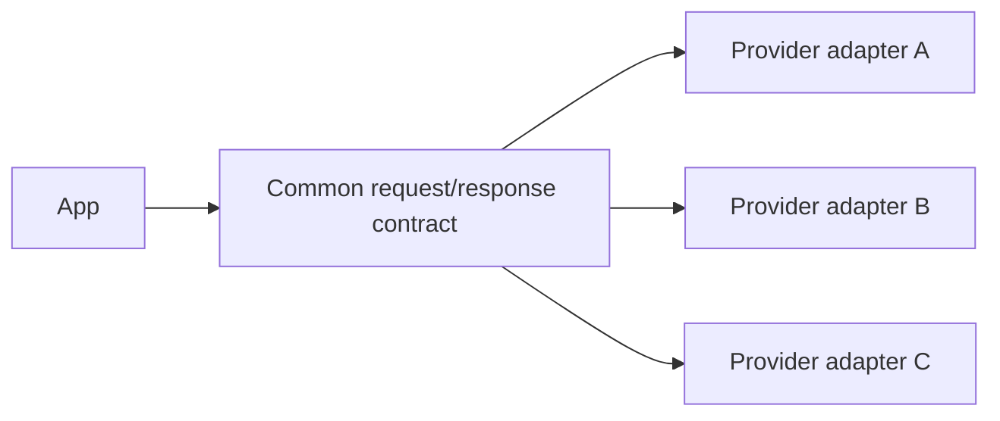
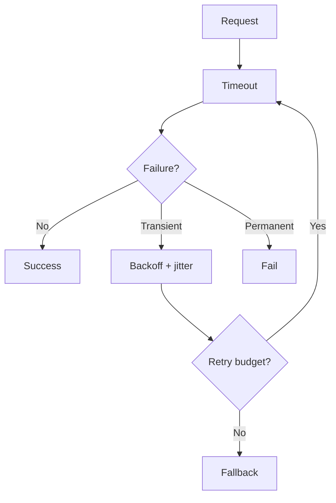
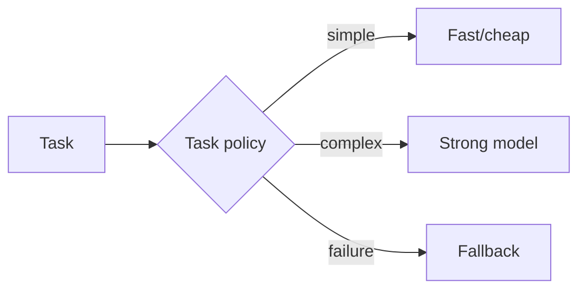

# 02 — Model APIs: Study Guide

## Provider abstraction



Keep SDK-specific messages, headers, and exceptions inside adapters so application code depends on a stable contract.

## Request reliability



Learn authentication, timeouts, cancellation, rate limits, retry classification, fallbacks, and idempotency.

## Streaming

Normalize provider events to a small internal model:

```text
text_delta | tool_call_delta | usage | completed | failed
```

This keeps the UI and orchestration code provider-independent.

## Routing



Start with deterministic rules. Add a learned router only when evaluation shows a real benefit.

## Cost and usage

Capture request ID, model, input/output tokens, latency, retries, status, and estimated cost for every request. This becomes the foundation for later cost/SLO work.

## Worked example

Replay the same 50 requests across two providers and compare success rate, p50/p95 latency, token usage, cost, and structured-output validity.

## Best practices

- Put a deadline around every network call.
- Never blindly retry permanent failures.
- Support cancellation.
- Track usage on success and failure.
- Pin SDK/model versions in experiments.
- Keep provider code at the edge.

## References

- OpenAI: https://platform.openai.com/docs
- Anthropic: https://docs.anthropic.com/
- Google AI: https://ai.google.dev/gemini-api/docs
- HTTP: https://developer.mozilla.org/en-US/docs/Web/HTTP
- httpx: https://www.python-httpx.org/

## Remember

**The provider is replaceable infrastructure; the application contract should be durable.**
