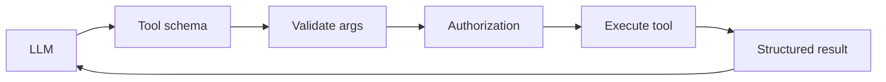
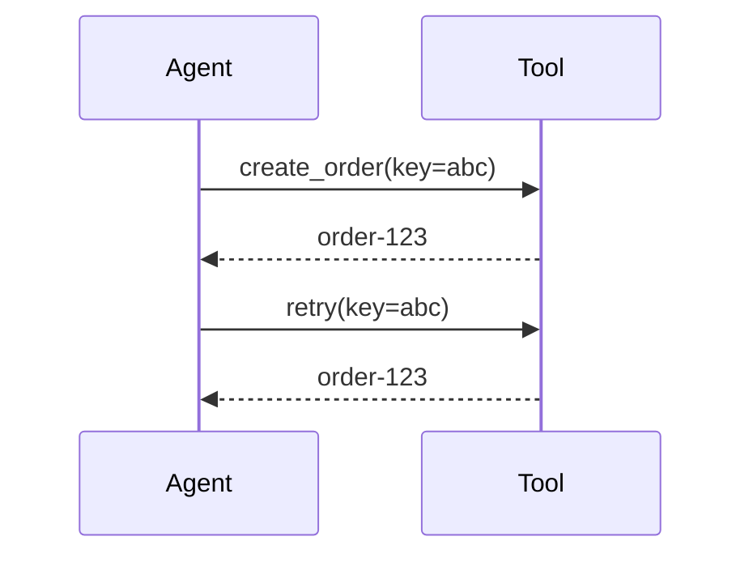
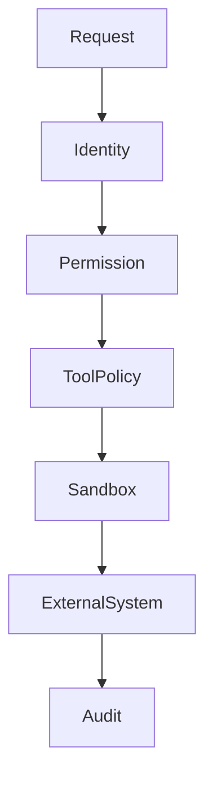

# 03 — Tools: Concept Notes

## What a tool really is

A tool is a controlled bridge between model decisions and deterministic software.



The model requests an action; your runtime decides whether and how that action is executed.

## Narrow tools beat giant tools

Bad:

```python
run_any_command(command: str)
```

Better:

```python
search_orders(customer_id: str, date_range: DateRange)
```

Narrow tools are easier to secure, test, document, and reason about.

## Read vs side-effect tools

```text
READ: search_docs, get_customer, calculate_price
WRITE: send_email, create_order, delete_record
```

Write actions deserve stronger authorization and often human approval.

## Idempotency



A retry should not create two orders. Idempotency keys make duplicate delivery safe.

## Structured errors

```json
{
  "code": "TIMEOUT",
  "retryable": true,
  "message": "backend did not respond"
}
```

The model and application need to distinguish failure types rather than receiving an empty result.

## Security boundary



Treat tool arguments and tool results as untrusted input.

## MCP concept

Model Context Protocol is best understood as an interoperability boundary for tools/resources. It does not replace application authorization, auditing, or validation.

## Worked example

Build three tools:

1. calculator
2. documentation search
3. file reader

For each, define a schema, permissions, timeout, result format, error format, and audit event.

## Best practices

- Register tools explicitly.
- Separate discovery from authorization.
- Prefer narrow tools.
- Use idempotency for retryable side effects.
- Make failures machine-readable.
- Test malicious arguments and oversized inputs.

## Remember
**Every tool is a security boundary because it turns model output into real-world effects.**
