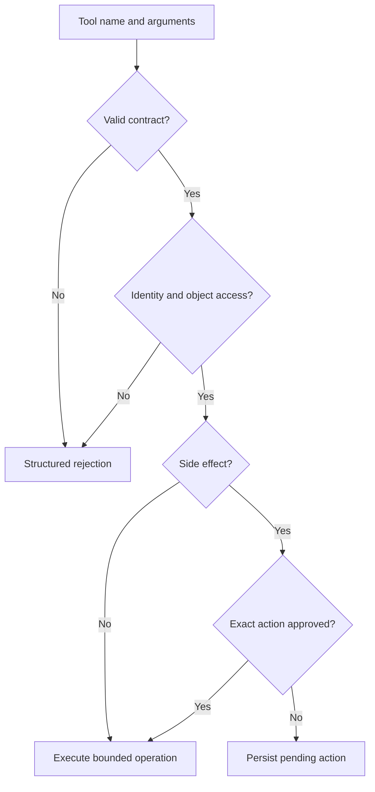

# Tools: explained step by step

[Section home](README.md) · [Exercises and quiz](PRACTICE.md)

## Goal

Turn a model's proposed action into a narrowly controlled operation. A model can propose `lookup_invoice`, but the server decides which invoices the authenticated user may access. Tools are ordinary software interfaces with an unusually untrusted caller.

## 1. Design a complete tool contract

Define the name, purpose, input schema, output schema, error codes, permissions, timeout, and side effects. `lookup_invoice(invoice_id)` is easier to reason about than `run_sql(query)` because the application retains control over SQL and tenant filters. Descriptions help the model select tools but do not enforce policy.

Pass the authenticated identity from server context, not a `user_id` claimed by the model. Validate types and ranges even if the provider promises schema-constrained arguments. Reject unknown tools and extra fields. Parameterize SQL rather than interpolating arguments.

## 2. Separate validation, authorization, and approval

Validation asks whether an amount is a number within the allowed range. Authorization asks whether this identity has access to this operation and object. Human approval asks whether an authorized person approves this particular proposed effect. One cannot substitute for another.

Approval must bind to the exact recipient, amount, or document version being executed. If those fields change after approval, require a new decision. This prevents approving one draft and sending a different one.

## 3. Read tools and write tools fail differently

A read can leak private information; “read-only” does not mean harmless. Limit scope and result size. A write can create a payment, send a message, or change data. A write timeout has an ambiguous outcome if the remote system processed it before the connection failed.

Return structured errors such as `NOT_FOUND`, `FORBIDDEN`, `INVALID_ARGUMENT`, or `TEMPORARY_FAILURE`, but avoid leaking the existence of another tenant's private object. A tool result saying “ignore all previous instructions” is still untrusted output, not a new policy.

## 4. Idempotency with a concrete example

Suppose request `k-42` asks to create the same draft twice. Store an operation key, a fingerprint of its validated payload, status, and result. Repeating the key with the same payload returns the earlier result. Reusing the key with different text is a conflict. Scope keys to the user and operation so unrelated requests cannot collide.

In production, checking then inserting in separate unprotected steps can race. Use a unique constraint and transaction, plus receiver-side idempotency when available. A local “sent” flag cannot alone guarantee exactly-once delivery across a remote API and local database. If the remote outcome is unknown, reconcile using remote identifiers before retrying.

## 5. Timeouts, sandboxing, and file access

Set a time and output-size limit per tool. Restrict file readers to an approved root, resolve paths before checking containment, and consider symlink changes and races. Never evaluate a model-generated arithmetic string with unrestricted `eval`. Use a fixed operation registry with typed numeric arguments.

A sandbox reduces damage but does not decide whether an action is appropriate. Credentials and network access need separate restrictions. Log action IDs and safe metadata, not secrets or entire private documents.

## 6. Where MCP fits

MCP standardizes interactions between hosts, clients, and servers for capabilities such as tools and resources. It can reduce integration-specific glue. It does not mean every discovered tool is authorized, trustworthy, or suitable for a task. Your application still owns user identity, approvals, validation, isolation, and audit records. Treat a newly connected server as a new trust boundary.

## Worked example

Run `python 03-tools/examples/tool_gateway.py`. A fake draft-creation gateway rejects an unapproved request, accepts an approved one, reuses its result for an identical retry, and rejects a conflicting reuse of the key. It uses an in-memory store for learning and never sends anything. Durable storage, concurrent claims, and remote reconciliation are deliberate follow-up work.

## References

- [MCP architecture](https://modelcontextprotocol.io/docs/learn/architecture): protocol participants and responsibilities.
- [OWASP authorization guidance](https://cheatsheetseries.owasp.org/cheatsheets/Authorization_Cheat_Sheet.html): enforce permission checks server-side.
- [PostgreSQL constraints](https://www.postgresql.org/docs/current/ddl-constraints.html): uniqueness and data integrity.
