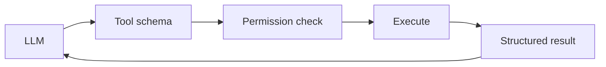
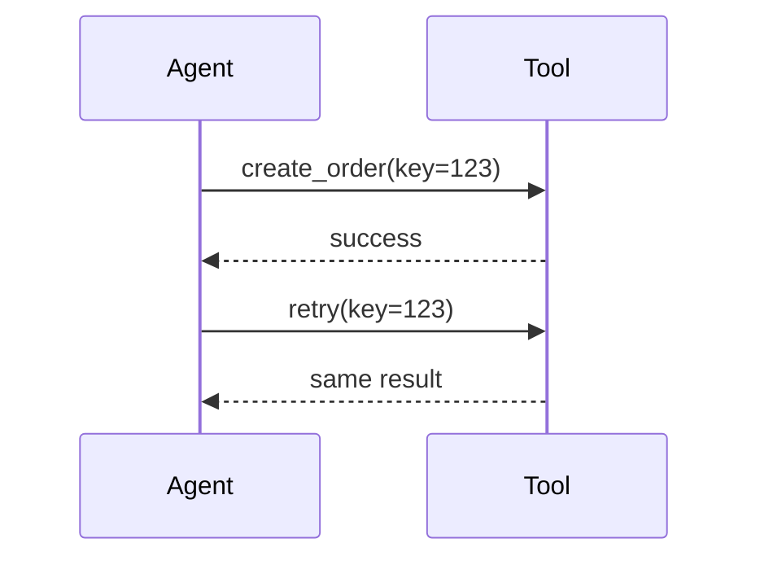
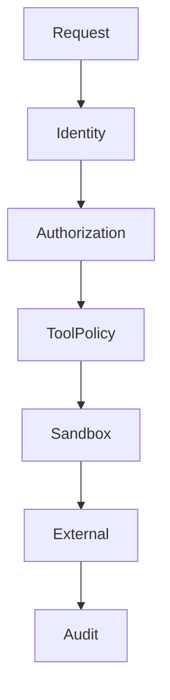

# 03 — Tools: Study Guide

## What is a tool?



A tool is a controlled bridge from model output to deterministic code.

## Tool anatomy

Every serious tool needs a name, purpose, input/output schema, authorization policy, timeout, retry behavior, idempotency behavior, and audit event.

## Narrow tools

Prefer `search_customer_orders(customer_id, date_range)` over `run_any_command(command)`. Narrow tools are easier to authorize, test, monitor, and explain.

## Side effects and idempotency



Retrying a side effect must not accidentally duplicate it. Use idempotency keys or an equivalent deduplication strategy.

## Failure model

Return structured errors such as:

```json
{"code":"TIMEOUT","retryable":true,"message":"backend timed out"}
```

Do not turn failures into empty strings that the model may interpret as valid data.

## Security layers



Validate model-generated parameters, enforce permissions independently, apply timeouts, and treat tool results as untrusted input.

## MCP

Learn MCP as an interoperability protocol for tools/resources. It does not replace application authorization, validation, logging, or sandboxing.

## Worked example

Build calculator, search, and file-reader tools. Register them explicitly, validate arguments, authorize each call, apply timeouts, execute, return structured results/errors, and record audit events.

## Best practices

- Prefer narrow tools.
- Separate discovery from authorization.
- Treat writes as higher risk than reads.
- Make retryable side effects idempotent.
- Test malformed and malicious inputs.

## References

- MCP: https://modelcontextprotocol.io/
- OpenAI Agents SDK: https://openai.github.io/openai-agents-python/

## Remember

**Every tool is a security boundary because it converts model intent into real effects.**
