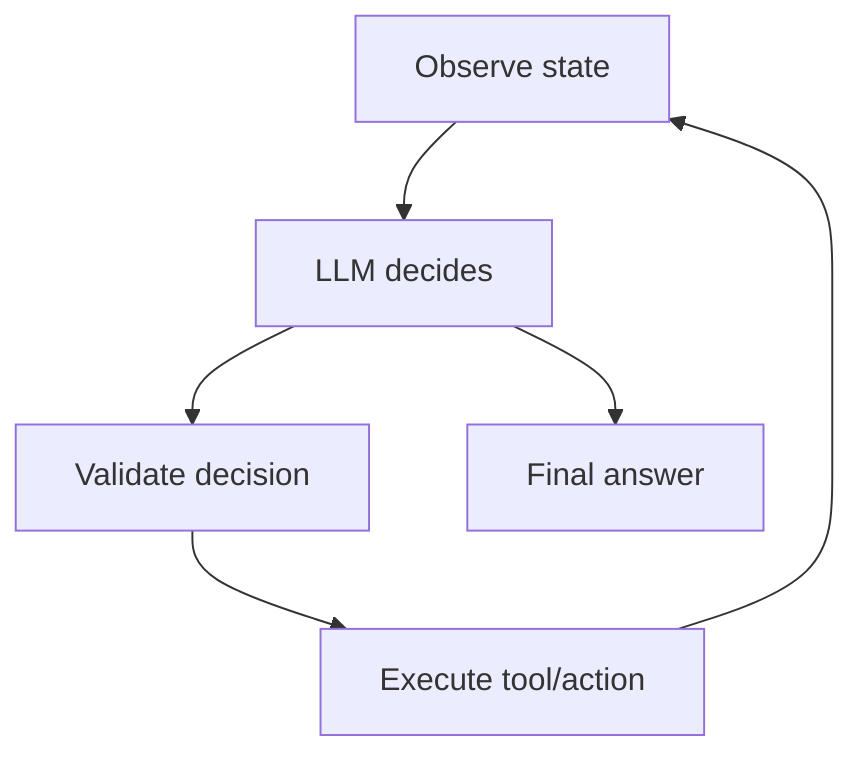
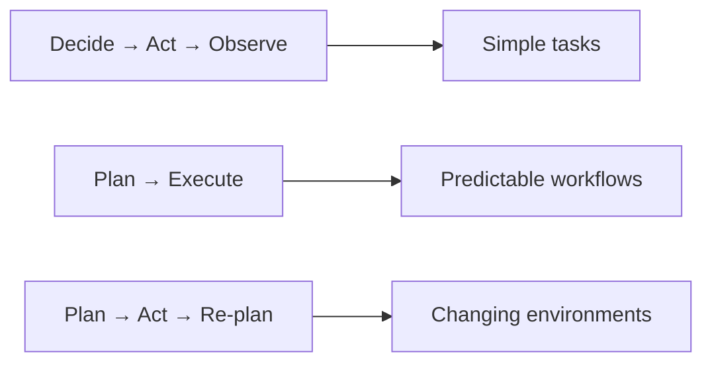
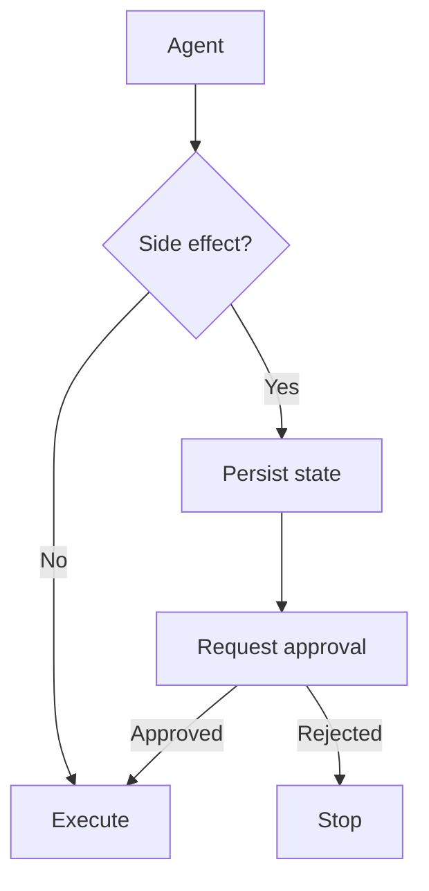

# 04 — Agents: Concept Notes

## What is an agent?

An agent is a bounded control loop in which an LLM chooses the next action using the current state.



The important concepts are state, permissions, budgets, and termination—not the loop syntax itself.

## Reactive vs planning



Start with the simplest strategy that meets the task requirement.

## Agent budgets

Every agent should have explicit limits:

```text
maximum turns
maximum tool calls
wall-clock deadline
token/cost budget
per-tool timeout
permission scope
```

These are safety controls as much as cost controls.

## Human approval



Persist before pausing so a process restart does not lose the pending operation.

## Memory integration

Current state answers “what do I need to continue this run?” Long-term memory answers “what should I retain for future runs?” Keep the two explicit.

## Worked example: research agent

Use three read-only tools: search, open source, summarize.

```text
question
  ↓
plan/search
  ↓
collect evidence
  ↓
verify sources
  ↓
synthesize
  ↓
cite
```

Limit it to a fixed number of turns and tool calls. Test a hostile document that attempts to redirect the agent.

## Best practices

1. Start with one agent.
2. Make every termination path explicit.
3. Prefer narrow tools.
4. Put budgets in code, not only prompts.
5. Persist state before side effects.
6. Evaluate traces, not only final answers.

## Remember
**An agent is a bounded decision system, not unlimited autonomy.**
