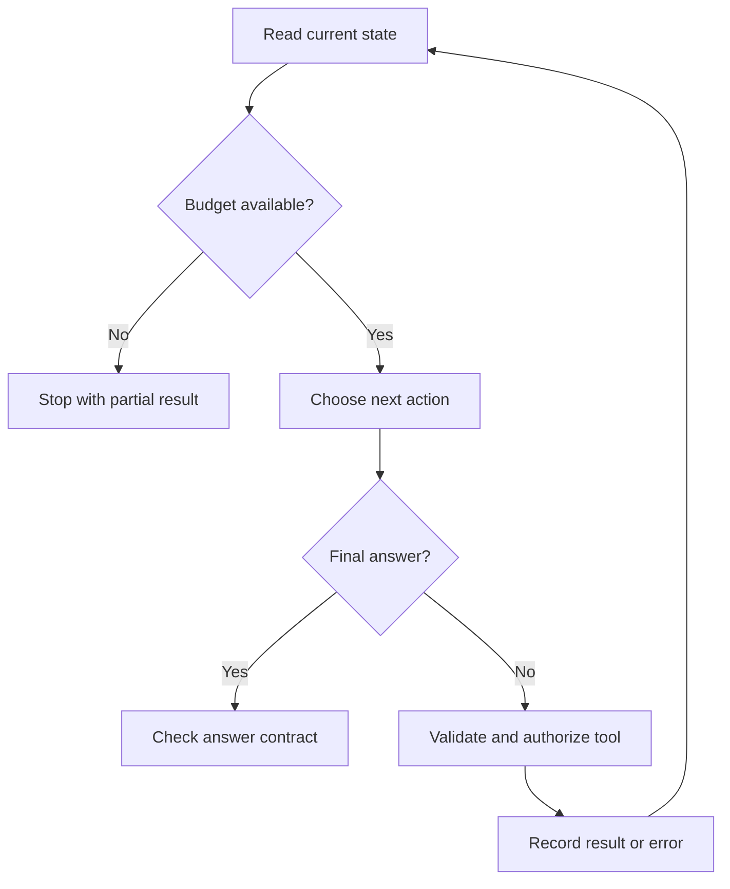

# Agents: explained step by step

[Section home](README.md) · [Exercises and quiz](PRACTICE.md)

## Goal and prerequisites

Use model APIs and tools to build a bounded decision loop. A deterministic workflow has predefined transitions; an agent lets a model choose some actions from observed state. Both can be useful. Choose an agent when the next useful step depends on information discovered during the task.

## 1. Trace one complete loop

For “What is the refund policy for order A?”, the agent first observes the question, proposes a lookup, receives a policy passage, and decides whether enough evidence exists to answer. The runtime checks the proposal before executing. Keep messages, observations, tool-call IDs, remaining budget, and terminal status explicit.

Every return to the top consumes resources. An error observation is still an observation; it should not reset the budget. A final answer can still fail output validation.

## 2. Reactive, planned, and hybrid behavior

A reactive agent chooses the next step after each observation. It adapts quickly but may repeat itself. A plan-first agent decomposes a stable task into steps but can cling to an outdated plan. A hybrid updates a plan when observations invalidate assumptions. Store a concise plan and evidence, not an unlimited transcript of speculative reasoning.

Reflection means checking work against criteria. A second model call saying “looks good” is not strong evidence by itself. Prefer deterministic checks for arithmetic, schemas, permissions, and citation existence. Use subjective review for properties such as clarity, with a defined rubric.

## 3. Stop conditions are application logic

Set independent limits on model turns, tool calls, elapsed time, and tokens or cost. Check remaining budget before each operation. Reserve a maximum potential output allowance when feasible, because discovering an overspend afterward is too late. Include terminal states such as `completed`, `needs_input`, `pending_approval`, `failed`, and `budget_exhausted`.

If each turn can propose several parallel calls, max turns alone does not bound tool count. Detect repeated identical calls to reduce loops, but do not confuse a legitimate repeated status check with a runaway agent. Define a polling policy separately.

## 4. Approval is durable state

Persist the exact proposed action, authenticated requester, approval ID, version/fingerprint, expiration, and status before asking a human. Resume only if the approval is valid for the current action. Denial and expiration are normal transitions. A restart must not silently treat pending work as approved.

This is human-in-the-loop control, not merely asking the model whether the human would agree. Editing a draft invalidates approval for the older draft unless an explicit versioned policy says otherwise.

## 5. Memory and context are selected inputs

Current state answers “what has happened in this run?” Long-term memory answers “what past information may help?” Retrieve only relevant, authorized memories. Avoid putting entire histories in every prompt: stale facts can distract the model and sensitive facts can leak. Preserve evidence IDs so the final answer can be audited without retaining unnecessary raw data forever.

## 6. Multi-agent patterns and their costs

| Pattern | Useful situation | Risk to test |
|---|---|---|
| Planner/executor | Separate decomposition from action | Plan becomes stale |
| Supervisor/specialists | Different capabilities or bounded contexts | Repeated delegation and bottlenecks |
| Agents as tools | Main agent needs a bounded specialist result | Nested budget consumption |
| Handoff | Another agent should own the next interaction | Lost state or permissions |
| Writer/critic | A rubric-based independent review helps | Shared model biases and false agreement |

Separate contexts can reduce irrelevant information, but summaries can lose evidence. Shared state can reduce duplication, but concurrent writes can conflict. Give each worker a bounded task and merge typed outputs deterministically. Multiple agents do not guarantee diversity or correctness; compare against a single-agent baseline on the same tasks and total budget.

## Worked run

Run `python 04-agents/examples/bounded_agent.py`. A scripted decision source chooses a lookup and then a final response. A second source repeats lookups until the budget stops it. This teaches runtime behavior; it is not a real LLM agent and makes no claim about model quality.

## References

- [ReAct paper](https://arxiv.org/abs/2210.03629): interleaving actions and reasoning in language models.
- [Tool contracts](../03-tools/DEEP-DIVE.md) and [durable workflows](../07-orchestration/DEEP-DIVE.md): enforcement and recovery.
