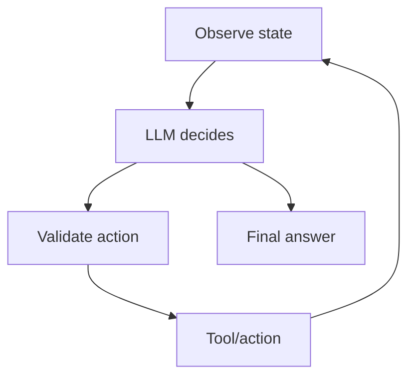
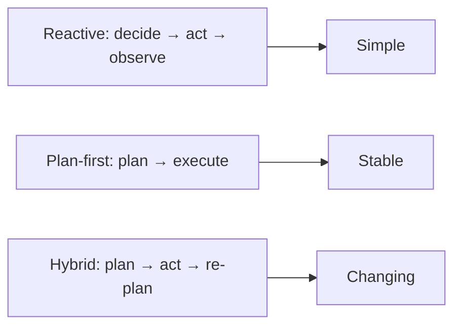
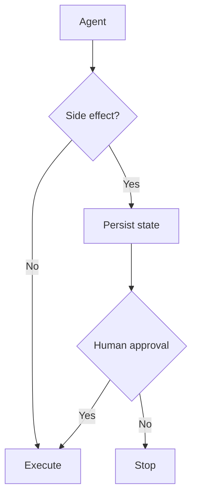

# 04 — Agents: Study Guide

## Agent mental model



An agent is a bounded decision loop, not an unlimited autonomous process.

## Minimal loop

```python
while turns < max_turns:
    decision = model(state)
    if decision.final:
        return decision.answer
    result = execute(decision.tool_call)
    state.add(decision, result)
```

The important engineering pieces are state, permissions, budgets, error handling, and termination paths.

## Reactive vs planning



Use the simplest strategy that wins on measured tasks.

## Budgets

Set maximum turns, tool calls, wall-clock time, token/cost budget, and per-tool timeout. A budget is a safety boundary.

## Human approval



Persist before waiting so a process restart does not lose the pending decision.

## Memory

Keep current run state separate from long-term memory. Retrieval should be explicit and bounded.

## Worked example

Build a research agent with search/open/summarize tools. Limit it to 8 turns and 12 tool calls, require citations, and test documents containing hostile instructions.

## Best practices

- Start with one agent before multi-agent designs.
- Make every stop condition explicit.
- Keep tools narrow.
- Enforce budgets outside the model.
- Persist before side effects.
- Record why tools were selected.

## Framework mapping

Map the same loop into OpenAI Agents SDK, PydanticAI, LangGraph, CrewAI, or Microsoft Agent Framework only after understanding the custom implementation.

## References

- OpenAI Agents SDK: https://openai.github.io/openai-agents-python/
- MCP: https://modelcontextprotocol.io/

## Remember

**Agent quality comes from controlling the loop, not simply making the model more autonomous.**
