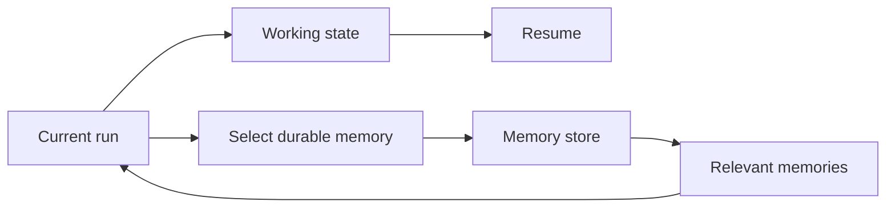
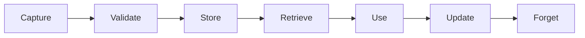
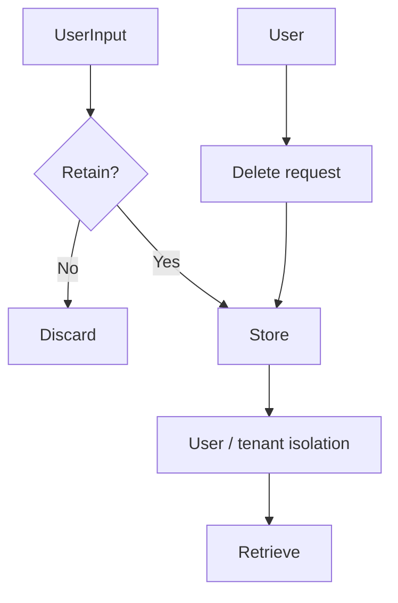

# 05 — Memory: Concept Notes

## State vs memory



State is required to continue the current execution. Memory is retained because it may be useful later.

## Memory types

| Type | Example | Typical lifetime |
|---|---|---|
| Working | current research notes | task |
| Conversation | recent messages | session |
| Semantic | user preference | long-term |
| Episodic | previous interaction | long-term |

Do not treat every message as permanent memory.

## Memory lifecycle



Forgetting is a feature. Add TTLs, correction, export, and deletion where appropriate.

## Example memory record

```text
id
scope/user_id
kind
content
source
confidence
created_at
updated_at
expires_at
```

Provenance tells you why the memory exists.

## Retrieval choices

Start with exact/keyword retrieval. Introduce semantic retrieval only when measured requirements justify it. A vector store is not automatically the right memory store.

## Privacy model



Cross-user retrieval tests are mandatory for multi-tenant systems.

## Worked example

User says: “I prefer concise answers.”

1. classify it as a preference
2. store provenance and timestamp
3. retrieve it only when style is relevant
4. let the user inspect it
5. allow deletion

## Best practices

- Store selectively.
- Preserve provenance.
- Scope by user/tenant.
- Test stale and contradictory memories.
- Make deletion verifiable.

## Remember
**Good memory is selective, scoped, inspectable, and removable.**
