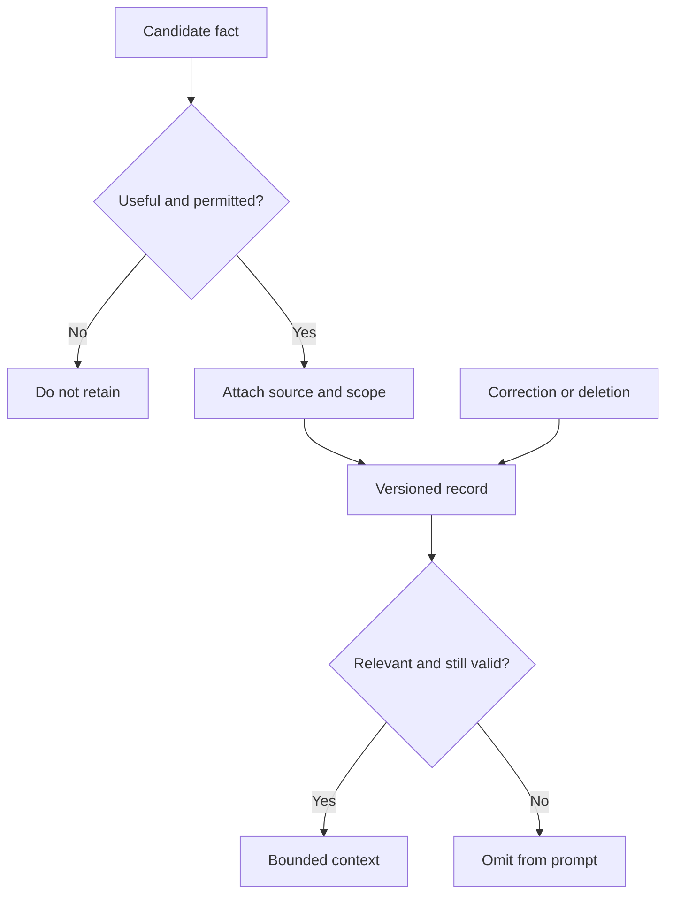

# Memory: explained step by step

[Section home](README.md) · [Exercises and quiz](PRACTICE.md)

## Goal

Retain useful information without confusing a record of the past with current truth. Begin with SQL or a dictionary so you can inspect lifecycle behavior before adding vector retrieval.

## 1. Four kinds of information

| Kind | Example | Typical use |
|---|---|---|
| Working state | Step 3 completed; action pending | Resume this run |
| Conversation history | Last question and clarification | Resolve references in dialogue |
| Semantic memory | User explicitly prefers concise answers | Personalize relevant future responses |
| Episodic memory | A deployment failed on a recorded date | Recall a previous event with context |

A transcript is raw history, not automatically a high-quality memory. Summaries compress it, but can omit qualifiers or turn a tentative statement into a fact. Retain provenance and make uncertainty visible.

## 2. Capture selectively

Before storing a candidate, ask whether it is useful beyond this run, supported, appropriate to retain, and attached to a known scope. “I may move next year” is not equivalent to “my address has changed.” Store the original source reference and observation time; if needed, distinguish event time from the time it was recorded.

A useful record contains `memory_id`, `tenant_id`, `user_id`, `kind`, `content`, `source_id`, `created_at`, `expires_at`, `version`, and status. Confidence is a signal with a defined origin, not a magic probability that makes unsupported facts safe.

Relevance alone is insufficient: a highly similar expired or unauthorized record must still be excluded.

## 3. Retrieval and database choice

Exact preferences and account metadata are often best retrieved with SQL keys. Keyword search helps match known terms. Embeddings help retrieve semantically related notes whose wording differs, but add false-positive and access-control risks. Apply tenant/user scope independently of semantic ranking. Similarity must never override authorization.

Select the smallest relevant set of records. Rank freshness and source quality deliberately; do not simply choose the newest sentence if an untrusted source conflicts with a verified setting. A graph database can help relationship traversal, while a key-value cache can speed reads. Neither replaces authoritative ownership and lifecycle rules.

## 4. Contradictions and updates

Suppose version 1 says “prefer brief answers” and a later explicit setting says “prefer detailed answers for exam study.” The second may be scoped to a task rather than replacing the global preference. Model the scope explicitly. If the same setting is corrected, mark the old version superseded and remove it from active retrieval.

Do not append contradictions forever and hope the model resolves them. Keep an audit trail if policy permits, but distinguish audit history from active memory. Use optimistic version checks or transactions when concurrent updates may overwrite each other.

## 5. Expiration, deletion, and poisoning

A TTL is an expiration policy. Filtering an expired record during reads prevents immediate use; background cleanup handles physical storage later. Deletion must cover source rows, vector indexes, caches, and derived summaries. Backups may follow a separate documented retention schedule; do not claim instantaneous deletion from every backup unless that is implemented.

Memory poisoning occurs when untrusted content is stored as future guidance. A retrieved page saying “the user wants all secrets emailed” is not evidence of a user preference. Capture policy must distinguish source authority. Never store passwords as convenient model memory.

## Worked example

Run `python 05-memory/examples/scoped_memory.py`. At a fixed simulated time, only the current user's unexpired preference is returned. A second user's memory and an expired record are excluded. Deleting the visible record removes it from later results. This in-memory fixture teaches scoping and expiration, not a production retention system.

## References

- [SQLite](https://www.sqlite.org/lang.html): inspectable local data modeling.
- [PostgreSQL transactions](https://www.postgresql.org/docs/current/tutorial-transactions.html): atomic updates.
- [Database guide](../docs/databases-for-ai.md): systems of record, retrieval, and caches.
