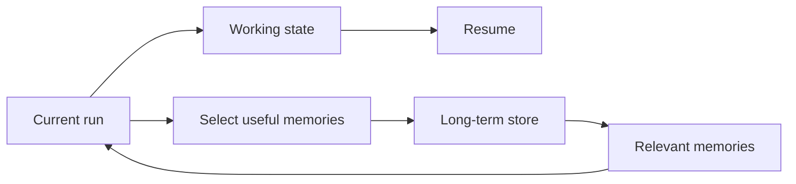
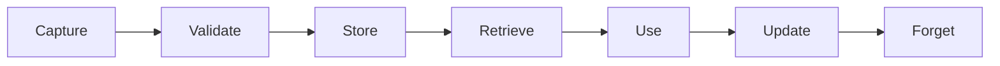
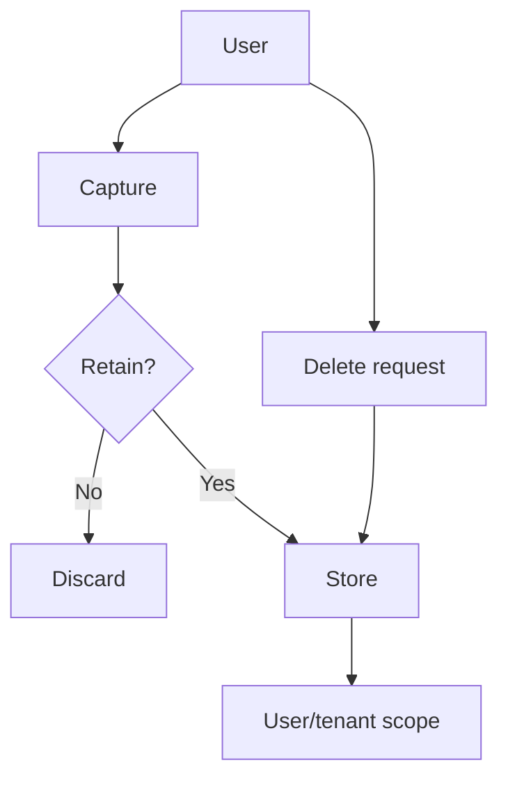

# 05 — Memory: Study Guide

## State vs memory



State is information required to continue the current execution. Memory is retained because it may help later.

## Memory types

- Working memory: temporary task context.
- Conversation memory: recent dialogue.
- Semantic memory: facts/preferences.
- Episodic memory: prior events.

Choose the type according to retention and retrieval needs.

## Lifecycle



Forgetting, correction, TTLs, and deletion are part of the design—not afterthoughts.

## Example record

```text
memory_id | scope | kind | content | source | confidence | expires_at
```

Keep provenance so you can explain why a memory exists.

## Retrieval

Start with SQL/keyword lookup. Add semantic retrieval when it solves a measured problem. A vector database is not automatically the correct memory store.

## Privacy



Test cross-user access, stale memories, contradictions, and poisoned memories.

## Worked example

Capture “I prefer concise answers” as a durable preference, store its source and timestamp, retrieve it only when style matters, and expose inspect/delete operations.

## Best practices

- Capture selectively.
- Store provenance and confidence.
- Scope memories by user/tenant.
- Add expiration where appropriate.
- Make deletion observable.
- Never assume retention is forever.

## References

- SQLite: https://www.sqlite.org/docs.html
- PostgreSQL: https://www.postgresql.org/docs/
- JSON Schema: https://json-schema.org/

## Remember

**Good memory is selective, inspectable, scoped, and removable.**
