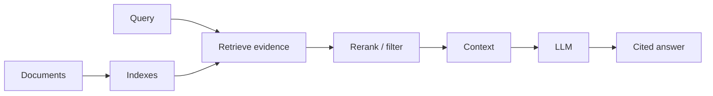
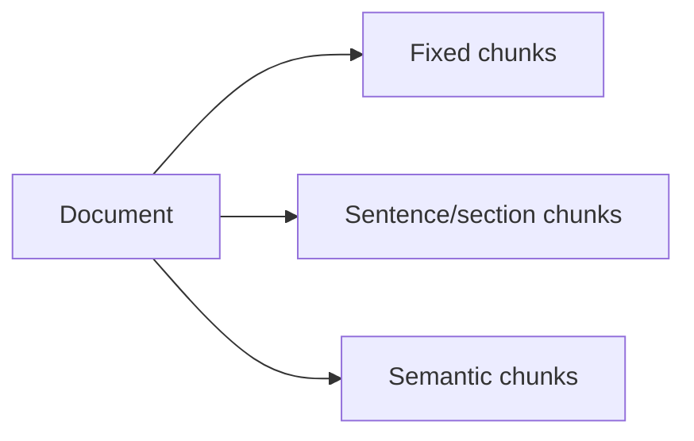
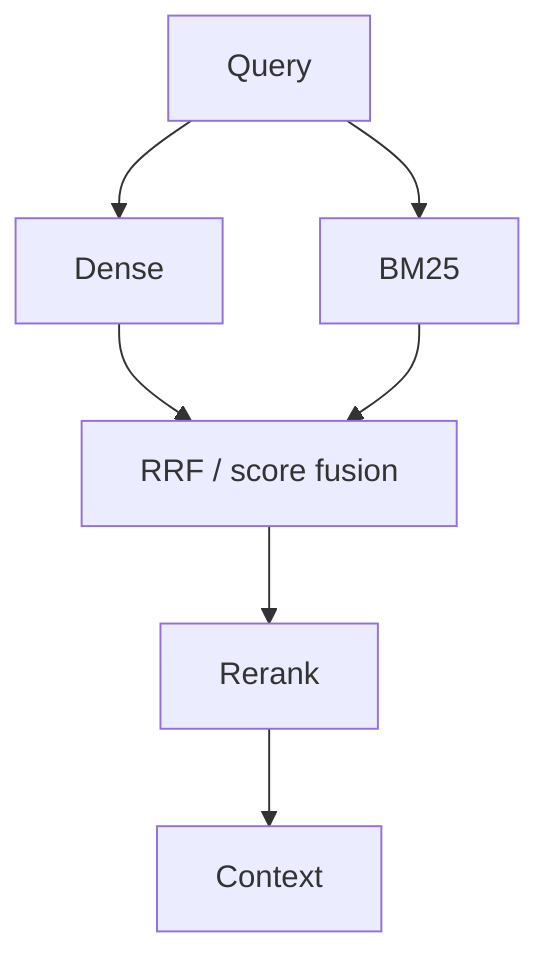

# 06 — RAG: Concept Notes

## RAG is two systems

RAG combines retrieval with generation.



The vector database is only one possible retrieval component.

## Dense vs sparse retrieval

```text
Dense / vector
query → embedding → semantic nearest neighbors

Sparse / lexical
query → terms/BM25 → exact and lexical matches

Hybrid
      dense + sparse
             ↓
          fusion
             ↓
          reranker
```

Dense search is strong for meaning. Sparse search is often strong for identifiers, names, error codes, and exact terminology.

## Chunking

A document must be split into retrievable units.



There is no universal best chunk size. Benchmark chunking against representative questions.

## Vector search

An embedding maps content to a vector. Search compares query and document vectors using a similarity function.

```text
query → vector q
chunk A → vector a
chunk B → vector b

similarity(q,a) > similarity(q,b)
→ retrieve A first
```

Exact nearest-neighbor search compares broadly against the index. ANN methods trade some recall or tuning complexity for much faster search at scale.

## HNSW and IVFFlat

```text
Exact
all candidates → highest similarity

ANN
index structure → small candidate set → highest similarity among candidates
```

HNSW and IVFFlat expose different speed, memory, build, and recall trade-offs. Measure them instead of copying defaults.

## Hybrid retrieval



Hybrid retrieval is useful when you need both semantic understanding and exact lexical matching.

## Database selection

```text
Relational state + vectors → PostgreSQL + pgvector
Search + lexical + filters → Elasticsearch/OpenSearch
Dedicated semantic retrieval → Qdrant / Weaviate / Pinecone
Document-centric data → MongoDB + vector search
```

The right choice depends on workload, filtering, update patterns, scale, operations, and existing infrastructure.

## Worked example

For technical documentation, benchmark:

1. BM25
2. dense top-k
3. hybrid fusion
4. hybrid + reranker

Then compare retrieval recall, citation correctness, answer quality, latency, and cost.

## Best practices

- Preserve source and version metadata.
- Enforce tenant/permission filters before generation.
- Evaluate retrieval independently from generation.
- Test unanswerable and conflicting questions.
- Keep only as much context as needed.

## Remember
**RAG quality starts with finding the right evidence; generation cannot recover evidence that retrieval missed.**
