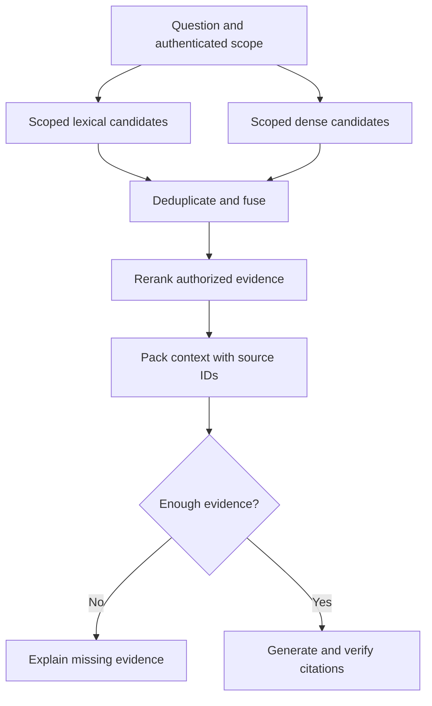

# Retrieval-augmented generation: explained step by step

[Section home](README.md) · [Exercises and quiz](PRACTICE.md)

## Goal

Answer from authorized evidence and know when evidence is missing. RAG changes the model's input at inference time; it does not retrain its weights. Study ingestion and query execution separately so you can identify which half failed.

## 1. Ingestion: preserve meaning and identity

Parse documents, clean formatting noise, and split into retrievable chunks. Keep document ID, chunk ID, section, version, source, and permissions. Table cells without headers can become misleading after extraction. A chunk saying “30 days” needs enough surrounding context to say what the deadline applies to.

Chunk size trades context completeness against precision. Overlap can preserve a sentence at a boundary but duplicates tokens and can crowd retrieval with near-identical passages. Try a heading-aware split before arbitrary character counts. When a document changes, replace or retire its old chunks; otherwise obsolete policies can outrank the new version.

## 2. Lexical and dense retrieval

Lexical retrieval matches terms. BM25 uses term frequency, rarity, and length normalization; it is stronger than the toy set-overlap example provided here. Dense retrieval embeds queries and chunks into a compatible vector space. It can connect “how to get money back” with “refund policy” but may miss exact identifiers.

For normalized vectors, cosine similarity equals dot product. A score is relative to the representation and corpus, not a calibrated confidence in factual truth. Changing embedding models generally requires re-embedding indexed documents; matching dimension alone does not make vector spaces compatible.

## 3. Exact and approximate vector search

Exact search compares the query with every eligible vector. Approximate nearest-neighbor search reduces work at the cost of potentially missing neighbors. HNSW uses a navigable graph; IVFFlat partitions vectors and scans selected partitions. Their tuning affects recall, latency, memory, and build time. Measure approximate recall against an exact baseline on the same corpus.

A relational database stores authoritative records and constraints; a vector index supports similarity ranking. They can coexist. PostgreSQL with a vector extension, dedicated retrieval stores, and search engines offer different operational trade-offs. Also learn document stores, key-value caches, graph stores, and analytical stores in the [database guide](../docs/databases-for-ai.md).

## 4. Hybrid search and reranking

Combine lexical and dense candidate lists when both exact terms and meaning matter. Scores may use incompatible scales, so averaging raw scores can be misleading. Reciprocal rank fusion (RRF) uses rank: a document gets `1 / (k + rank)` from each list containing it. With `k=60`, ranks 1 and 2 contribute `1/61 + 1/62`, approximately 0.03252. Missing from a list means no contribution from that list.

A reranker scores query-candidate pairs in more detail. It can reorder candidates but cannot recover a relevant document absent from all candidates. Query rewriting can improve recall but may drift from the user's intent; preserve original constraints such as dates and IDs.

Filtering must occur before protected content reaches the model or an unauthorized external reranker. Enforce access within retrieval where supported and verify it again before exposing content. Filtering only after a global top-k can starve a user's candidate set.

## 5. Grounding is claim-level work

A citation is useful only if its source supports the associated claim. Validate that cited IDs exist in the selected evidence; then check entailment or human-reviewed support. A valid source ID does not itself prove a sentence is supported. Conflicting sources need explicit handling, such as preferring the authoritative current policy and reporting unresolved conflict.

Use abstention when the corpus lacks an answer. Agentic RAG lets a model decide to retrieve again, rewrite a query, or consult another source. That can help multi-hop questions but needs the budgets and permissions from the agent chapter.

## 6. Evaluate retrieval separately

If three relevant documents exist and top-5 retrieves two, recall@5 is `2/3`. If only those two among the five results are relevant, precision@5 is `2/5`. For unanswerable questions with no relevant documents, define a separate abstention metric rather than dividing by zero. Then evaluate answer correctness, evidence support, citation correctness, latency, and cost.

Run `python 06-rag/examples/hybrid_search.py`. Hand-ranked toy lists demonstrate fusion, tenant filtering, and recall. It is not a trained embedding model, BM25 implementation, or performance benchmark.

## References

- [RAG paper](https://arxiv.org/abs/2005.11401): retrieval plus generation.
- [pgvector](https://github.com/pgvector/pgvector): exact and approximate search behavior.
- [RRF paper](https://plg.uwaterloo.ca/~gvcormac/cormacksigir09-rrf.pdf): rank fusion method.
