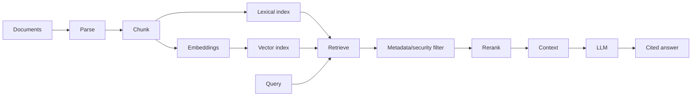
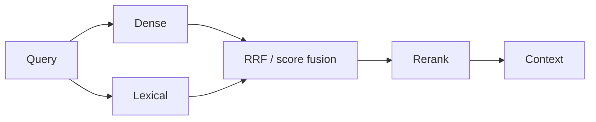

# 06 — RAG: Study Guide

## RAG in one picture



RAG is a retrieval system plus generation. A vector database is only one component.

## Ingestion

Understand parsing, cleaning, chunking, metadata, document versions, duplicate detection, and provenance. Preserve `document_id`, section, source, version, tenant, and permissions.

## Dense vs sparse

```text
semantic question → dense retrieval
exact identifier  → lexical/sparse retrieval
both             → hybrid retrieval
```

Dense retrieval captures semantic similarity. Sparse/BM25 retrieval is often stronger for exact names, IDs, codes, and rare terms.

## Vector search

Study cosine/dot-product similarity, exact nearest-neighbor search, approximate nearest-neighbor search, and indexes such as HNSW and IVFFlat. Benchmark recall, latency, memory, and indexing time rather than copying defaults.

## Hybrid retrieval



Use hybrid retrieval when exact and semantic signals are both important.

## Query processing

Compare:

```text
query → retrieve → generate
query → rewrite → retrieve → rerank → generate
query → dense+lexical → fuse → rerank → generate
```

Only keep added complexity when evaluation demonstrates improvement.

## Database choices

```text
PostgreSQL + pgvector → relational state + vectors
Elasticsearch/OpenSearch → lexical search + filters + vector/hybrid
Qdrant/Weaviate/Pinecone → retrieval-first/vector workloads
MongoDB/Redis → vector search alongside existing application data
```

Study the database decision guide in `../docs/databases-for-ai.md`.

## Grounded generation

Require source IDs/citations and a clear “not enough evidence” behavior. Security filters must happen independently from semantic similarity.

## Worked example

Take 100 technical questions and compare dense-only, BM25-only, hybrid, and hybrid+reranker. Measure recall@k, citation correctness, groundedness, answer quality, latency, and cost.

## Best practices

- Preserve provenance.
- Keep retrieved context small.
- Filter permissions before generation.
- Evaluate retrieval separately from generation.
- Include unanswerable and conflicting cases.

## References

- RAG paper: https://arxiv.org/abs/2005.11401
- Sentence Transformers: https://www.sbert.net/
- FAISS: https://faiss.ai/
- pgvector: https://github.com/pgvector/pgvector
- Elasticsearch: https://www.elastic.co/docs/solutions/search
- LlamaIndex: https://docs.llamaindex.ai/

## Remember

**Better generation cannot compensate for missing or unauthorized evidence.**
