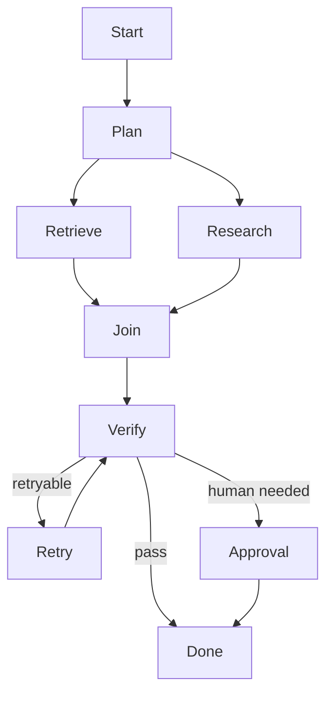
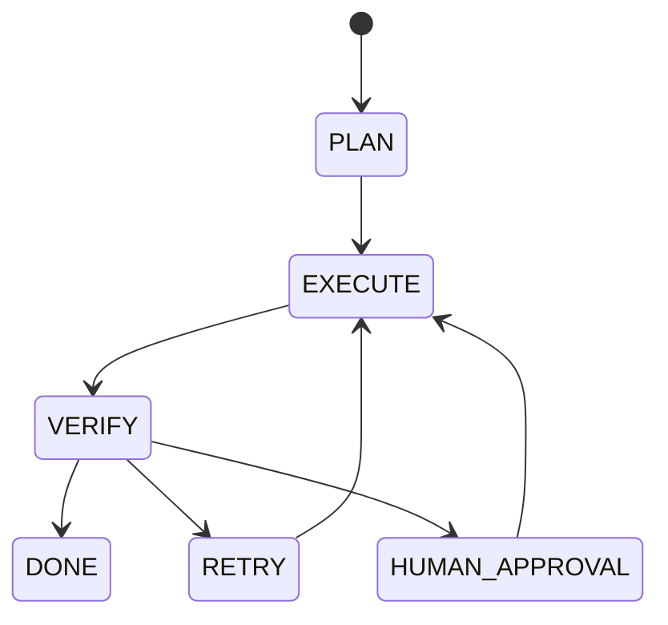

# 07 — Orchestration: Concept Notes

## Why orchestration exists

A single agent loop handles local decisions. Orchestration handles a process with multiple steps, state transitions, retries, concurrency, and human pauses.



## Deterministic vs model-driven work

Keep predictable operations in code. Use an LLM where judgment is required.

```text
ingest → classify(LLM) → retrieve → generate(LLM) → validate → publish
```

## State machines



Every state and transition should be observable and, where necessary, persisted.

## Parallelism

Independent work can run concurrently:

```text
          ┌→ search A ┐
question ─┼→ search B ┼→ merge → synthesize
          └→ search C ┘
```

Parallel execution can lower latency but increases capacity usage and coordination complexity.

## Durable execution

The real requirement is:

```text
start → work → crash → restart → resume → finish
```

For side effects, use idempotency or compensation so retries do not duplicate work.

## Worked example

Research workflow:

1. parse question
2. create search plan
3. run three searches concurrently
4. deduplicate sources
5. draft answer
6. verify claims
7. request approval when required
8. publish

## Best practices

- Use explicit state schemas.
- Persist checkpoints around important transitions.
- Bound retries and timeouts.
- Make side effects idempotent.
- Separate retryable from permanent failures.
- Prefer deterministic joins and merges.

## Remember
**Orchestration makes multi-step AI work inspectable, resumable, and safe to retry.**
