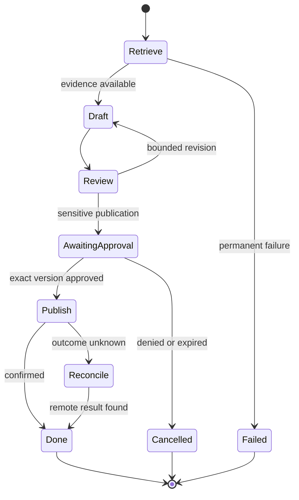

# Orchestration: explained step by step

[Section home](README.md) · [Exercises and quiz](PRACTICE.md)

## Goal

Make multi-step work understandable after a crash, delay, retry, or human pause. Orchestration owns transitions and recovery. An agent may make a local decision inside one step without controlling the entire workflow.

## 1. Model work as explicit state

Represent a research job with `job_id`, `status`, `version`, inputs, evidence IDs, completed steps, pending action, and error. A state machine restricts valid transitions. An event log records what happened; a checkpoint stores enough current state to resume. They are related but not identical.

The `Reconcile` branch prevents treating every timeout as an invitation to republish. Revision cycles need a limit even though the diagram draws a loop.

## 2. Branches, parallelism, and joins

Run independent searches concurrently. If search B needs an ID returned by A, they are dependent and must be ordered. Specify whether a join requires all results or accepts a partial subset. Assign each result a stable task ID and deduplicate before merging. Avoid having workers mutate the same unprotected dictionary or document.

If independent tasks take 2, 3, and 5 seconds, ideal parallel latency is about 5 seconds plus coordination overhead, compared with 10 seconds sequentially. Actual performance depends on contention, quotas, and retries. Define how cancellation propagates if one required task fails.

## 3. Checkpoint before a pause, and understand the crash gap

A durable checkpoint survives process exit. A variable in memory does not. Store a versioned state transition in a transaction. Resume from the last committed transition rather than restarting the whole workflow automatically.

However, a checkpoint does not make remote side effects atomic. If publishing succeeds and the worker crashes before saving “published,” a restart may repeat publication. Receiver-side idempotency, remote status lookup, or an outbox plus a suitable delivery/deduplication design is needed. At-least-once delivery means duplicates are possible.

## 4. Retry, idempotency, and compensation

Retry only operations known to be safe or deduplicated, within a deadline and attempt budget. An idempotent write has the same logical effect under repetition. A compensating action attempts to undo a prior business effect, such as cancelling a reservation. Compensation may fail and may not restore the original world perfectly; sending another email cannot erase the first email from a recipient's memory.

Use optimistic version checks when two workers can resume the same job. A lease can reduce duplicate work, but a stale worker may continue after lease expiry; fencing or equivalent server-side version enforcement may be necessary for critical writes.

## 5. Human pauses and queued work

A pending approval should release compute resources and retain durable state. Authenticate the approver, validate expiration and action version, then atomically claim the transition. Duplicate callbacks must not create duplicate actions. Store a deliberate `unknown` or `reconciling` status when the external outcome cannot be confirmed.

A queue decouples request acceptance from execution. Return a job ID, expose status, and define cancellation behavior. Queues still need capacity, backpressure, retry limits, dead-letter handling, and retention policies.

## 6. Framework mapping without hiding semantics

A graph runtime such as LangGraph models state and edges; its persistence and interrupt mechanisms support pause/resume when configured appropriately. A durable workflow engine provides additional execution and recovery machinery. In either case, you still define side-effect safety and failure policy. Do not assume a framework checkpointer provides exactly-once remote writes.

Run `python 07-orchestration/examples/checkpoint_resume.py`. It uses a temporary SQLite database, deliberately fails after a committed intermediate step, and resumes using a new connection. No external action occurs. It demonstrates local recovery, not a distributed transaction.

## References

- [LangGraph overview](https://docs.langchain.com/oss/python/langgraph/overview): graph/state runtime; checked 2026-09-27.
- [Temporal documentation](https://docs.temporal.io/): durable workflow concepts.
- [SQLite transactions](https://www.sqlite.org/lang_transaction.html): commit and rollback.
