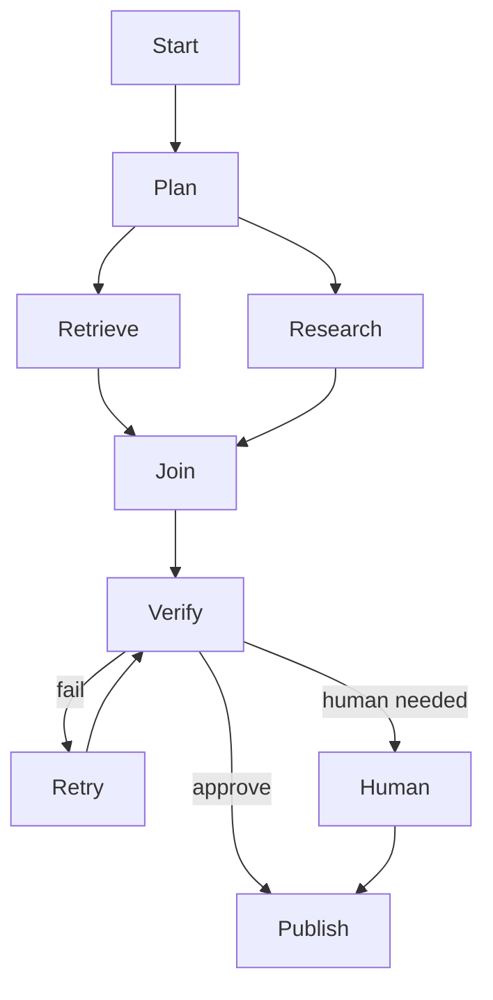
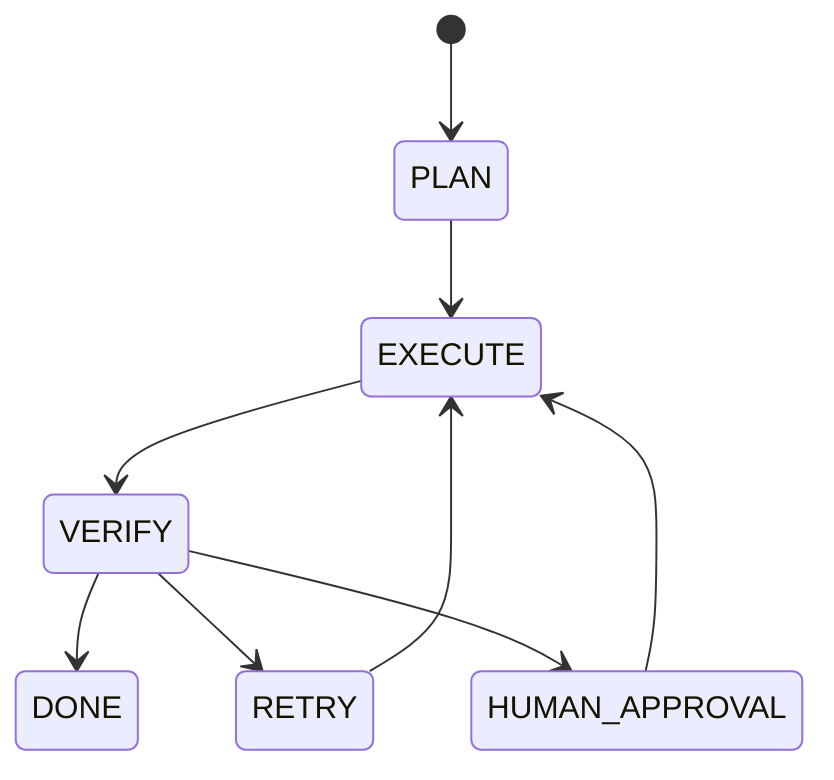

# 07 — Orchestration: Study Guide

## Why orchestration?

An agent loop handles local decisions. Orchestration manages multi-step state, branching, parallel work, retries, checkpoints, queues, and human pauses.



## Deterministic vs model-driven steps

Prefer deterministic code for deterministic work and use the model where judgment is genuinely required:

```text
ingest → classify(LLM) → retrieve → generate(LLM) → validate → publish
```

## State machines



Persist state before irreversible transitions.

## Parallelism

Run independent retrieval/research tasks concurrently, then merge deterministically. Measure whether the latency gain justifies added complexity and resource usage.

## Durable execution

The important scenario is:

```text
start → work → crash → restart → resume → finish
```

Use idempotency or compensation for side effects so retries do not duplicate actions.

## Worked example

Build a research workflow that creates a plan, performs three parallel searches, deduplicates evidence, drafts, verifies claims, requests approval for low-confidence output, then resumes and publishes.

## Best practices

- Explicit typed state.
- Durable checkpoints.
- Bounded retries.
- Clear retriable/non-retriable steps.
- Idempotent side effects.
- Audit trail for transitions.

## Framework mapping

Study LangGraph for explicit graph/state execution; compare with Microsoft Agent Framework and durable workflow engines such as Temporal when long-running execution becomes central.

## References

- LangGraph: https://docs.langchain.com/oss/python/langgraph/overview
- Temporal: https://docs.temporal.io/
- Microsoft Agent Framework: https://learn.microsoft.com/en-us/agent-framework/

## Remember

**Orchestration makes AI workflows inspectable, resumable, and safe to retry.**
