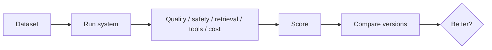
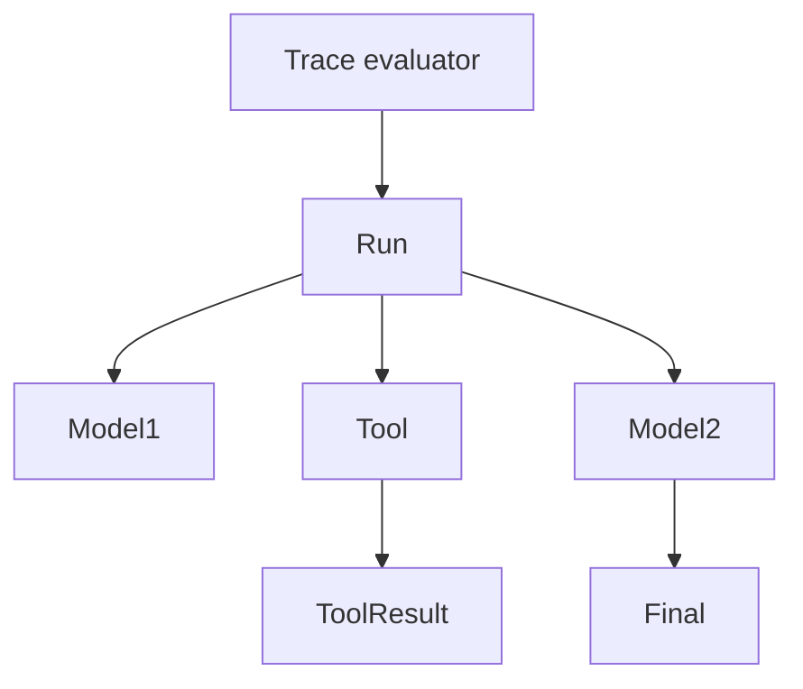

# 08 — Evaluation: Concept Notes

## Why evaluation is different

AI systems can produce multiple acceptable answers, and a plausible-looking answer can still be wrong or unsafe.



Evaluation is the evidence behind engineering decisions.

## Evaluation layers

```text
unit tests
   ↓
component evaluation
   ↓
trace evaluation
   ↓
end-to-end task evaluation
   ↓
adversarial testing
```

## Golden datasets

Start with representative cases, including:

- normal requests
- edge cases
- unanswerable requests
- malformed inputs
- malicious inputs
- long contexts
- conflicting evidence

Store dataset versions so results remain comparable.

## Deterministic metrics

Examples:

```text
schema validity
exact match
required fields
correct tool name
correct tool arguments
retrieval recall@k
citation presence
latency
cost
```

Use deterministic metrics whenever the task allows it.

## LLM-as-judge

Use judges for qualities such as helpfulness or groundedness when exact scoring is difficult. Calibrate judge scores against human labels and inspect disagreements.

## Trace evaluation



A final answer may look correct while the trace reveals an unnecessary tool call, unsafe action, or unsupported retrieval.

## Regression testing

Pin:

```text
model version
prompt version
dataset version
retrieval configuration
framework version
```

Run the same suite after meaningful changes.

## Worked example

For a RAG assistant, report:

```text
recall@5
citation correctness
groundedness
answer correctness
p50/p95 latency
cost
safety failures
```

Compare dense-only and hybrid retrieval instead of deciding from a single demo.

## Best practices

1. Measure before optimizing.
2. Separate retrieval and generation failures.
3. Keep subjective judges calibrated.
4. Store historical scores.
5. Test safety together with quality.

## Remember
**A demo shows possibility; an evaluation suite shows reliability.**
