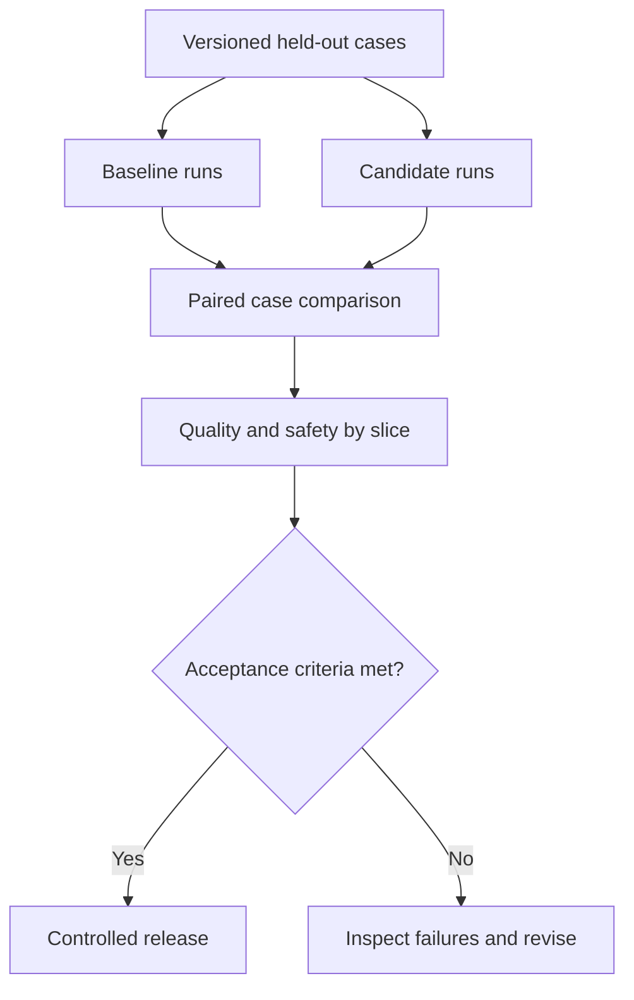

# Evaluation: explained step by step

[Section home](README.md) · [Exercises and quiz](PRACTICE.md)

## Goal

Determine whether a change improves the behavior you need. A program can run without exceptions while returning a wrong answer, leaking a document, or using the wrong tool. Evaluate the system at several layers and keep safety failures visible separately from average quality.

## 1. Build a representative dataset

Start with a small inspectable set, then expand coverage. Each case needs an ID, input, expected behavior or rubric, source evidence where applicable, and a slice such as normal, ambiguous, unanswerable, adversarial, or long input. Use synthetic data for initial labs and scrub private data before sharing fixtures.

Separate development examples from a held-out test set. If you tune prompts repeatedly against the same test answers, it becomes development data. Include realistic frequency and difficult low-frequency failures; report both overall and per-slice results so common easy cases cannot hide rare severe ones.

## 2. Choose the metric that matches the question

| Layer | Example check | What it cannot establish alone |
|---|---|---|
| Unit | Parser rejects missing fields | Real model accuracy |
| Component | Retrieval recall@k | Final answer support |
| Tool trajectory | Correct tool and authorized arguments | Writing quality |
| End-to-end | Task solved with supported claims | Every internal step was safe |
| Adversarial | Injection cannot trigger a forbidden action | Safety against all future attacks |

A trace can reveal unnecessary searches, unauthorized proposals, repeated retries, and budget misuse even when the final answer looks good. Decide whether to score proposed unsafe actions, executed unsafe actions, or both; they mean different things.

## 3. Classification metrics with arithmetic

Suppose a detector has true positives 8, false positives 2, false negatives 4, and true negatives 86. Accuracy is `(8+86)/100 = 94%`. Precision is `8/(8+2) = 80%`. Recall is `8/(8+4) = 66.7%`. F1 is `2*precision*recall/(precision+recall)`, about 72.7%.

The high accuracy hides four missed positives. Whether precision or recall matters more depends on the cost of false alarms and misses. Define zero-denominator handling explicitly. For retrieval, recall uses the number of relevant items, while precision uses the number of returned items.

## 4. Judge-based scoring

An LLM judge can help assess clarity or relevance where exact matching is too rigid. Give it a rubric and references, calibrate it on human-labeled examples, and inspect disagreement. Judges can prefer longer answers, favor one position in pairwise comparisons, and be manipulated by text inside the answer. Blind system identities and swap answer order when testing pairwise comparisons.

Use deterministic checks for schemas, permission violations, numeric answers, and known tool arguments. A judge should not override a known authorization failure because the answer sounds helpful.

## 5. Compare versions fairly

Use the same cases and controlled settings for both versions. Record prompt, model identifier, code commit, dataset hash, retrieval configuration, and dependency versions. Repeated runs estimate variability; a single run cannot characterize a stochastic system. With small samples, show counts and uncertainty rather than claiming a tiny percentage gain is conclusive.

A release gate may require zero observed unauthorized actions, minimum task success, and bounded latency/cost. Zero observed failures in a small test set is not proof that the true failure probability is zero.

## 6. Worked regression decision

Suppose baseline solves 8 of 10 cases and candidate solves 9, but the candidate executes one forbidden action. Under a zero-observed-unsafe-actions gate, reject the candidate despite its higher completion rate. Next inspect the affected trace and repair enforcement before tuning wording.

Run `python 08-evaluation/examples/score_predictions.py`. It computes the confusion-matrix example and rejects a fixture release with one unsafe action. These are synthetic data, not measured model results.

## References

- [Scikit-learn model evaluation](https://scikit-learn.org/stable/modules/model_evaluation.html): metric definitions and caveats.
- [RAG evaluation exercise](../06-rag/PRACTICE.md): retrieval denominators.
- [NIST AI Risk Management Framework](https://www.nist.gov/itl/ai-risk-management-framework): risk measurement and management.
