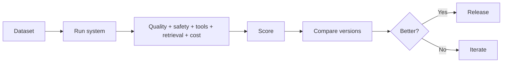
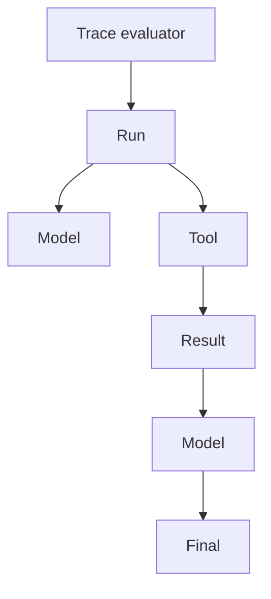

# 08 — Evaluation: Study Guide

## Evaluation loop



AI evaluation must look beyond whether code executed successfully.

## Golden datasets

Start with 25–100 representative examples and include happy paths, edge cases, unanswerable requests, malicious inputs, long inputs, and conflicting evidence.

## Evaluation layers

```text
unit → component → trace → end-to-end → adversarial
```

Use exact/schema metrics where possible. Examples: tool argument correctness, retrieval recall@k, citation presence/correctness, latency, cost, unsafe-action rate.

## LLM-as-judge

Use judges for subjective properties such as relevance or style. Calibrate against human labels, inspect disagreements, and remember that the judge is itself probabilistic.

## Trace evaluation



A final answer can look plausible even when the system chose the wrong tool or retrieved poor evidence.

## Regression

Record model version, prompt version, dataset version, retrieval configuration, and framework version. Rerun the same suite after meaningful changes.

## Worked example

Benchmark a RAG assistant with retrieval recall@5, citation correctness, groundedness, answer correctness, p50/p95 latency, cost, and security failures. Compare dense-only with hybrid retrieval.

## Best practices

- Measure before optimizing.
- Separate retrieval and generation failures.
- Prefer deterministic metrics.
- Calibrate subjective scoring.
- Store historical results.
- Test safety alongside quality.

## References

- OpenAI: https://platform.openai.com/docs
- Ragas: https://docs.ragas.io/
- DeepEval: https://deepeval.com/
- OWASP: https://owasp.org/www-project-top-10-for-large-language-model-applications/

## Remember

**A demo shows possibility; an evaluation suite shows reliability.**
