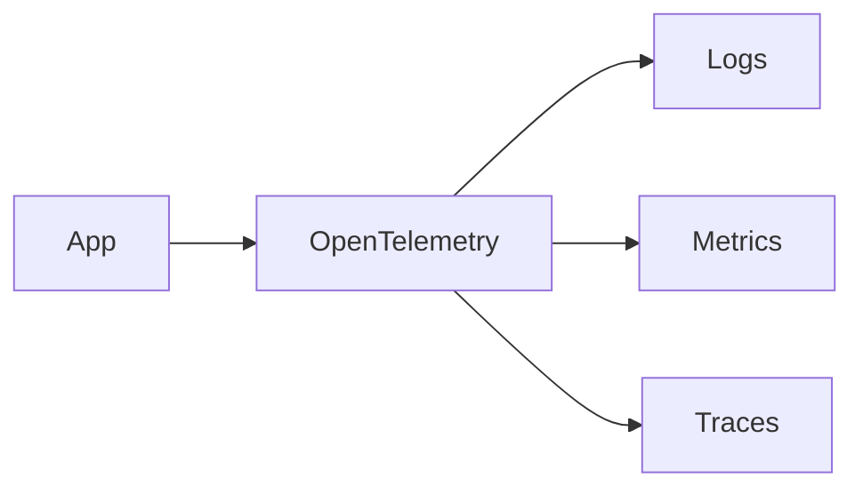
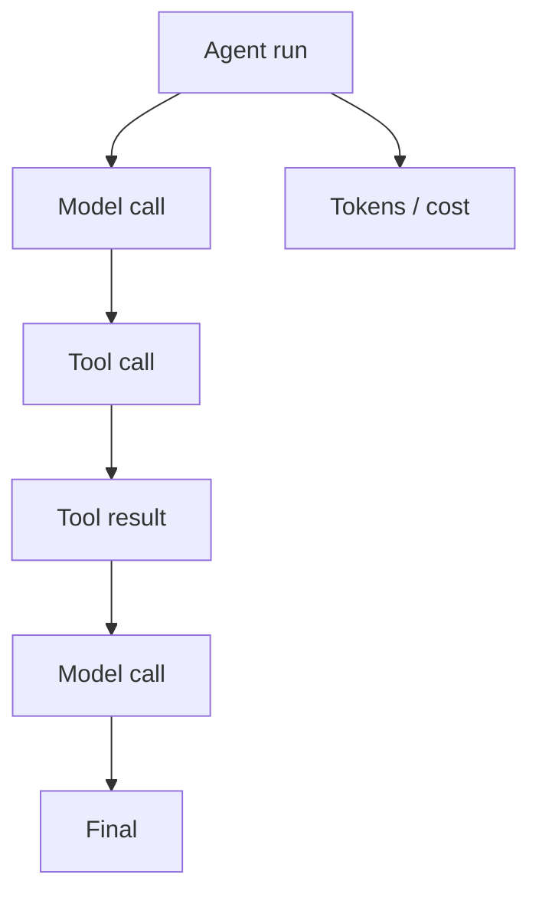

# 09 — Observability: Concept Notes

## What observability answers

```text
What happened?
Why?
How long?
What did it cost?
Where did it fail?
Can I reproduce it?
```

## Logs, metrics, traces



- **Logs** describe individual events.
- **Metrics** summarize behavior over time.
- **Traces** connect events belonging to one request or run.

## Agent trace



A useful trace should let you reconstruct the execution without reading every source-code line.

## Important AI metrics

```text
success rate
p50/p95/p99 latency
provider latency
queue wait
tool errors
retry count
agent turns
tokens
estimated cost
retrieval count
safety failures
```

## Correlation

Use a stable `trace_id` and `run_id` across model, tool, retrieval, and workflow events.

```json
{
  "trace_id": "t-123",
  "run_id": "r-456",
  "component": "tool",
  "event": "finish",
  "duration_ms": 220
}
```

## Privacy

Observability can become a data-leak channel. Redact secrets, define retention, and avoid storing every prompt/tool payload by default.

## Worked example

When a research agent fails, inspect:

1. model and prompt version
2. tool selections
3. arguments/results subject to redaction
4. retrieval configuration
5. timing
6. token usage/cost
7. failure category

## Best practices

- Instrument system boundaries.
- Use correlation IDs.
- Record versions needed for reproduction.
- Sample healthy traffic where appropriate.
- Keep high visibility into errors.
- Treat telemetry as sensitive data.

## Remember
**Observability turns an AI failure from a mystery into an engineering investigation.**
