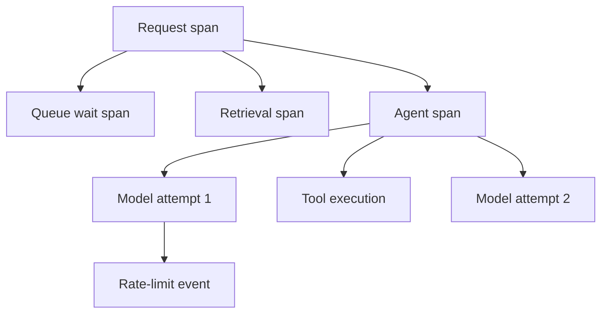

# Observability: explained step by step

[Section home](README.md) · [Exercises and quiz](PRACTICE.md)

## Goal

Explain a failed or slow request using evidence. Instrument boundaries before adding a dashboard. A chart of average latency alone cannot tell you whether a request waited in a queue, retried a model call, or stalled inside a tool.

## 1. Logs, metrics, and traces

Logs describe individual events. Metrics aggregate measurements over time. Traces connect spans belonging to one request or workflow execution. A span represents an operation with a start, end, attributes, status, and parent relationship. Use a shared trace ID across components and a run/job ID across longer-lived workflow activity where appropriate.

Do not put each request ID in a metric label: unbounded label values create high cardinality and high storage cost. IDs belong in logs and traces. Metric labels should usually be bounded categories such as operation or error type.

The parent-child relationships identify responsibility. A retry is a separate attempt so its latency and cost do not disappear inside one successful final event.

## 2. Choose useful attributes

Record operation name, safe model identifier, prompt version, dataset/config version, status, error category, duration, attempt number, and token usage if available. Record tool name and a safe action ID. Raw prompts and outputs are optional sensitive payloads, not mandatory telemetry.

Use a monotonic clock for elapsed time and wall-clock timestamps for correlation. For distributed systems, clock skew can distort naive subtraction of timestamps across machines; use tracing instrumentation and interpret cross-host timing carefully.

## 3. Latency percentiles and critical paths

For sorted latencies `[10,20,30,40,100]`, the nearest-rank p95 is the value at `ceil(0.95*5)`, hence 100. Other percentile definitions interpolate; document the method. With five samples, tail estimates are crude. Do not average p95 values from different hosts to obtain a global p95; aggregate suitable distributions or raw samples.

Parallel spans can overlap. Two child spans lasting 100 ms and 120 ms may fit into a parent of around 130 ms; adding children as 220 ms would misrepresent wall-clock latency. Follow the critical path to optimize user-perceived time.

## 4. Cost and usage

Capture each attempt, including retries and failed responses when usage is known. Distinguish provider-reported usage, locally estimated usage, and unknown usage. Record pricing configuration and date for estimates. A provider change can alter tokenization, usage fields, and billing; historical costs should not silently recompute with today's prices.

Useful metrics include task success, queue depth, p50/p95/p99 latency, token usage, retries, tool failures, budget exhaustion, and approval waiting time. Approval waiting is not the same as worker compute time.

## 5. Privacy, retention, and sampling

Define an allowlist of safe fields. Redacting a field named `password` does not catch a password pasted into free text. For beginner labs, log metadata only. Production payload logging needs access controls, scrubbing, retention, and review.

Sampling reduces volume but can hide rare failures. Choose and document a policy that retains adequate error evidence. A missing trace may mean “not sampled,” not “no operation happened.” Restrict telemetry access because IDs and metadata can still reveal sensitive behavior.

## 6. Debugging walkthrough

A request takes 4 seconds. Its trace shows 1 second in queue, 0.2 seconds retrieving, a 1-second failed model attempt, 0.5 seconds backoff, and a 1.3-second successful attempt. The total is explained without blaming retrieval. Reducing chunk size will not solve the main delay; investigate admission pressure and rate limits first.

Run `python 09-observability/examples/trace_summary.py`. It calculates a fixture p95 and emits metadata-only events. It is a small learning utility, not an OpenTelemetry exporter.

## References

- [OpenTelemetry signals](https://opentelemetry.io/docs/concepts/signals/): logs, metrics, and traces.
- [W3C Trace Context](https://www.w3.org/TR/trace-context/): propagation identifiers.
