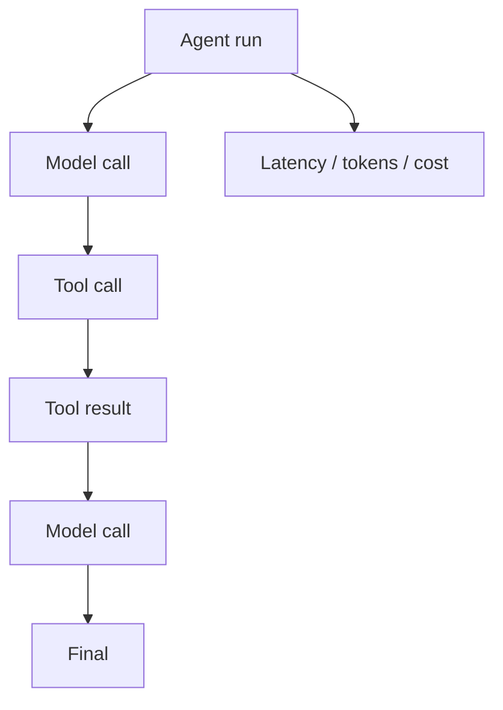
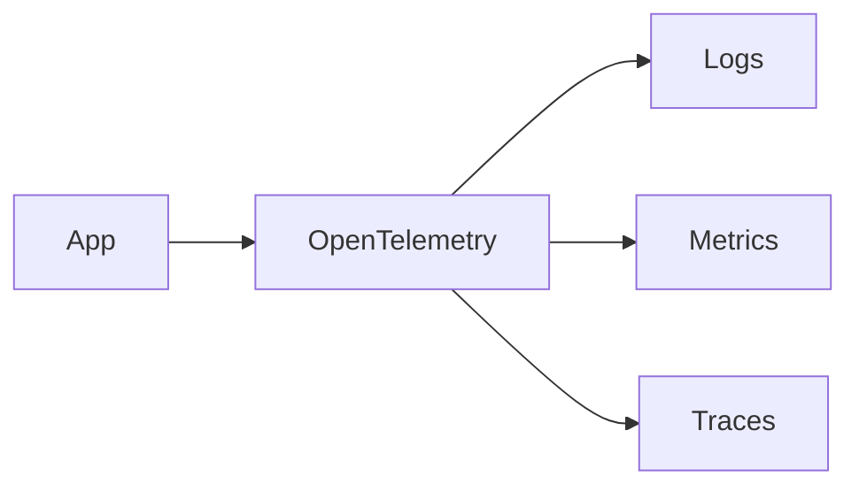

# 09 — Observability: Study Guide

## What observability should answer

```text
What happened?
Why did it happen?
How long did it take?
What did it cost?
Where did it fail?
Can I reproduce it?
```

## Agent trace



Use shared trace/run IDs so the sequence can be reconstructed.

## Logs, metrics, traces

- Logs describe individual events.
- Metrics summarize behavior over time.
- Traces connect one request/run across components.



## AI-specific metrics

Track success rate, p50/p95/p99 latency, model latency, queue wait time, tool errors, retries, agent turns, token usage, estimated cost, retrieval counts, and safety failures.

## Privacy-aware telemetry

Do not blindly persist prompts, documents, secrets, or tool payloads. Define redaction and retention before production.

## Worked example

A failed research run should reveal prompt/model versions, tools selected, redacted arguments/results, retrieval configuration, timing, token/cost usage, and final failure category.

## Best practices

- Instrument component boundaries.
- Correlate model/tool/retrieval spans.
- Record versions needed to reproduce a run.
- Sample successful traffic but retain high error coverage.
- Treat telemetry as sensitive data.

## References

- OpenTelemetry: https://opentelemetry.io/docs/
- W3C Trace Context: https://www.w3.org/TR/trace-context/
- Langfuse: https://langfuse.com/docs
- Phoenix: https://phoenix.arize.com/

## Remember

**Observability turns an agent failure from a mystery into an engineering problem.**
