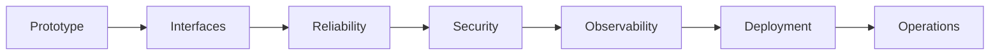
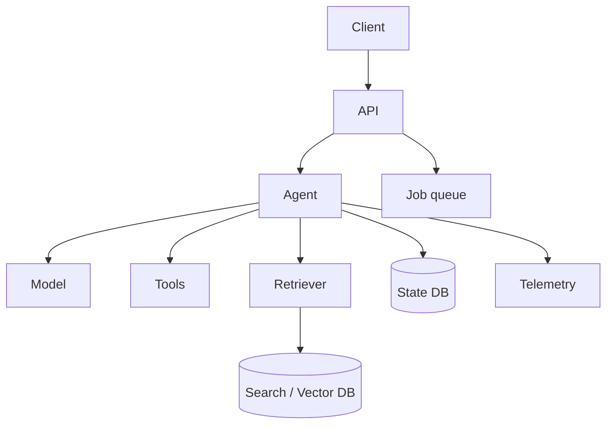
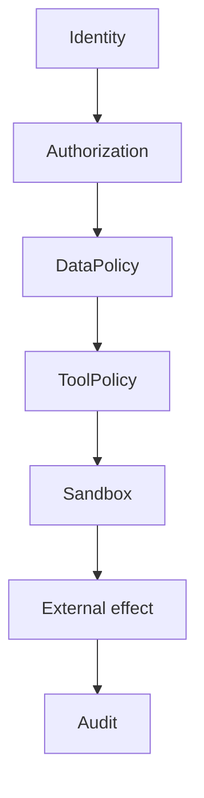

# 10 — Production: Concept Notes

## Prototype → production



Production means the system must behave safely when users, failures, permissions, and costs are real.

## Typical architecture



Keep model access, tools, retrieval, state, and infrastructure behind clear interfaces.

## Security model



Treat user content, retrieved documents, web pages, and tool output as untrusted data.

## Resilience

Use:

- deadlines
- bounded retries
- cancellation
- queues
- rate limits
- graceful degradation
- health/readiness checks

Example degraded modes:

```text
RAG unavailable → explicit unavailable response
strong model unavailable → approved fallback model
worker unavailable → queue and retry
agent unavailable → deterministic fallback where possible
```

## Prompt injection

A document containing `ignore previous instructions` is still document data. Retrieval must not silently elevate document text to system authority.

Test injection against both final answers and tool permissions.

## Operational limits

```text
request rate
max turns
max tool calls
execution deadline
context limit
cost/token budget
```

Hard limits should live in code/configuration, not only in prompts.

## Worked example

Deploy a research-agent API with authentication, persistent state, RAG, tools, tracing, an evaluation gate, queues, cost controls, and incident runbooks. Then inject provider outages, tool failures, prompt injection, queue backlogs, and runaway loops.

## Best practices

1. Least privilege.
2. Secure defaults.
3. Explicit budgets.
4. Observable failure modes.
5. Degraded-mode behavior.
6. Load and failure testing before release.

## Remember
**A production AI agent is a distributed system with probabilistic decisions and security-sensitive side effects.**
