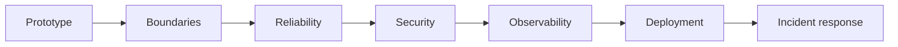
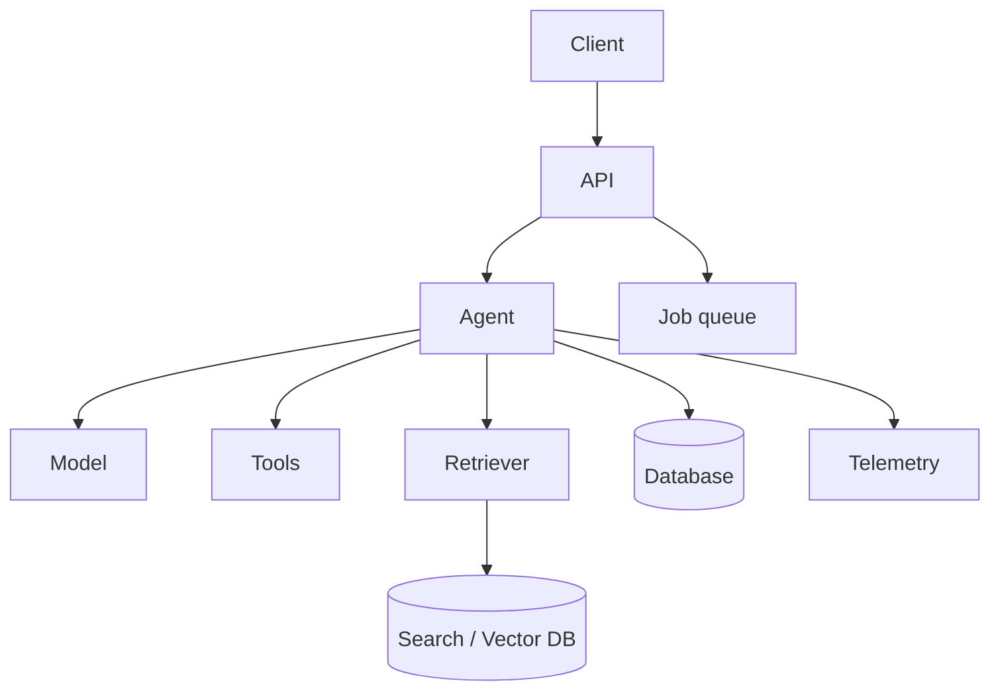
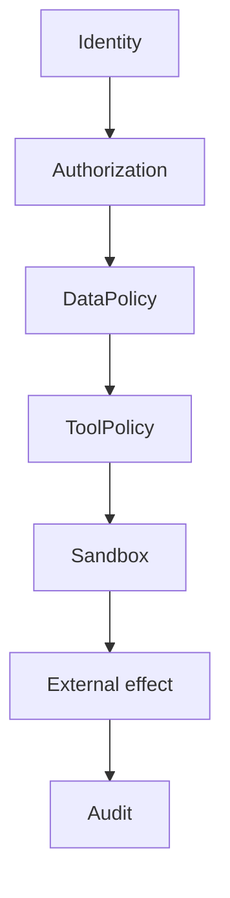

# 10 — Production: Study Guide

## Prototype → production



## Service architecture



Keep model access, tools, retrieval, state, queues, and infrastructure behind clear interfaces.

## Security



Treat user input, retrieved content, web data, and tool outputs as untrusted. Keep secrets out of model-visible context unless explicitly required and controlled.

## Reliability

Use deadlines, bounded retries, cancellation, queues, rate limits, graceful degradation, readiness/health checks, and controlled fallbacks.

Example degraded modes:

```text
agent unavailable → deterministic fallback
RAG unavailable → explicit unavailable response
strong model unavailable → approved fallback model
worker unavailable → durable queue/retry
```

## Prompt injection

Test malicious instructions embedded in documents, search results, and tool outputs. The application policy must remain higher priority than retrieved content.

## Operational limits

Set request-rate, max-turn, tool-call, execution-time, context-size, and token/cost limits.

## Worked project

Deploy a research agent API with authentication, persistent state, RAG, tools, tracing, evaluation gates, queues, cost controls, security tests, and incident runbooks. Inject provider outages, tool failures, prompt injection, queue backlog, and runaway loops.

## Best practices

- Least privilege.
- Secure defaults.
- Explicit budgets.
- Degraded modes.
- Auditable side effects.
- Rollback/change controls.
- Load and failure testing before production.

## References

- OWASP LLM Top 10: https://owasp.org/www-project-top-10-for-large-language-model-applications/
- OpenTelemetry: https://opentelemetry.io/docs/
- Docker: https://docs.docker.com/
- Kubernetes: https://kubernetes.io/docs/
- MCP: https://modelcontextprotocol.io/

## Remember

**A production AI agent is a distributed system with probabilistic components and security-sensitive side effects.**
