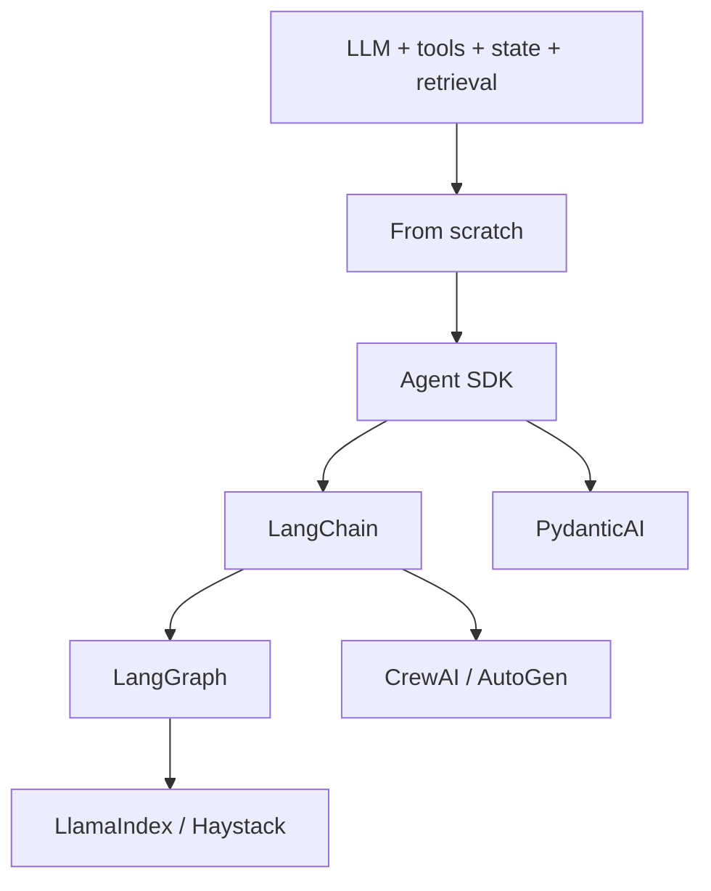
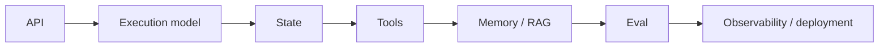

# 11 — Frameworks: Concept Notes

## Why frameworks exist

Frameworks package repeated engineering patterns so teams do not rebuild them for every application.



This is a learning sequence, not a ranking.

## Understand the abstraction layers

```text
model provider
     ↓
model/tool abstraction
     ↓
agent runtime
     ↓
state/workflow orchestration
     ↓
retrieval/data layer
     ↓
evaluation + observability
```

A framework may cover one layer or many. Understand which one it owns.

## Same problem, different framework

Canonical task:

```text
question
  ↓
research
  ↓
retrieve evidence
  ↓
write draft
  ↓
verify
  ↓
cite
```

Implement it from scratch and then with several frameworks. Compare the same behavior rather than unrelated tutorials.

## Framework roles

| Technology | Useful concept to study |
|---|---|
| OpenAI Agents SDK | lightweight agent runtime, tools, guardrails, handoffs |
| PydanticAI | typed Python agents and dependencies |
| LangChain | integrations and high-level application patterns |
| LangGraph | explicit stateful graphs and orchestration |
| LlamaIndex | data ingestion, indexing, and RAG |
| Haystack | componentized search/RAG pipelines |
| CrewAI | role-based multi-agent collaboration |
| Microsoft Agent Framework | agents, workflows, sessions, checkpoints |
| AutoGen | message-oriented multi-agent systems |
| smolagents | small transparent agent implementations |
| DSPy | metric-driven program/prompt optimization |
| MCP | tool/resource interoperability |

## How to evaluate a framework



Ask:

1. What does it hide?
2. What does it simplify?
3. How are state and retries handled?
4. How do I test failures?
5. Where can custom code escape the abstraction?
6. What operational coupling does it create?

## Worked example

Take the from-scratch research agent and rebuild it in LangGraph. Draw both architectures, mark which responsibilities moved into framework primitives, then inject the same failures and compare recovery.

## Best practices

- Learn the primitive first.
- Pin versions in experiments.
- Read current official docs.
- Keep application logic separate from framework glue.
- Compare operational value, not only lines of code.
- Keep an escape hatch to custom code.

## Remember
**A framework is valuable when it buys capability, reliability, or productivity without hiding the engineering decisions you still need to own.**
