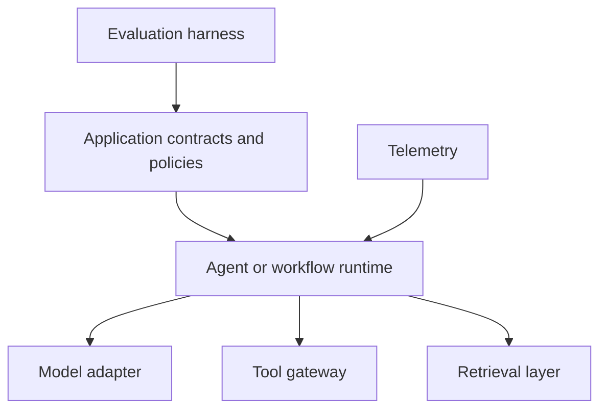

# Frameworks: explained step by step

[Section home](README.md) · [Exercises and quiz](PRACTICE.md)

## Goal

Learn what a framework owns and what remains your responsibility. Rebuild the same small application across approaches, keeping its contract and evaluation cases fixed. A shorter example is not automatically more reliable or easier to operate.

## 1. Separate the abstraction layers

A provider SDK sends model requests. An agent runtime coordinates model decisions and tools. A graph/workflow runtime manages explicit transitions. A retrieval library helps ingest, index, and query data. An optimizer searches for better program or prompt configurations against a metric. A protocol defines interoperability. These roles overlap, but they are not interchangeable.

The application stays above the framework: your permissions, expected outputs, and release criteria should be testable independently of its internal message objects.

## 2. Framework study map

Use the existing [tooling guide](../docs/tooling-guide.md) for its broader package map. The table below describes learning experiments, not a promise that every release supports every feature identically.

| Family | Concept to inspect | Concrete comparison task |
|---|---|---|
| OpenAI Agents SDK | Agent loop, tools, handoffs | Follow one call from proposal to validated result |
| PydanticAI | Typed inputs/outputs and dependencies | Inject a fake service and reject malformed output |
| LangChain | Integrations and higher-level model/tool patterns | Swap an adapter without changing business rules |
| LangGraph | Explicit state, transitions, persistence | Pause and resume the same approved action |
| LlamaIndex | Data ingestion and retrieval abstractions | Preserve source IDs through a cited answer |
| Haystack | Composable search/RAG pipelines | Replace a retriever while holding evaluation fixed |
| CrewAI | Roles and collaborative flows | Compare a crew against a single-agent baseline |
| Microsoft Agent Framework | Agents and workflows | Track state and recovery across a multi-step task |
| AutoGen | Message-driven multi-agent patterns | Read a legacy example and map migration concepts |
| smolagents | Compact agent implementations | Inspect the execution boundary and sandbox design |
| DSPy | Metric-driven program optimization | Optimize on development data, score on held-out data |
| MCP | Client/server interoperability | Discover a tool without granting it blanket permission |

As checked on 2026-09-27, the [official AutoGen repository](https://github.com/microsoft/autogen) describes AutoGen as in maintenance mode and directs new users toward Microsoft Agent Framework. Keep AutoGen in the study track for existing systems and migration, rather than treating it as the default new-project choice. Record versions because these ecosystems evolve.

## 3. One canonical application

Use a tiny policy assistant: accept a question, retrieve from three synthetic documents, optionally call a read-only lookup, and return a supported answer with source IDs or an abstention. Fix a small dataset containing normal, missing-evidence, wrong-tenant, malformed-tool, and timeout cases.

Start with a plain Python implementation and a fake model so you can test orchestration deterministically. Replace only the runtime adapter. When using a live model later, hold model and prompt settings constant where possible and record unsupported differences.

## 4. What to inspect in each implementation

Find where state lives, how retries are triggered, which errors escape, how tool calls are authorized, and how a paused run resumes. Check whether callbacks can execute again after restart. Determine which telemetry is captured and whether sensitive payloads are retained by default.

Keep domain objects separate from framework message objects. Adapter code translates at the boundary. This reduces migration work and allows your evaluation harness to run unchanged. A framework's validation helper still needs to enforce the particular business constraints you care about.

## 5. Comparison matrix and honest conclusions

Record setup complexity, lines of application code, dependency versions, testability, recovery behavior, trace completeness, latency, cost, and missing capabilities. Use the same workload and repeat measurements. Do not interpret fixture latency as real model performance or compare one framework's cached run against another's cold run.

A framework is worthwhile if its capabilities reduce meaningful engineering effort for your requirements. A simple fixed pipeline may be clearer in ordinary Python. A long-running, branching, human-reviewed workflow may justify a graph runtime. Retrieval-heavy work may justify a dedicated pipeline abstraction. These are hypotheses to validate, not universal rankings.

## 6. Language and tool choices

Python offers a large AI experimentation ecosystem; TypeScript can fit web applications and existing JavaScript teams; Go or Java may fit established service infrastructure. Preserve a language-neutral JSON contract across boundaries. Avoid rewriting an entire system merely to use one library; compare integration cost, team familiarity, deployment needs, and operational support.

Run `python 11-frameworks/examples/adapter_contract.py`. Two fake adapters expose the same result shape. This demonstrates contract portability only; no third-party framework is installed or benchmarked by the example.

## References

- [LangGraph overview](https://docs.langchain.com/oss/python/langgraph/overview): stateful orchestration; checked 2026-09-27.
- [Microsoft Agent Framework](https://learn.microsoft.com/en-us/agent-framework/overview/): official overview; checked 2026-09-27.
- [AutoGen migration guide](https://learn.microsoft.com/en-us/agent-framework/migration-guide/from-autogen/): migration concepts.
- [Existing framework references](STUDY-GUIDE.md): official documentation for the remaining families.
