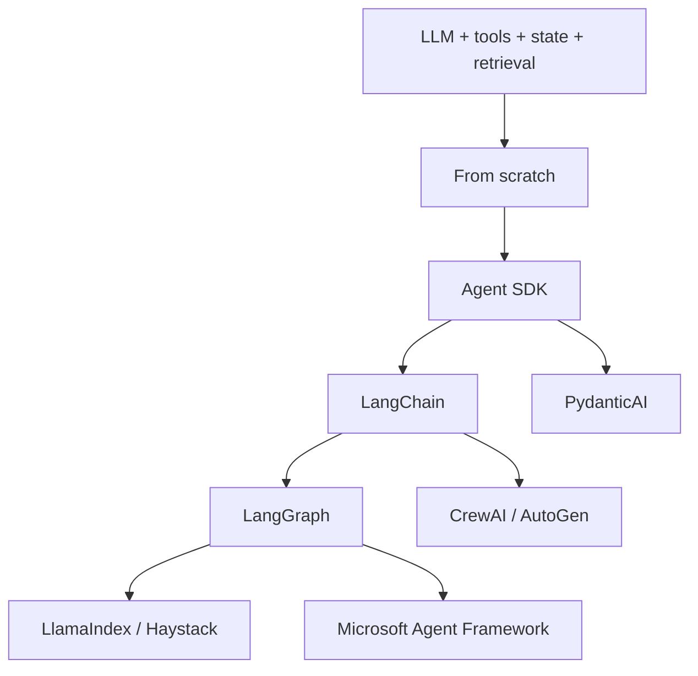
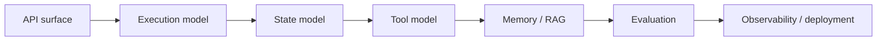

# 11 — Frameworks: Study Guide

## Why frameworks exist

Frameworks package repeated patterns around model calls, tools, state, workflows, retrieval, memory, evaluation, and observability.



This is a learning sequence, not a ranking.

## Canonical comparison problem

Use the same application everywhere:

```text
question → plan → retrieve evidence → use tools → write → verify → cite
```

Implement it from scratch, then with several frameworks. Compare source size, state model, testing surface, failure recovery, observability, latency, cost, dependency footprint, and migration risk.

## What each framework teaches

| Technology | Main study purpose |
|---|---|
| OpenAI Agents SDK | lightweight agents, tools, guardrails, handoffs |
| PydanticAI | typed Python agents and dependencies |
| LangChain | model/tool integrations and higher-level application abstractions |
| LangGraph | explicit stateful graphs and long-running workflows |
| LlamaIndex | ingestion, indexing, retrieval, data-centric apps |
| Haystack | componentized search/RAG pipelines |
| CrewAI | role-oriented multi-agent collaboration and flows |
| Microsoft Agent Framework | agents, sessions, workflows, checkpoints, hosting |
| AutoGen | message-oriented multi-agent systems |
| smolagents | small, transparent agents |
| DSPy | metric-driven/programmatic optimization |
| MCP | interoperable tool/resource protocol boundary |

## Framework mental model



Ask: what does the framework hide, what does it simplify, where can custom logic be inserted, how does restart/retry work, how do you test it, and how would you migrate away?

## Worked example

Take the handwritten agent from Phase 2. Rebuild it using OpenAI Agents SDK, PydanticAI, and LangGraph. Draw all three architectures. Inject the same timeout, malformed tool result, and restart failures. Compare behavior rather than judging from code size alone.

## Best practices

- Pin versions for experiments.
- Read current official docs.
- Keep provider-specific code isolated.
- Preserve an escape hatch to custom code.
- Prefer a framework because it provides capability/reliability, not fashion.
- Record package versions and experiment dates.

## References

- OpenAI Agents SDK: https://openai.github.io/openai-agents-python/
- LangChain: https://docs.langchain.com/oss/python/langchain/overview
- LangGraph: https://docs.langchain.com/oss/python/langgraph/overview
- LlamaIndex: https://docs.llamaindex.ai/
- Haystack: https://docs.haystack.deepset.ai/
- PydanticAI: https://ai.pydantic.dev/
- CrewAI: https://docs.crewai.com/
- Microsoft Agent Framework: https://learn.microsoft.com/en-us/agent-framework/
- AutoGen: https://microsoft.github.io/autogen/stable/
- smolagents: https://huggingface.co/docs/smolagents/index
- DSPy: https://dspy.ai/
- MCP: https://modelcontextprotocol.io/

## Remember

**A framework should reduce meaningful engineering effort without replacing your understanding of the system.**
