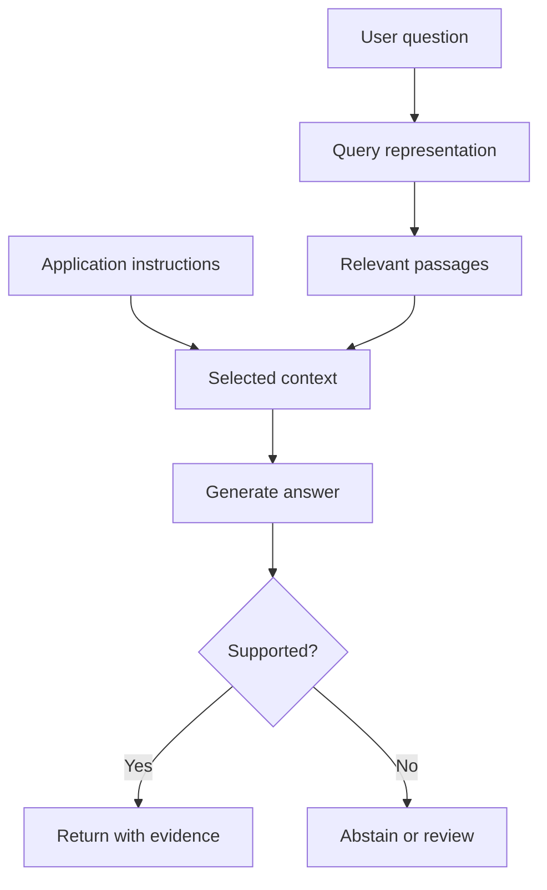

# Domain 2 — Fundamentals of Generative AI

**Exam weight: 24%**

## GenAI mental model

```text
prompt/input → foundation model → generated output
```

Outputs may include text, code, images, audio, or video.

## Tokens

LLMs process text as tokens rather than whole words. Token counts affect context limits, latency, inference cost, and throughput. Do not assume one token equals one word.

```text
Text → tokenizer → tokens → model processing → output tokens
```

## Transformers and attention

```text
Input tokens
    ↓
Embeddings
    ↓
Positional information
    ↓
Self-attention
    ↓
Feed-forward layers
    ↓
Repeated transformer blocks
    ↓
Output probabilities
    ↓
Generated token
```

Attention lets the model weigh relationships between tokens in context. AIF-C01 does not require transformer mathematics; understand the vocabulary and purpose.

## Foundation models

A foundation model is broadly trained and can be adapted for many tasks.

Selection factors:
- modality
- quality/performance
- model size
- latency
- context/input-output limits
- languages
- customization
- cost
- compliance
- availability
- prompt caching where relevant

## Embeddings

An embedding converts content such as text into a numerical vector representing semantic characteristics.

```text
“How do I reset my password?”
              ↓
          embedding
              ↓
       [0.12, -0.44, ...]
              ↓
      similarity retrieval
```

## RAG mental model

```text
Documents → chunking → embeddings → index
                                      ↓
Query → retrieve relevant chunks → prompt + context
                                      ↓
                               foundation model
                                      ↓
                                   answer
```

RAG is useful when the model needs external or changing knowledge without retraining the base model.

## Hallucinations

A hallucination is generated content that is unsupported, fabricated, or factually wrong. Controls include RAG grounding, better prompts, retrieval quality, output validation, confidence/verification, and human review where appropriate.

## GenAI strengths

- adaptability
- conversational interaction
- content generation
- summarization/transformation
- coding assistance
- search and assistants

## GenAI limitations

- hallucinations
- nondeterminism
- latency
- cost
- context limits
- bias
- explainability limits
- privacy/security risks
- prompt injection

## Context engineering

```text
Goal + instructions + retrieved knowledge + state + tools + memory
                              ↓
                         model context
                              ↓
                       response/action
```

## Agentic AI awareness

```text
User goal → Agent → LLM
                 ↙  ↓  ↘
              tools memory orchestration
                 ↓
          external systems
```

Know tools, memory, orchestration, multi-agent patterns, MCP, and agent communication at the exam-guide level.

## Exam traps

- Embeddings are not generated answers.
- Vector search is not model training.
- RAG is not fine-tuning.
- Larger model does not automatically mean better business choice.
- More context can increase cost and latency.

## Worked walkthrough — how generation differs from retrieval

Imagine a librarian who finds passages and a writer who composes an answer from them. Retrieval supplies evidence; generation creates an output sequence. A foundation model can support several tasks after broad training, while an application chooses the context and output constraints for one task. Not every foundation model is text-only: modalities can include images, audio, and other data.

An embedding model maps content into a vector for comparison. It does not itself answer “What is our refund policy?” A language model can compose an answer but may invent one if evidence is missing. Diffusion models learn a denoising process used in generation; understand the contrast with autoregressive token generation without assuming all image models use the same architecture.



### Tokens and context in practical terms

A tokenizer may split a long word into several pieces. Counts differ by model and language. The context window limits what can be supplied for a call; it is not permanent learning. Conversation memory and retrieved documents must be selected into the available budget. More context can increase cost and distraction, so evaluate whether each addition helps.

### Model selection and limitations

Choose a model using task quality, modality, language coverage, latency, cost, and data requirements. Generated fluency is not evidence of accuracy. Hallucinations, bias, prompt injection, and inconsistent outputs require different controls. Low temperature may reduce sampling variation but does not make an unsupported statement true. A business metric such as correctly resolved requests is more informative than counting generated words.

### Exercise and self-check

You have a fictional 4,000-token total allowance, reserve 800 output tokens, and need 600 tokens for instructions/history. How many remain for retrieved evidence before extra overhead? What if the answer is missing from all documents?

<details><summary>Worked answer</summary>

There are 2,600 tokens before overhead. Select relevant passages within that allowance using the real tokenizer when calling a model. If evidence is missing, return an explicit limitation or ask for more information; filling the context with unrelated passages does not solve the problem.

</details>

Practice further in the [domain quiz workbook](DOMAIN-QUIZZES.md#domain-2).
