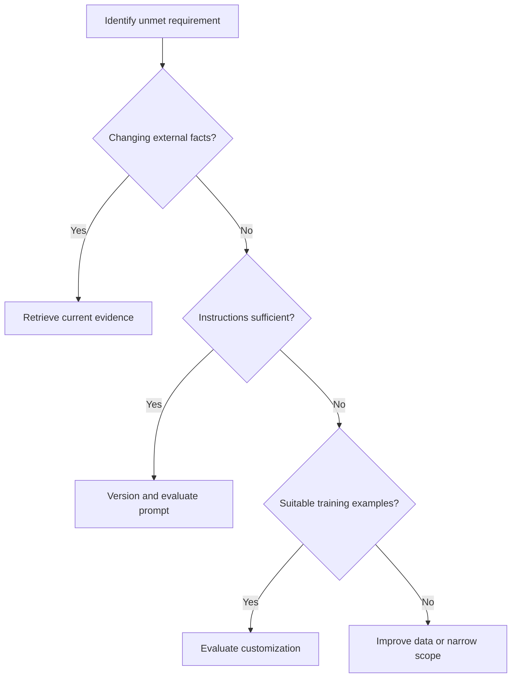

# Domain 3 — Foundation Models, Prompting, RAG and Evaluation

**Exam weight: 28% — largest domain**

## Application architecture

```text
User → Application → context/prompt → Foundation Model → validated output
                         ↙       ↘
                       RAG       tools
```

## Prompt engineering

A useful prompt often contains:

```text
Role/behavior + Task + Context + Constraints + Output format + Examples
```

- **Zero-shot:** no examples.
- **One-shot:** one example.
- **Few-shot:** multiple examples.
- **Structured output:** specify a machine-readable format when downstream software consumes the response.

Example:

```text
Summarize the incident report for an engineering manager.
Return: impact, root cause, customer impact, corrective action.
Keep it under 150 words. Use only information in the report.
```

## Prompt injection

Untrusted input can attempt to override intended instructions.

```text
Trusted instructions + untrusted content → LLM → potentially unsafe action
```

Controls include treating external content as untrusted, least-privilege tools, authorization outside the model, output validation, guardrails, human approval, logging, and monitoring. A prompt should not be the only security boundary.

## RAG in depth

```text
Documents → chunk → embed → index
                         ↑
Query → retrieve → optional rerank → context → model → answer
```

Chunking tradeoff:
- too small → lose context
- too large → noisy/expensive retrieval

## Fine-tuning vs RAG vs prompting

| Need | Common approach |
|---|---|
| Better instructions/format | Prompt engineering |
| Current/private knowledge | RAG |
| Change behavior/style with training examples | Fine-tuning |
| External actions | Tools/agents |
| Factual grounding | RAG + validation |

These approaches can be combined.

## Foundation model lifecycle

```text
Data selection → model selection → pre-training/existing FM
       → adaptation → evaluation → deployment → monitoring/feedback ↺
```

## Evaluation

Evaluate according to the task: factuality, relevance, groundedness, safety/toxicity, latency, cost, task success, and human judgment where appropriate.

## Model-selection questions

1. Required modality?
2. Required quality?
3. Acceptable latency?
4. Context size?
5. Language requirements?
6. Customization needs?
7. Cost target?
8. Compliance/security requirements?

## Exam traps

- Fine-tuning is not the default solution for fresh company knowledge.
- RAG does not permanently change model parameters.
- Prompt engineering does not retrain a model.
- Tool authorization should not be delegated solely to an LLM.
- Fluent output can still be incorrect.

## Worked walkthrough — choose the adaptation method

An HR assistant needs today's policies and a consistent concise tone. Begin with clear prompting for tone and RAG for changing policy facts. Fine-tuning changes parameters using examples and may help a repeated behavior requirement; it is not the simplest way to refresh a policy each morning. These approaches can be combined after evaluation identifies the remaining weakness.

Pre-training learns broad patterns from a large corpus. Continued pre-training extends training on additional data. Instruction tuning uses examples of tasks and desired responses. Distillation trains a smaller student to reproduce useful behavior from a teacher or teacher-generated data; it trades training effort against potential serving benefits. Training-data quality, permissions, representativeness, and held-out evaluation matter for every adaptation method.



The branches suggest an investigation order, not mutually exclusive products. Measure a baseline before investing in training. A better prompt cannot retrieve a document the application never supplied.

### Prompt techniques and evaluation

Few-shot prompts contain task examples; structured output defines a machine-readable response. Reasoning-oriented prompting is intended to encourage intermediate problem solving, but a long explanation is not proof of correctness. For applications, request concise evidence or verifiable intermediate artifacts rather than relying on hidden reasoning.

ROUGE and BLEU compare generated text with references using overlap-based signals; BERTScore uses contextual representations. None alone establishes factual correctness or business value. An answer can use different wording and still be correct, or overlap with a reference while making a harmful error. Combine automatic checks with human review and task-specific metrics. Keep prompt versions so a regression can be reproduced.

### Exercise and self-check

For each requirement choose a first experiment: current policy facts, consistent JSON keys, repetitive domain style, or a real account update. Explain where authorization belongs for the final requirement.

<details><summary>Worked answer</summary>

Try RAG for policy facts, a schema plus prompting for JSON, prompt examples before considering fine-tuning for style, and an authorized tool for the account update. Validate the exact action outside the model. A tool gives capability; it does not prove permission.

</details>

Practice further in the [domain quiz workbook](DOMAIN-QUIZZES.md#domain-3).
