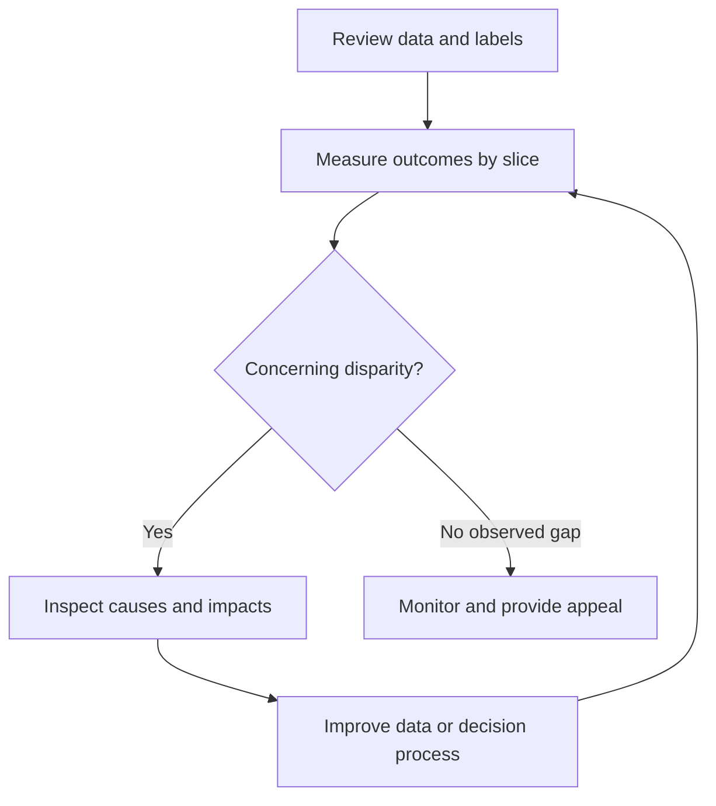

# Domain 4 — Responsible AI

**Exam weight: 14%**

```text
Responsible AI
├── Fairness / bias
├── Transparency
├── Explainability
├── Privacy
├── Safety
├── Accountability
└── Human oversight
```

## Bias and fairness

Bias can arise from sampling, labels, historical decisions, measurement, features, or deployment context. Fairness asks whether outcomes are unjustifiably different across relevant groups.

## Transparency vs explainability

**Transparency:** relevant information about the system, purpose, limitations, data origins, and use.

**Explainability:** understandable reasons or evidence about model behavior.

## Human oversight

```text
AI recommendation → risk check → human review when required → decision/action
```

High-impact uses may need human review, escalation, or approval.

## Data lineage

```text
source → ingestion → transformation → training/retrieval → application
  └────────────── provenance / lineage ─────────────────────────────┘
```

Track origin, transformation, and use of data.

## Model documentation

Know the purpose of model cards: document intended use, limitations, evaluation information, and relevant metadata.

## Responsible AI checklist

- Is data appropriate and representative?
- Could outcomes introduce harmful bias?
- Are limitations understandable?
- Is human escalation available?
- Is sensitive data protected?
- Are outputs validated?
- Are logs and provenance available?
- Is the use case appropriate for automation?

## Exam trap

Responsible AI is broader than bias. Think fairness, transparency, explainability, privacy, safety, accountability, and human oversight.

## Worked walkthrough — a high average can hide unequal outcomes

A support classifier has 90% accuracy overall. Before calling it fair, inspect relevant groups, languages, and input conditions. Suppose it misses 2 of 20 positive cases in group A but 8 of 20 in group B. Recall is 90% for A and 60% for B. This is a signal to investigate data, labels, thresholds, and deployment context, not by itself a complete fairness judgment.

Bias can enter through who is sampled, how outcomes are labeled, which features proxy sensitive attributes, and how predictions are used. Removing one demographic column does not automatically remove proxy effects. Different fairness definitions can conflict; select and justify measures appropriate to the use case with accountable stakeholders.



The monitoring path says “no observed gap,” not “proved fair forever.” Changes in population or workflow can change the result.

### Explainability, transparency, and accountability

Explainability concerns understandable evidence about behavior. Transparency includes intended use, limitations, data provenance, and how people interact with the system. Accountability assigns an owner who can investigate and correct harm. A model card communicates important information but does not substitute for enforcement or evaluation.

Human oversight needs a real decision point, relevant evidence, time to review, and the ability to reject or appeal. Asking a rushed reviewer to approve hundreds of outputs can lead to rubber-stamping. Privacy requires minimization and controlled retention; safety includes preventing harmful outcomes beyond privacy alone.

### Exercise and self-check

Calculate the two recall values above. Design an appeal path for a misclassified support request and list what a reviewer needs to see. Avoid exposing unrelated personal data in the review screen.

<details><summary>Worked answer</summary>

A finds 18/20 positives (90%); B finds 12/20 (60%). A reviewer needs the affected request, applicable rubric, model/version, relevant evidence, and an override mechanism. Record the correction and investigate whether it reveals a systematic gap. One corrected case does not resolve the whole issue.

</details>

Practice further in the [domain quiz workbook](DOMAIN-QUIZZES.md#domain-4).
