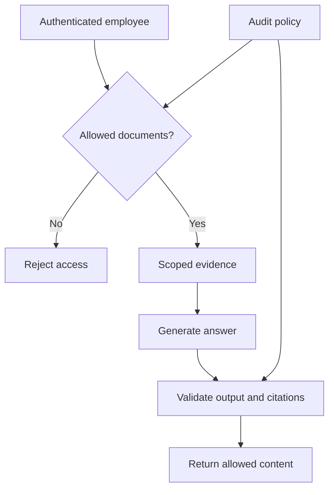

# Domain 5 — Security, Compliance and Governance

**Exam weight: 14%**

## Shared responsibility

```text
AWS → security OF the cloud
Customer → security IN the cloud
           identities, permissions, data, configuration, workload controls
```

Exact responsibility depends on the service.

## Core security services

| Service | Mental model |
|---|---|
| IAM | identities, roles, policies, permissions |
| KMS | encryption key management |
| Secrets Manager | store/manage secrets |
| Macie | discover/protect sensitive S3 data |
| CloudTrail | API/activity audit trail |
| CloudWatch | monitoring, logs, metrics, alarms |
| Config | configuration/compliance assessment |
| Artifact | AWS compliance reports/contracts |
| Inspector | vulnerability/security assessment |
| VPC | network isolation/control |
| PrivateLink | private connectivity to supported services |
| Bedrock Guardrails | control/filter model inputs and outputs |

## Least privilege

```text
User/Agent → IAM role → minimum permissions → specific actions/resources
```

## AI-specific threats

### Prompt injection
Untrusted instructions attempt to alter model/agent behavior.

### Data leakage
Sensitive information can enter prompts, logs, retrieval stores, outputs, or downstream systems.

### Unsafe tool use
Reduce blast radius with least privilege, scoped credentials, validation, allowlists, human approval, and logging.

### Output validation
Generated output should not automatically be trusted as correct or safe.

## Governance lifecycle

```text
Policy → data governance → access controls → logging/monitoring
      → review/audit → corrective action ↺
```

Consider data residency, retention, lifecycle, access, provenance, audit trails, compliance requirements, and review cadence.

## Key comparisons

```text
IAM → authorization
KMS → encryption keys
Secrets Manager → secrets
CloudTrail → audit/API activity
CloudWatch → operational monitoring
Artifact → AWS compliance documentation
```

## Exam traps

- IAM is not encryption.
- KMS and Secrets Manager solve different problems.
- CloudTrail and CloudWatch solve different problems.
- Guardrails do not replace application authorization.
- Security controls should be layered.

## Worked walkthrough — protect a document assistant

An employee asks a policy question. Authenticate them, determine document permissions, retrieve only eligible passages, then supply those passages to the model. Keep access credentials in the application boundary. A retrieved document cannot grant itself permission to call another service.



Encryption at rest and in transit protects data in specific states; it does not decide which authenticated users may read it. Access control, encryption, logging, and retention solve different parts of the problem.

### Distinguish the controls

IAM governs identities and permissions. KMS manages cryptographic keys. Secrets Manager manages secrets such as credentials. CloudTrail records supported account/API activity for audit; CloudWatch supports operational monitoring. Config evaluates resource configuration against rules. Artifact provides AWS compliance documentation, not automatic certification of your application. Macie helps discover sensitive information in S3; it does not replace your data-classification and access policies.

Shared responsibility changes with the managed service used, but customers still own important choices about data, identities, permissions, and configuration. Guardrails can help filter or constrain content, but cannot replace object-level authorization or prove all responses accurate.

### Governance as a repeatable process

Assign owners, define allowed uses, record data origins, establish retention and residency requirements, and schedule review. Collect evidence of controls actually working. An audit log with secrets in it creates another sensitive data store, so logging itself needs access and retention rules. A source citation helps trace a claim but is not the same as proof of compliance.

### Exercise and self-check

Map these needs to controls: who changed a resource, alert on request latency, restrict document access, manage encryption keys, and store an API credential. Then explain why none alone stops every prompt-injection attack.

<details><summary>Worked answer</summary>

Use CloudTrail for relevant API activity, CloudWatch for operational alarms, IAM plus application/document authorization for access, KMS for keys, and Secrets Manager for the credential. Injection defenses also need trusted boundaries, scoped tools, output validation, and appropriate human approval. No single service makes untrusted text authoritative.

</details>

Practice further in the [domain quiz workbook](DOMAIN-QUIZZES.md#domain-5).
