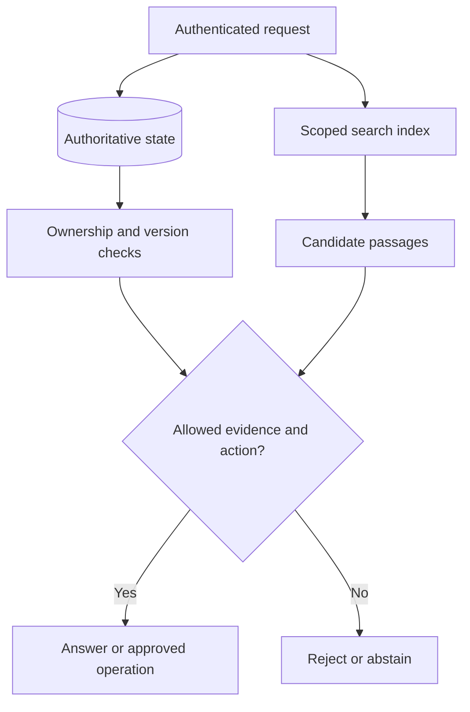

# Architecture, databases, and tooling: applied workbook

[Architecture](architecture.md) · [Database concepts](databases-for-ai.md) · [Tooling map](tooling-guide.md) · [Learning path](../LEARNING-PATH.md)

## 1. Database walkthrough: a policy assistant

Store users, permissions, document versions, and approval records as authoritative application data. Use transactions and constraints to preserve invariants. Add a search index for retrieval and a cache only for data that can tolerate its invalidation policy. A vector index answers “what is similar?”; it does not answer “who is allowed to approve this draft?”

| Data/access pattern | Useful starting representation | Important limitation |
|---|---|---|
| Approval status and owner | Relational row with version/constraints | External sends are not atomic with the row |
| Flexible parsed document | Document record or JSON field | Shape flexibility does not remove validation |
| Similar text passages | Vector index plus metadata | Similarity does not prove truth or permission |
| Exact error code | Lexical index or exact key | Wording variation may need semantic retrieval |
| Relationship traversal | Graph model when traversal dominates | Extra complexity if joins already suffice |
| Frequently read safe result | Scoped key-value cache | Stale or cross-tenant results if keys are wrong |
| Long-term usage trends | Analytical/time-series store | Not necessarily the transactional source of truth |

For a SQL approval record, `UPDATE approvals SET status='sending' WHERE id=? AND owner=? AND status='pending' AND version=?` illustrates a compare-and-set transition. Check the affected row count inside the intended transaction. Exactly one row changed means a local claim succeeded; it does not prove a remote email was sent. Parameterize all values and enforce expiry and payload matching too.

## 2. Architecture exercise: trace a correction

A policy changes from 30 days to 14 days. List the writes needed to update the source, retire old chunks, re-index new chunks, invalidate caches, and record the version. Then ask a query while re-indexing is incomplete.

**Acceptance:** define a consistent serving policy such as serving the last fully published version or temporarily reporting an update; do not mix outdated and current facts silently. Preserve source/version provenance in citations.

Worked reasoning

Build a new index version and switch the active version only when ready, or use a documented incremental consistency strategy. Cache keys include corpus version or receive explicit invalidation. Deletion propagates to old search entries and derived stores according to retention policy. A transaction on the source row alone does not atomically update every external index.

## 3. Tooling exercise: justify one choice

For a three-document local assistant, choose a plain Python retriever first. For an application already using PostgreSQL with permission joins, evaluate whether full-text/vector support there meets requirements before adding a separate database. For a specialized large retrieval workload, compare dedicated stores using the same corpus, filters, recall targets, and latency measurements.

Write a decision record: requirement, simplest option, alternative, evidence, operational cost, and condition that would trigger reconsideration. Keep benchmark cells empty until executed.

## 4. Topic-template exercise

Use [the topic template](topic-template.md) to describe cache invalidation. Fill in a diagram, a concrete stale-result example, one runnable or paper exercise, expected outcomes, limitations, and a quiz answer explanation. A template organizes thinking; filling every heading with generic wording does not teach the topic.

## Quiz

1. Does vector similarity establish permission? **A** Yes; **B** No; **C** At high scores only.
2. What enforces unique operation keys under races? **A** A prompt; **B** An informal convention; **C** A database uniqueness constraint with appropriate transactional handling.
3. When a corpus changes, what may require invalidation? **A** Derived indexes and caches; **B** Only README text; **C** Nothing.
4. Why keep the same corpus for database comparisons? **A** To guarantee a winner; **B** To reduce workload confounding; **C** To avoid measurements.
5. What does an affected-row count of one prove in the claim example? **A** An email was delivered; **B** A model is correct; **C** The specified local state transition matched and changed a row.

Answers

1. **B** — ranking and authorization are independent.
2. **C** — a separate unchecked read/write can race.
3. **A** — stale derived data can outlive its source.
4. **B** — different data makes performance and relevance results hard to compare.
5. **C** — remote effects require their own confirmation/reconciliation.

