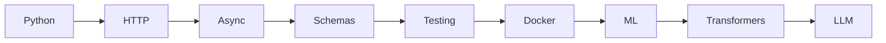
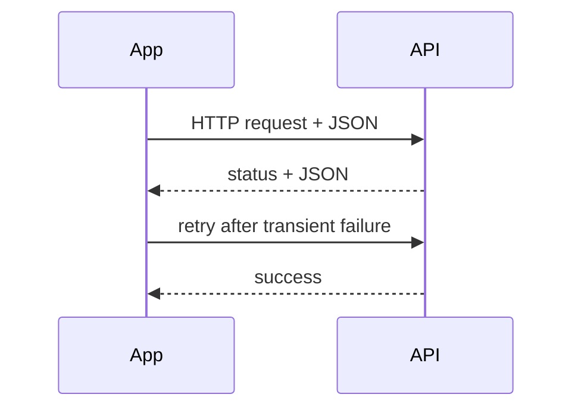
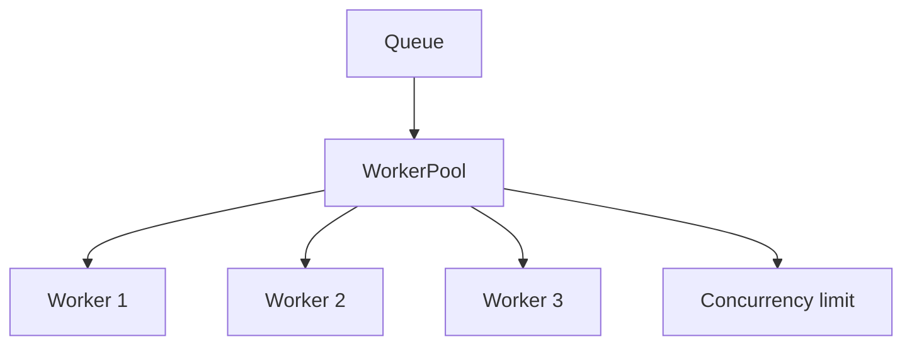
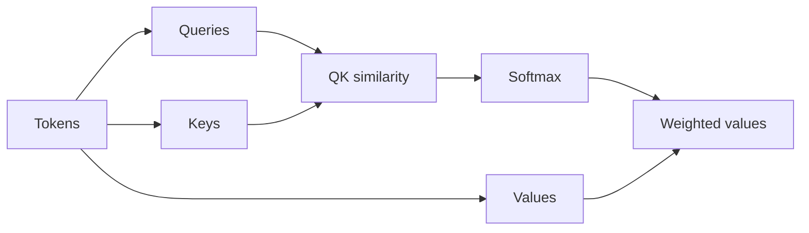

# 00 — Foundations: Visual Study Guide

## The big picture

Foundations are the layer underneath every agent, RAG system, and model API.



### Mental model
A production AI application is still a software system. The model is one probabilistic component inside deterministic code that handles networking, state, validation, retries, security, and tests.

## 1. Python for AI engineering

Know modules/packages, virtual environments, typing, dataclasses, exceptions, logging, files, CLIs, and async code.

**Example:**
```python
from dataclasses import dataclass

@dataclass
class Message:
    role: str
    content: str

messages = [Message("user", "Explain attention")]
```

Best practice: keep domain objects typed and make side effects explicit.

## 2. HTTP and APIs



Learn methods, headers, status codes, auth, timeouts, retries, pagination, and idempotency.

**Rule:** retry only errors that are plausibly transient.

## 3. Async and concurrency



An async system is not “faster” automatically. Measure throughput, p95 latency, resource usage, and failure rate.

## 4. Schemas

Think:
`untrusted input → validation → typed object → business logic`.

Use JSON Schema/Pydantic-style contracts at boundaries.

## 5. Testing

Separate:
- deterministic unit tests
- integration tests
- contract tests
- property-based tests
- AI evaluation tests

## 6. Docker

```text
source → image → container → service
```

Use containers to make local experiments reproducible.

## 7. ML and transformers

Understand vectors, matrices, embeddings, loss, overfitting, attention, tokenization, positional information, and autoregressive generation.

### Attention intuition


The key idea: each token decides which other tokens are relevant to it.

## Best practices to remember

1. Type boundaries.
2. Make failures explicit.
3. Measure concurrency instead of guessing.
4. Test failure paths, not just happy paths.
5. Keep experiments reproducible.

## Study example
Build an API client, add a bounded async worker pool, validate all inputs, containerize it, and test failures before moving to LLMs.

## Further reading

- Python docs: https://docs.python.org/3/
- asyncio: https://docs.python.org/3/library/asyncio.html
- pytest: https://docs.pytest.org/
- Docker: https://docs.docker.com/
- JSON Schema: https://json-schema.org/
- Attention Is All You Need: https://arxiv.org/abs/1706.03762

## Remember
**AI engineering is software engineering plus probabilistic components.**