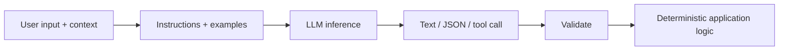
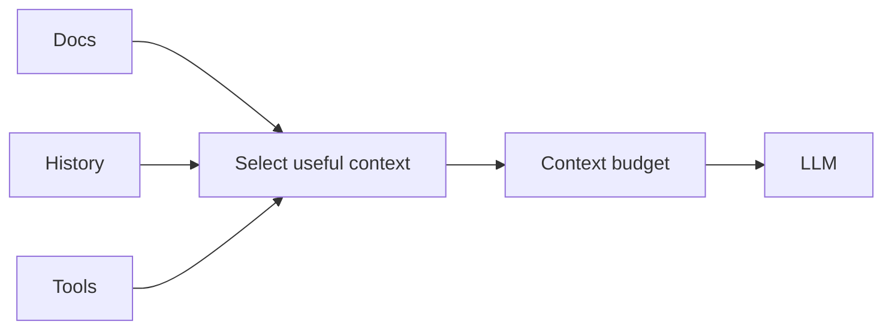
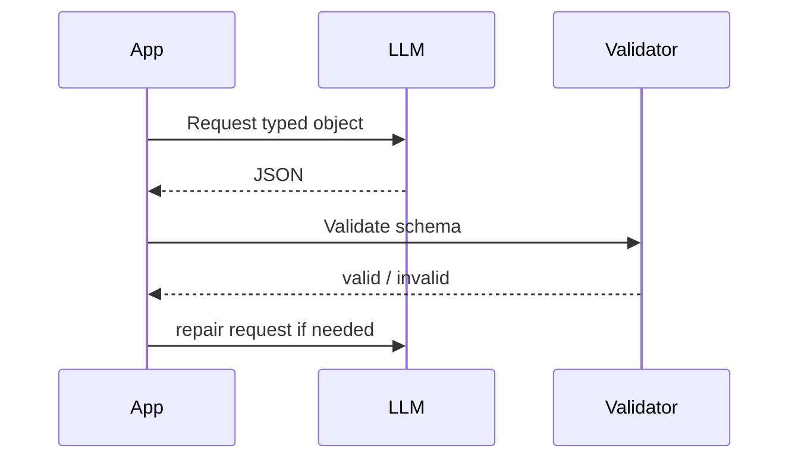
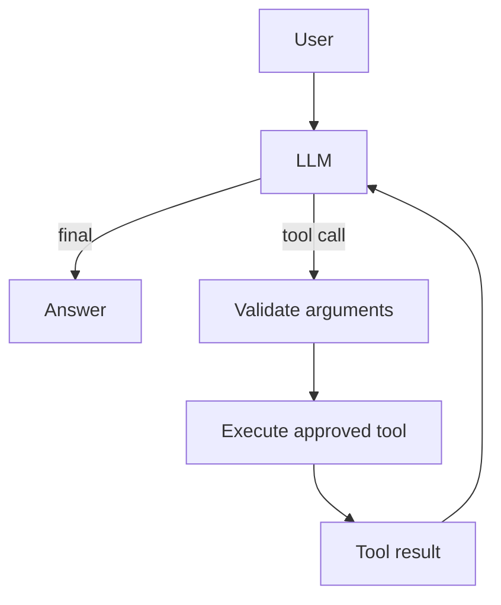

# 01 — LLM Engineering: Visual Study Guide

## The model boundary



The key idea is simple: **the model is probabilistic; the surrounding application should provide deterministic boundaries.**

## Tokens and context

Tokens are the units the model processes. Context is the information available for the current inference. Context limits create an engineering trade-off: more information can improve grounding, but excess or irrelevant information can increase cost and reduce signal.



Best practice: never treat the context window as a dumping ground. Retrieve, summarize, prioritize, and remove stale information.

## Prompting

Think of a prompt as an interface contract:

```text
role/instructions
+ task
+ trusted context
+ examples
+ output constraints
= model request
```

Change one variable at a time when experimenting.

## Structured output



Never silently accept invalid model output. Validation is part of the architecture.

## Tool calling



Every tool should have a clear schema, timeout, permission boundary, and failure representation.

## Sampling and variability

Temperature/top-p and model choice change output variability. Deterministic-looking settings do not make an AI system logically deterministic. Keep benchmark prompts and datasets fixed so changes are measurable.

## Reliability

```text
request
 → timeout
 → classify error
 → retry transient failure with backoff+jitter
 → fallback when policy allows
 → record result
```

Do not retry permanent validation/authentication failures.

## Safety mental model

Treat retrieved documents, web pages, user content, and tool outputs as **data**, not higher-priority instructions.

## Worked example

Build a support-ticket extractor:

1. Input unstructured ticket.
2. Ask for `{title, priority, category, owners}`.
3. Validate with a typed schema.
4. Retry only malformed output.
5. Record model, prompt version, latency, tokens, and outcome.
6. Add 25 regression cases.

## Best practices

- Version prompts.
- Keep system instructions separate from untrusted content.
- Validate structured output.
- Bound tool calls and context.
- Measure quality before tuning prompts.
- Log enough metadata to reproduce a failure.

## Further reading

- OpenAI developer docs: https://platform.openai.com/docs
- Anthropic docs: https://docs.anthropic.com/
- Hugging Face course: https://huggingface.co/learn
- JSON Schema: https://json-schema.org/

## Remember
**LLM engineering is the art of putting reliable interfaces around an unreliable inference process.**