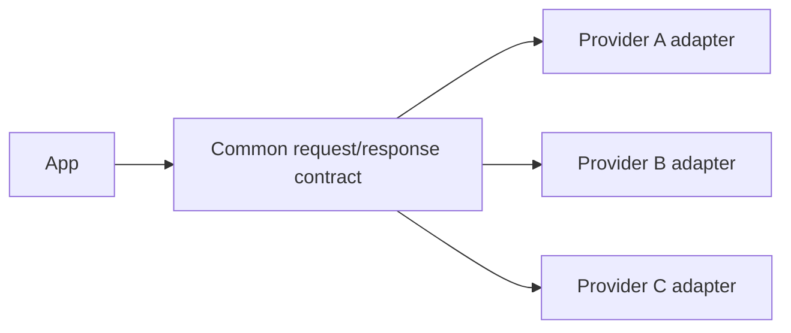
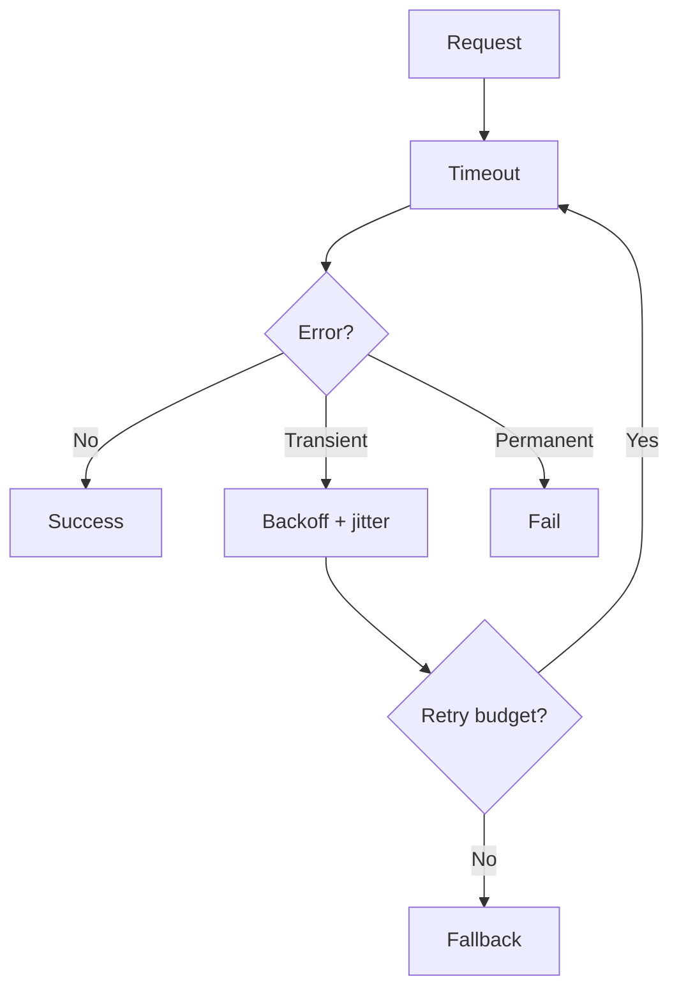
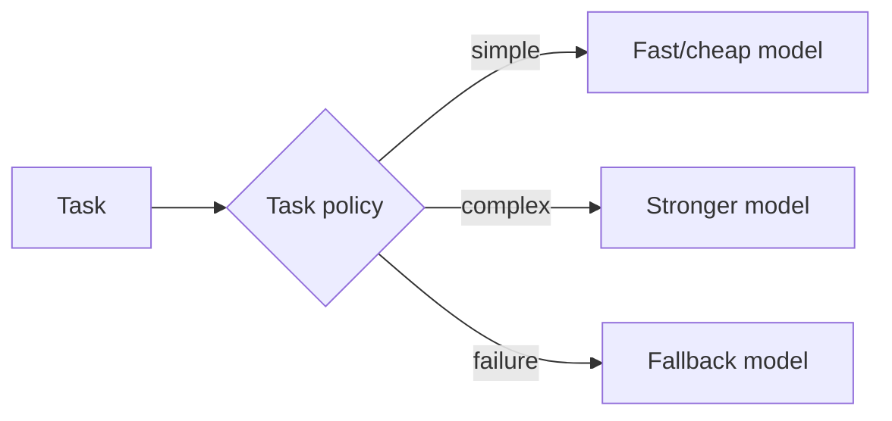

# 02 — Model APIs: Visual Study Guide

## Provider boundary



Keep SDK-specific messages and exceptions inside adapters. Your application should depend on your contract, not a provider's wire format.

## Reliable request lifecycle



Transient examples include rate limits or temporary server failures. Permanent failures include invalid arguments and authorization failures.

## Streaming

A streaming adapter should expose semantic events rather than provider-specific chunks:

```text
text_delta | tool_call_delta | usage | completed | failed
```

This lets your UI remain stable when the model provider changes.

## Routing



Start with deterministic routing rules. Only add a learned router when evaluation proves it improves the trade-off.

## Cost accounting

Store request ID, model, tokens, duration, retry count, status, and estimated cost. Later sections will use this data for optimization and SLOs.

## Example

Build one chat client against two providers. Replay 50 fixed requests and compare:

- success rate
- p50/p95 latency
- token usage
- estimated cost
- structured-output validity

## Best practices

- Timeouts on every remote request.
- Bounded retries with jitter.
- Cancellation support.
- Provider adapters isolated from business logic.
- Usage captured even when the request fails.
- Version and pin SDKs in experiments.

## References

- OpenAI: https://platform.openai.com/docs
- Anthropic: https://docs.anthropic.com/
- Google AI: https://ai.google.dev/gemini-api/docs
- HTTP: https://developer.mozilla.org/en-US/docs/Web/HTTP
- httpx: https://www.python-httpx.org/

## Remember
**An LLM provider is an infrastructure dependency; design the boundary so you can replace it.**