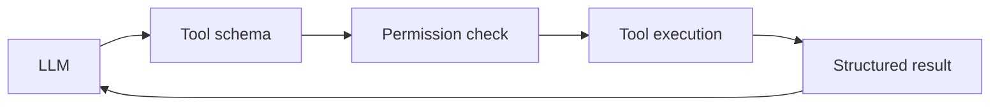
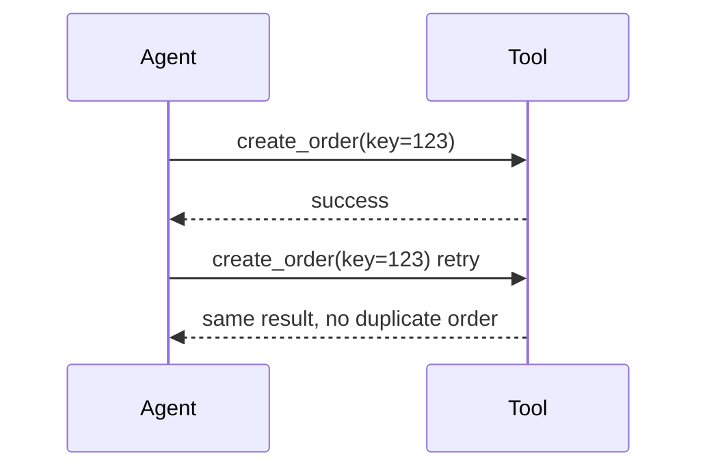
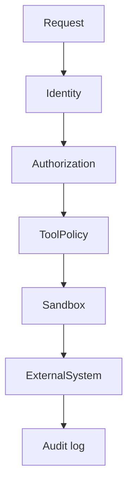

# 03 — Tools: Visual Study Guide

## What is a tool?

A tool is a controlled bridge from model output to deterministic code.



The model can request a tool. It should not receive unrestricted authority to execute arbitrary code.

## Tool anatomy

Every production tool should have:

```text
name
purpose
input schema
output schema
authorization policy
timeout
retry policy
idempotency behavior
audit event
```

## Narrow vs broad tools

Bad:
`run_any_shell_command(command)`

Better:
`search_customer_orders(customer_id, date_range)`

Narrow tools make permissions, testing, and reasoning easier.

## Idempotency

A tool that performs side effects must tolerate duplicate delivery or use an idempotency key.



## Failure handling

Return structured tool errors such as:

```json
{"code":"TIMEOUT","retryable":true,"message":"backend timed out"}
```

Do not hide failures as empty strings.

## Security layers



Treat parameters and tool results as untrusted data.

## MCP

Study MCP as a protocol for interoperable tools/resources, not as a replacement for your authorization model. The same permission, timeout, auditing, and validation rules still apply.

## Worked example

Build a calculator, search, and file-reader tool runtime:

1. Define typed schemas.
2. Register tools explicitly.
3. Validate arguments.
4. Check permissions.
5. Apply timeout.
6. Execute.
7. Return structured result/error.
8. Record an audit event.

## Best practices

- Prefer narrow, purpose-built tools.
- Separate tool discovery from authorization.
- Treat side effects as higher risk than reads.
- Use idempotency for retryable side effects.
- Test malformed arguments and malicious inputs.

## References

- Model Context Protocol: https://modelcontextprotocol.io/
- OpenAI Agents SDK: https://openai.github.io/openai-agents-python/

## Remember
**Tools turn model decisions into real-world effects; every tool is therefore a security boundary.**