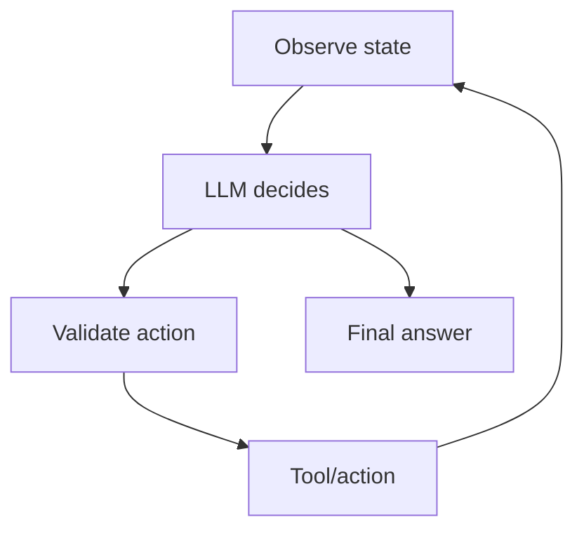
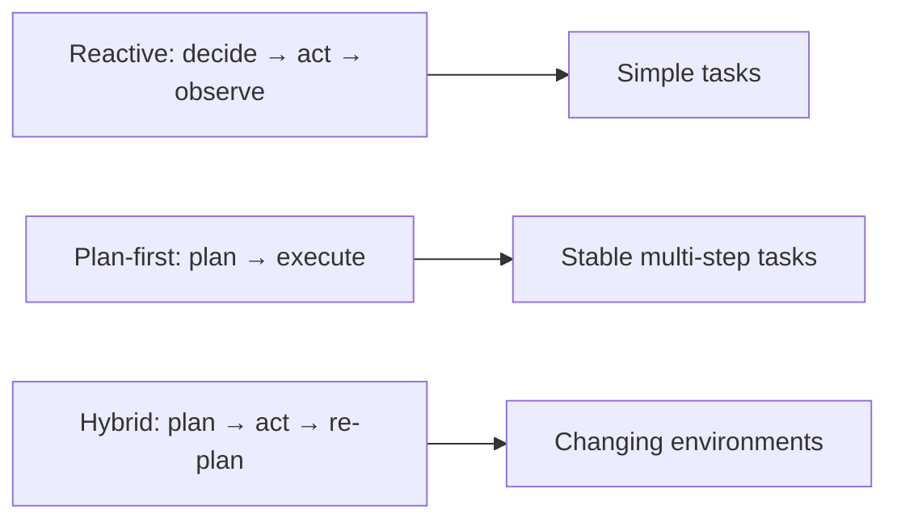
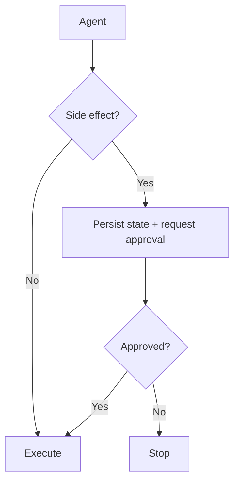

# 04 — Agents: Visual Study Guide

## What makes an agent?

An agent is not just a chat prompt. It is a loop in which the model chooses actions, the application executes them, and the resulting state influences the next decision.



## Minimal agent

```python
while turns < max_turns:
    decision = model(state)
    if decision.final:
        return decision.answer
    result = execute(decision.tool_call)
    state.add(decision, result)
```

The important part is not the loop syntax; it is the explicit state, permissions, budgets, and stop conditions around it.

## Reactive vs planning



Use the simplest strategy that performs well on measured tasks.

## Budgets

Every agent should have hard boundaries:

```text
max turns
max tool calls
wall-clock deadline
token/cost budget
per-tool timeout
permission boundary
```

These are safety mechanisms, not optional optimizations.

## Human approval



Persist state before pausing so a process restart does not lose the workflow.

## Memory integration

Separate current run state from long-term memory. Retrieval should be explicit and bounded, not an ever-growing transcript.

## Worked example

Build a research agent with only three tools: search, open-source, summarize. Limit it to 8 turns and 12 tool calls. Require citations for every final claim. Test a malicious document containing instructions for the agent to ignore its policy.

## Best practices

- Start with one agent before multi-agent designs.
- Make every termination path explicit.
- Keep tools narrow.
- Set budgets before optimizing prompts.
- Persist state before irreversible side effects.
- Log the reason for each tool choice.

## Framework mapping

The same concepts appear as abstractions in OpenAI Agents SDK, LangGraph, PydanticAI, CrewAI, and Microsoft Agent Framework. Learn the loop first; then identify what each framework hides or adds.

## References

- OpenAI Agents SDK: https://openai.github.io/openai-agents-python/
- Model Context Protocol: https://modelcontextprotocol.io/

## Remember
**An agent is a bounded decision loop, not an unlimited autonomous process.**