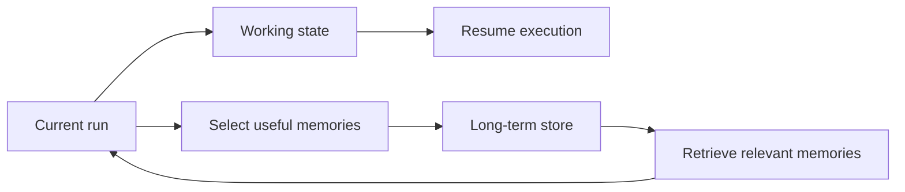
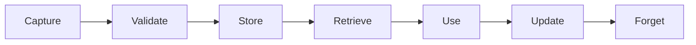
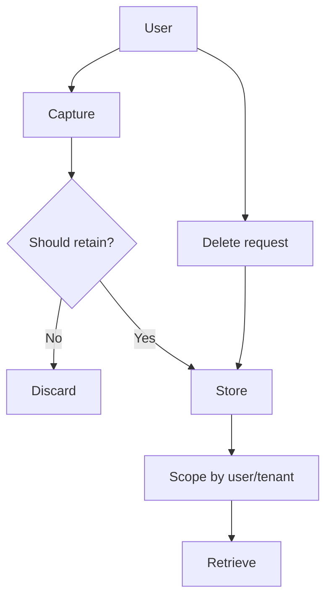

# 05 — Memory: Visual Study Guide

## State vs memory



**State** is needed to continue this execution. **Memory** is retained because it may help later.

## Memory types

- Conversation memory: recent dialogue.
- Semantic memory: facts/preferences.
- Episodic memory: what happened in previous interactions.
- Working memory: temporary information for a task.

Do not put all four into one unstructured table without a retention policy.

## Memory lifecycle



Forgetting is part of the design. Provide deletion and correction paths.

## Example data model

```text
memory_id
scope/user_id
kind
content
source
created_at
updated_at
confidence
expires_at
```

Store provenance so you know why a memory exists.

## Retrieval

Start with exact/keyword retrieval. Add semantic retrieval only where it solves a measured problem. A vector database is not automatically the correct memory store.

## Privacy



Test cross-user access explicitly.

## Worked example

Build a preference memory service:

1. User says “I prefer concise answers.”
2. Application decides this is a durable preference.
3. Store it with source and timestamp.
4. Retrieve it only for tasks where style matters.
5. Allow inspection and deletion.

## Best practices

- Explicit memory capture beats storing everything.
- Store provenance and confidence.
- Separate tenant/user scopes.
- Add TTLs where appropriate.
- Test stale, contradictory, and poisoned memories.
- Make deletion observable and verifiable.

## References

- SQLite: https://www.sqlite.org/docs.html
- PostgreSQL: https://www.postgresql.org/docs/
- JSON Schema: https://json-schema.org/

## Remember
**Good memory is selective, inspectable, scoped, and removable.**