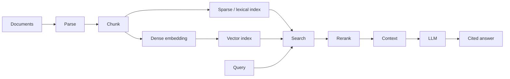
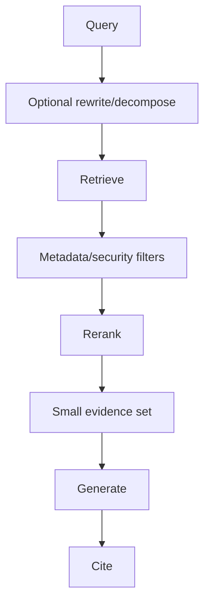

# 06 — RAG: Visual Study Guide

## RAG in one picture



RAG is a retrieval system plus generation. The vector database is only one component.

## Dense vs sparse

Dense retrieval finds semantic similarity. Sparse/lexical retrieval is strong for exact terms, identifiers, names, and rare keywords.

```text
query
 ├─ dense search ── semantic matches
 └─ sparse search ── exact/lexical matches
                  ↓
             hybrid fusion
                  ↓
               rerank
```

## Chunking

Start with simple fixed-size chunks. Then compare sentence-, section-, and semantic-aware chunks. The correct chunk size depends on the documents and questions; benchmark it instead of choosing by intuition.

## Metadata

Every chunk should preserve useful provenance:

```text
document_id
section
source_url
version
timestamp
tenant
permissions
```

Metadata is critical for filtering and citations.

## Vector databases

A vector index stores embeddings and supports nearest-neighbor search. Common patterns include exact search and approximate nearest-neighbor indexes such as HNSW or IVFFlat.

Use PostgreSQL + pgvector when relational state and vector retrieval naturally belong together. Consider Elasticsearch/OpenSearch when lexical search, filters, and analytics are central. Consider Qdrant/Weaviate/Pinecone when the workload is primarily semantic retrieval and a dedicated service is useful.

## Query pipeline



Security filters should never be replaced by semantic similarity.

## Evaluation

Separate retrieval from generation:

- retrieval recall@k
- precision/false positives
- citation correctness
- groundedness
- final answer correctness
- latency
- cost

## Worked example

For technical documentation, compare:

A. dense top-k
B. BM25 top-k
C. hybrid fusion
D. hybrid + reranker

Use the same 100-question dataset. Keep the winning pipeline only when the measured improvement justifies its complexity.

## Best practices

- Preserve provenance.
- Keep retrieved context small and relevant.
- Filter by tenant/permissions before generation.
- Measure retrieval independently.
- Test conflicting and unanswerable questions.

## References

- RAG paper: https://arxiv.org/abs/2005.11401
- Sentence Transformers: https://www.sbert.net/
- FAISS: https://faiss.ai/
- pgvector: https://github.com/pgvector/pgvector
- Elasticsearch: https://www.elastic.co/guide/en/elasticsearch/reference/current/index.html
- LlamaIndex: https://docs.llamaindex.ai/

## Remember
**RAG quality starts with retrieval quality; a better prompt cannot compensate for missing evidence.**