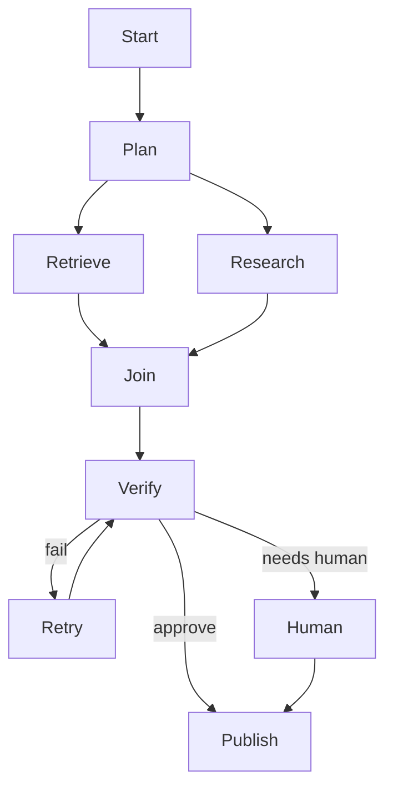
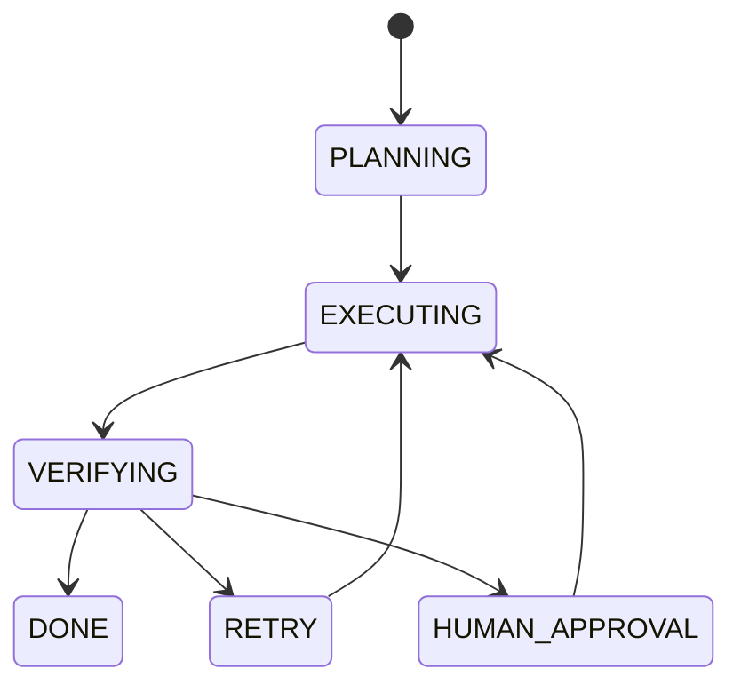

# 07 — Orchestration: Visual Study Guide

## Why orchestration?

An agent loop is good for local decisions. Orchestration manages multi-step execution, durable state, branching, concurrency, retries, and human pauses.



## Deterministic vs model-driven steps

Keep deterministic work deterministic. Introduce model uncertainty only where judgment is needed.

```text
ingest → classify(LLM) → retrieve → generate(LLM) → validate → publish
```

## State machine



Persist state before irreversible transitions.

## Parallelism

Parallelize independent work, then merge deterministically. Measure whether the latency reduction is worth complexity and capacity usage.

## Durable execution

The key scenario is not “the workflow ran once.” It is:

```text
start → work → crash → restart → resume → finish
```

For side effects, use idempotency or compensation so a retry does not duplicate the operation.

## Worked example

Build a research workflow:

1. Parse question.
2. Generate search plan.
3. Run three independent searches concurrently.
4. Merge and deduplicate sources.
5. Generate draft.
6. Verify claims.
7. Pause for approval when confidence is low.
8. Resume and publish.

## Best practices

- Explicit state schema.
- Durable checkpoints.
- Bounded retries.
- Separate retriable from non-retriable steps.
- Make side effects idempotent.
- Keep a clear audit trail.

## Framework mapping

LangGraph is useful for explicit graph/state execution. Microsoft Agent Framework and workflow engines such as Temporal are useful when durable execution and long-running workflows become primary concerns.

## References

- LangGraph: https://docs.langchain.com/oss/python/langgraph/overview
- Temporal: https://docs.temporal.io/
- Microsoft Agent Framework: https://learn.microsoft.com/en-us/agent-framework/

## Remember
**Orchestration is the discipline of making multi-step AI work inspectable, resumable, and safe to retry.**