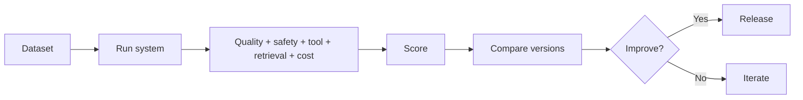
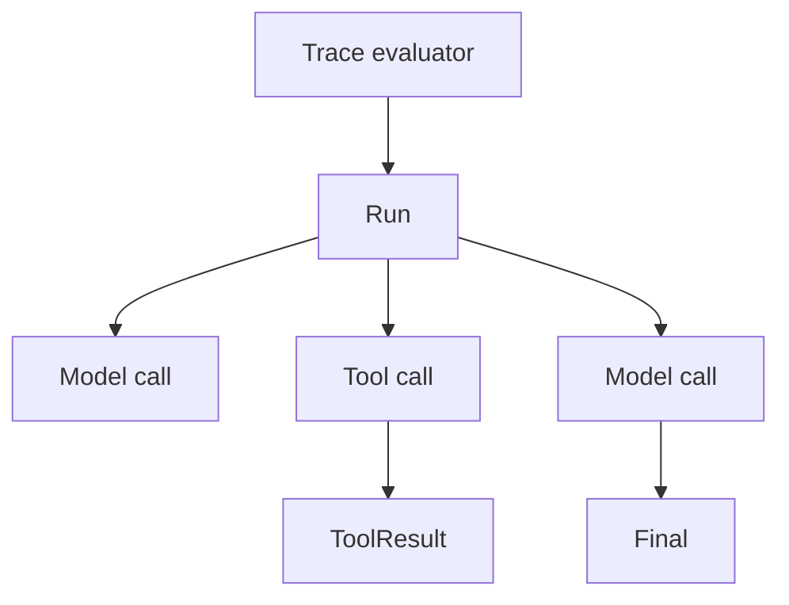

# 08 — Evaluation: Visual Study Guide

## Why evaluation is different for AI

Traditional software often has a clear expected output. AI systems can produce multiple acceptable answers, while still failing on correctness, safety, tool use, or grounding.



## Golden datasets

Start with 25–100 representative cases. Include happy paths, edge cases, unanswerable requests, malicious inputs, long inputs, and contradictory evidence.

## Evaluation layers

```text
unit tests
    ↓
component evals
    ↓
trace evals
    ↓
end-to-end task evals
    ↓
adversarial/red-team tests
```

Examples:
- schema validity
- correct tool name/arguments
- retrieval recall@k
- citation correctness
- grounded answer quality
- unsafe-action rate
- p95 latency
- estimated cost

## LLM-as-judge

Use judges for qualities that are difficult to score deterministically, but calibrate them against human labels and inspect disagreements. A judge is another probabilistic component and should not become unquestioned truth.

## Trace evaluation



A good trace evaluator can detect wrong tool selection even when the final answer looks plausible.

## Regression testing

Pin:

```text
model version
prompt version
dataset version
retrieval configuration
framework version
```

Then rerun after meaningful changes.

## Worked example

Take the RAG assistant from Phase 3. Build 100 questions and report:

```text
retrieval recall@5
citation correctness
answer correctness
groundedness
p50/p95 latency
estimated cost
safety failures
```

Compare dense-only vs hybrid retrieval. Decide based on evidence.

## Best practices

- Measure before optimizing.
- Separate retrieval failures from generation failures.
- Keep deterministic metrics where possible.
- Calibrate subjective judges.
- Test security and quality together.
- Store evaluation history for trend analysis.

## References

- OpenAI docs: https://platform.openai.com/docs
- Ragas: https://docs.ragas.io/
- DeepEval: https://deepeval.com/
- OWASP LLM security: https://owasp.org/www-project-top-10-for-large-language-model-applications/

## Remember
**A demo proves that a system can work; an evaluation suite proves whether it works reliably.**