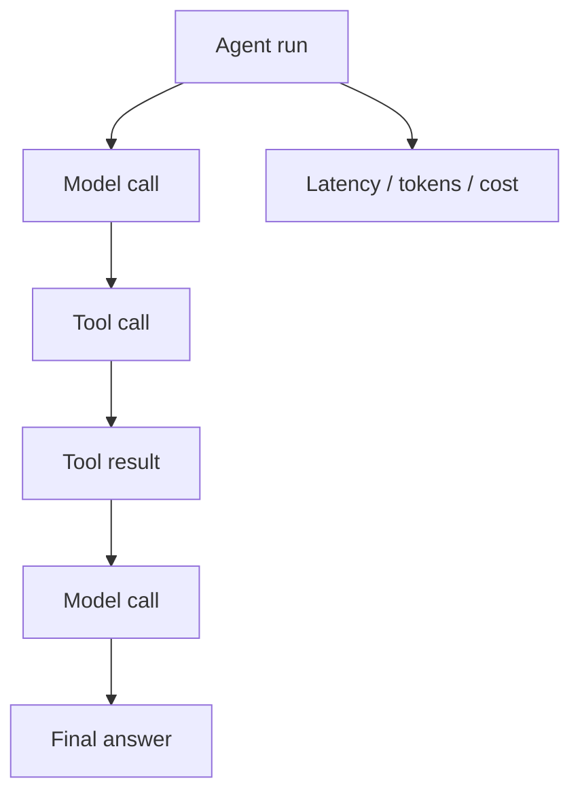
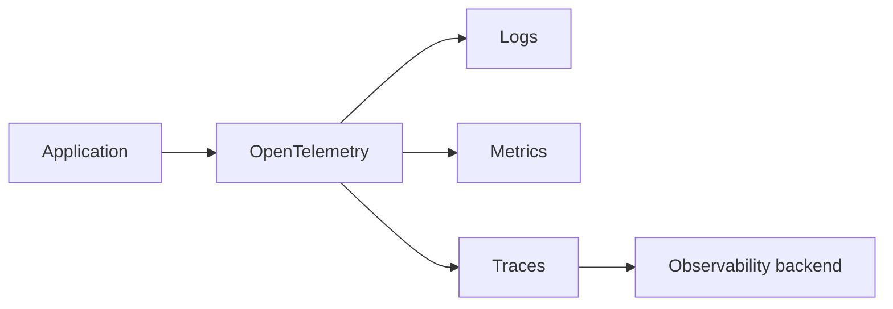

# 09 — Observability: Visual Study Guide

## The question observability answers

```text
What happened?
Why did it happen?
How long did it take?
What did it cost?
Where did it fail?
Can I reproduce the failure?
```

## Agent trace



Use a shared trace ID and run ID so events can be reconstructed.

## Logs vs metrics vs traces

- Logs explain individual events.
- Metrics summarize system behavior over time.
- Traces connect the events of one request/run.



## Useful AI metrics

Track:

```text
request success rate
p50/p95/p99 latency
model latency
queue wait time
tool failure rate
retry count
agent turns
input/output tokens
estimated cost
retrieval count
safety failures
```

## Privacy

Do not automatically store all prompts, documents, secrets, or tool outputs. Define redaction and retention policies.

## Worked example

Given a failed research agent run, the trace should tell you:

1. Which prompt version was used.
2. Which model responded.
3. Which tools were selected.
4. Tool arguments and outcomes, subject to redaction.
5. Retrieval configuration.
6. Timing of each step.
7. Token usage/cost.
8. Final failure category.

## Best practices

- Instrument boundaries, not every line of code.
- Correlate model/tool/retrieval spans.
- Record model and prompt versions.
- Sample successful traffic but keep high coverage for failures.
- Treat telemetry as sensitive data.

## References

- OpenTelemetry: https://opentelemetry.io/docs/
- W3C Trace Context: https://www.w3.org/TR/trace-context/
- Langfuse: https://langfuse.com/docs
- Phoenix: https://phoenix.arize.com/

## Remember
**Without traces, an agent failure is a mystery; with traces, it becomes an engineering problem.**