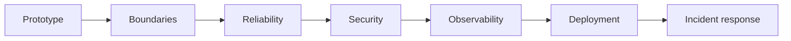
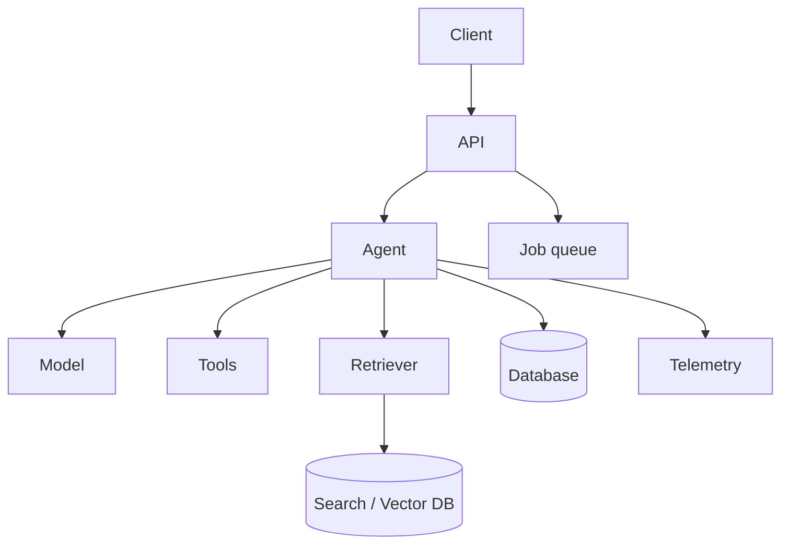
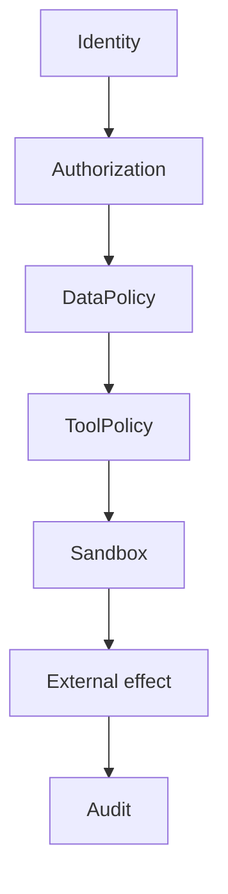

# 10 — Production: Visual Study Guide

## Prototype to production



Production starts when failures have real consequences.

## Service architecture



Keep model access, tools, retrieval, state, and infrastructure behind clear interfaces.

## Security model



Treat user input, retrieved data, web content, and tool output as untrusted. Secrets should never be casually placed into prompts or model-visible context.

## Resilience

Use deadlines, bounded retries, cancellation, queues, rate limits, graceful degradation, and health/readiness checks.

For AI systems, degraded modes might include:

```text
agent unavailable → deterministic FAQ
RAG unavailable → explicit unavailable message
strong model unavailable → cheaper fallback
async worker unavailable → queue and retry later
```

## Prompt injection

A document can contain text such as “ignore previous instructions.” The system should treat that as document content, not as a policy update. Test this explicitly.

## Operational controls

Hard limits should include request rate, max turns, tool calls, execution time, context size, and cost budget.

## Worked project

Deploy a research agent API with:

- authentication
- persistent state
- RAG
- tools
- tracing
- evaluation gate
- queue for long jobs
- cost controls
- security tests
- incident runbooks

Then inject provider outages, tool failures, prompt injection, queue backlogs, and runaway loops.

## Best practices

- Least privilege.
- Explicit budgets.
- Degraded mode.
- Secure defaults.
- Immutable audit records where needed.
- Rollback/change controls.
- Load and failure testing before production.

## References

- OWASP LLM Top 10: https://owasp.org/www-project-top-10-for-large-language-model-applications/
- OpenTelemetry: https://opentelemetry.io/docs/
- Docker: https://docs.docker.com/
- Kubernetes: https://kubernetes.io/docs/
- MCP: https://modelcontextprotocol.io/

## Remember
**A production agent is a distributed system with probabilistic components and security-sensitive side effects.**